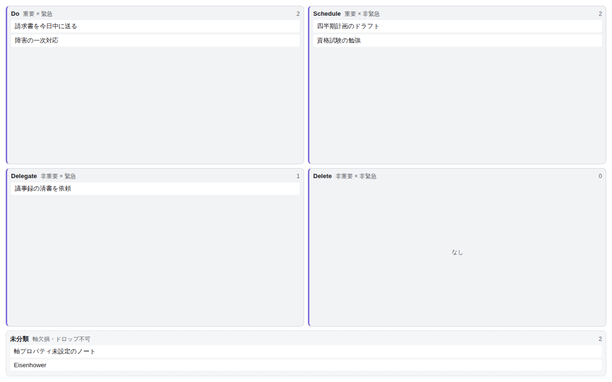

# Eisenhower Matrix for Bases

Display notes from an Obsidian **Base** as a 2×2 Eisenhower matrix — urgency × importance — and drag cards between quadrants to write the classification back to each note's frontmatter. Runs fully locally (no network, no telemetry).

_The interface language follows Obsidian automatically, or can be forced to English or Japanese in settings._

- A perspective the built-in Bases views (table / cards / kanban) can't give: a two-axis **urgent × important** overview with in-place, persisted re-classification.
- Write-back uses the standard `app.fileManager.processFrontMatter` API — no custom storage.
- `isDesktopOnly: true` — classification is mouse/keyboard drag-and-drop; touch support is planned for a later version.

## How to use

1. **Prepare a Base** — create or open a `.base` containing the notes you want to triage.
2. **Add the view** — in the Base's view switcher, add a view of the type **"Eisenhower Matrix"** provided by this plugin.
3. **Set the axis properties** — in _Configure view_, pick the **boolean `note.*` properties** to use for urgency and importance (defaults: `urgent` / `important`). Non-writable `formula` / `file.*` properties can't be selected. The plugin settings tab lets you change the default properties, quadrant labels/colors, the uncategorized-zone display, and the display language (Auto / English / Japanese).
4. **Drag cards to classify** — each note is placed into one of the four quadrants from its two axis values. Dragging a card to another quadrant (mouse or keyboard) writes the corresponding `true` / `false` back to the frontmatter. Notes whose axis properties are unset go to the **Uncategorized zone**, from which you can drag them into a quadrant. Notes holding non-boolean values are shown locked to prevent accidental overwrites.
5. **Undo the last move** — right after re-classifying, use the "Undo" toast, or the command **"Eisenhower Matrix for Bases: Undo last move"** (assign any hotkey in Settings → Hotkeys), to revert one step. It is a dedicated undo, independent of Obsidian's Ctrl+Z, and keeps only the single most recent move. A card that started uncategorized is returned to Uncategorized by removing its axis properties.

> v1 supports boolean axes (`true` / `false`). Numeric and tag axes are under consideration for a future version.

### Daily operation (v0.2)

These are all **off / empty by default**, so cards look and behave exactly as before until you opt in.

- **Completion toggle** — set a boolean *completion property* (e.g. `done`) in settings. When set, each card shows a check button; click it (or press `x` while the card is focused) to write `done: true` without opening the note. Let a Base filter decide whether finished notes disappear: add **`done != true`** to the Base and completed cards drop out automatically; if you keep them, the "dim completed notes" option marks them instead. Toggling flips completion on/off, and the last toggle can be reverted with the same **Undo** as a drag. Cards whose completion property holds a non-boolean value (e.g. a date) disable the check to protect the existing value.
- **Property badges** — show up to 3 read-only badges (due date, tags, project, …) under each card title, chosen per view (with a settings default). Because they're read-only, `formula` and `file.*` properties can be shown too. An optional toggle emphasizes due-like values (`YYYY-MM-DD` on or before today).
- **Stagnation indicator** — cards untouched for longer than a threshold (14 days by default; change, or disable with 0, in the settings tab) get a subtle stagnation badge (clock icon + elapsed days). It is a read-only marker based on last-modified time (`mtime`), so automated processing (Linters, Templater, sync) also resets it — noted in the settings.
- **Setup diagnostics** — if you assign the same property to both axes (which locks every card 🔒), an in-view banner explains the cause and the fix. A one-line hint also shows which urgency / importance properties are currently resolving the classification when everything falls to Uncategorized.

## Installation

### Community plugin (submitted)

Once listed, install it from Obsidian → Settings → Community plugins → Browse by searching for "Eisenhower Matrix for Bases".

### Manual installation

Download `main.js` / `manifest.json` / `styles.css` from the [Releases](https://github.com/nakaba-lab/eisenhower-bases-view/releases) page, place them in `<Vault>/.obsidian/plugins/eisenhower-bases-view/`, then enable the plugin in Settings.

---

## 日本語

Obsidian の Bases（コアのデータベース機能）の**カスタムビュー**として、緊急度×重要度の 2×2 Eisenhower マトリクスを提供するプラグイン。ノートを 4 象限（Do / Schedule / Delegate / Delete）に配置し、カードのドラッグで frontmatter プロパティを書き戻して分類を永続化する。完全ローカル動作（ネットワーク通信・テレメトリなし）。

- 既存の Bases ビュー（テーブル / カード / カンバン）ではできない「緊急×重要」の 2 軸俯瞰と、その場での再分類（永続化）を実現する。
- 書き戻しは標準の `app.fileManager.processFrontMatter` を用いる。
- `isDesktopOnly: true`（マウス DnD のため当面デスクトップ限定・タッチ対応は将来）。

### 使い方

1. **Base を用意する** — 対象ノート群を含む `.base` を作成 / オープンする。
2. **ビューを追加する** — Base のビュー追加で、本プラグインが提供する種別 **「Eisenhower Matrix」** を選ぶ。
3. **軸プロパティを設定する** — ビュー設定（Configure view）で、緊急度・重要度に使う **boolean の `note.*` プロパティ**を指定する（既定は `urgent` / `important`）。書き戻せない `formula` / `file.*` プロパティは選べない。プラグイン設定タブで既定プロパティ・象限ラベル / 色・欠損ノート表示・表示言語（Auto / 英 / 日）を変更できる。
4. **カードをドラッグして分類する** — 各ノートは両軸の値で 4 象限に配置される。カードを別象限へドラッグ（マウス / キーボード）すると、その象限に対応する `true` / `false` が frontmatter に書き戻される。軸プロパティが未設定（欠損）のノートは「未分類ゾーン」に入り、そこから象限へドラッグして分類できる。boolean 以外の値を持つノートは誤書き換えを防ぐためロック表示になる。
5. **直前の移動を元に戻す** — 分類し直した直後の「元に戻す」トースト、またはコマンド **「Eisenhower Matrix for Bases: 直前の移動を元に戻す」**（設定 → ホットキーで任意のキーを割り当て可能）で 1 手戻せる。Obsidian 標準の取り消し（Ctrl+Z）とは統合していない独立した専用コマンドで、保持するのは直前の 1 手のみ。元が未分類だったカードは軸プロパティを削除して未分類へ戻す。

> v1 は boolean 軸（`true` / `false`）に対応する。数値・タグ軸は将来のバージョンで検討する。

### 日常運用（v0.2）

いずれも**既定はオフ / 空**なので、オプトインするまでカードの見た目・挙動は従来どおり。

- **完了トグル** — 設定で boolean の*完了プロパティ*（例 `done`）を指定すると、各カードにチェックボタンが出る。クリック（またはカードにフォーカス中に `x` キー）でノートを開かずに `done: true` を書き込める。完了ノートを消すか残すかは Base 側のフィルタに委ねる方針で、Base に **`done != true`** を張れば完了カードは自動で消える。残す場合は「完了ノートを淡色表示」オプションで目印にできる。チェックは押すたびに完了 / 未完了を切り替えられ、直前の 1 手はドラッグ移動と同じ**「元に戻す」**で戻せる。完了プロパティが日付など boolean 以外の値を持つカードは、既存の値を守るためチェックを無効化する。
- **追加プロパティバッジ** — カードのタイトル下に、期日・タグ・プロジェクトなどを**読み取り専用のバッジ**で最大 3 個表示できる（ビューごと＋設定で既定を選択）。読み取り専用なので数式や `file.*` 系プロパティも表示できる。期日らしい値（`YYYY-MM-DD` で今日以前）を強調するトグルも用意した。
- **滞留インジケータ** — 最終更新から一定日数（既定 14 日・設定タブで変更、0 で無効）を超えて動いていないカードに、控えめな滞留バッジ（時計アイコン＋経過日数）を付ける。最終更新日時（`mtime`）に基づく読み取り専用の目印で、Linter・Templater・同期などの自動処理でも更新日時はリセットされる点に注意（設定画面に明記）。
- **設定ミス診断バナー** — 緊急度軸と重要度軸に同じプロパティを割り当てて全カードが移動不可（🔒）になったとき、原因と直し方をビュー内バナーで説明する。全ノートが未分類に落ちたときは、いまどの緊急度 / 重要度プロパティで分類しているかを 1 行で示す。

### インストール

#### コミュニティプラグイン（申請中）

掲載後は、Obsidian の設定 → コミュニティプラグイン → 閲覧 から「Eisenhower Matrix for Bases」を検索してインストールできる。

#### 手動インストール

[Releases](https://github.com/nakaba-lab/eisenhower-bases-view/releases) から `main.js` / `manifest.json` / `styles.css` を取得し、対象 Vault の `<Vault>/.obsidian/plugins/eisenhower-bases-view/` に配置して、設定でプラグインを有効化する。

---

## Support / 支援

This plugin is free and open source (MIT). If it helps you, you can support its development:

- **GitHub Sponsors** (recurring): https://github.com/sponsors/nakata5577
- **Ko-fi** (one-time tip): https://ko-fi.com/nakata5577

本プラグインは無料・オープンソース（MIT）です。役立ったら開発の支援をいただけると励みになります（GitHub Sponsors：継続／Ko-fi：単発）。Obsidian のプラグイン詳細ページの「Donate」からも同じ導線にアクセスできます。

---

## 開発 / Development

| 目的 / Purpose | コマンド / Command |
|------|---------|
| ビルド（型チェック＋esbuild 本番バンドル → `main.js`） / Build | `npm run build` |
| 開発（esbuild watch） / Dev watch | `npm run dev` |
| 型チェックのみ / Type-check only | `npm run typecheck` |
| テスト / Test | `npm test` |
| Lint | `npm run lint` |
| フォーマット / Format | `npm run format` |

Issue 駆動 + Git Flow + git worktree + TDD（Red-Green-Refactor）+ Spec 駆動 + 多段コードレビューを採用する。詳細は `CLAUDE.md` と `.claude/rules/`、要件は `docs/要件定義書.md`、設計は `docs/design/` を真実源とする。

## 前提 / Requirements

- 動作確認に Obsidian デスクトップ（1.12.0 以上・Bases コアプラグイン有効）/ Obsidian desktop 1.12.0+ with the Bases core plugin enabled
- 開発に Node.js / npm、GitHub 連携に `gh`（GitHub CLI）、フック実行に `python3`

> プラグイン id: `eisenhower-bases-view` ／ name: `Eisenhower Matrix for Bases` ／ `minAppVersion` 1.12.0（スパイク #16 の実機検証〔1.12.7〕で確定）。

---

> このプロジェクトは Claude Code エージェント開発ワークフロー・テンプレート v1.9.0 から生成。
