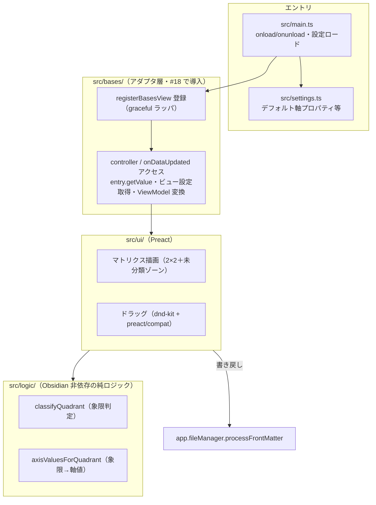
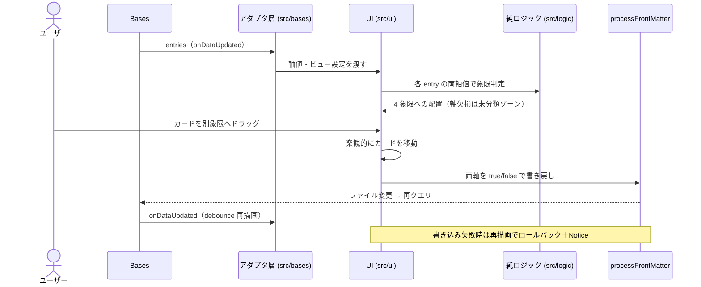

# アーキテクチャ設計

> 要件は `docs/要件定義書.md`、本書は HOW（最新の設計・構造）の真実源。

## 責務（このユニットは何をするか）

Obsidian Bases のカスタムビューとして 2×2 Eisenhower マトリクスを描画し、カードのドラッグで各ノートの frontmatter（緊急度軸・重要度軸の boolean プロパティ）を書き戻して分類を永続化する。churn しやすい Bases API への耐性のため、**Bases API 接触面を薄いアダプタ層に隔離**し、UI と純ロジックを Bases から疎結合に保つ。

## 構成要素（主要コンポーネント／モジュール）

- **`src/logic/`** — Obsidian 非依存の純ロジック（象限判定・象限→軸値）。単体 TDD の対象。
- **`src/bases/`** — アダプタ層（#18 で導入）。`registerBasesView` 登録（`registerView.ts` の graceful ラッパ）、`BasesView` サブクラス（`EisenhowerBasesView.ts`）、entries→ViewModel 変換（`toViewModel.ts`）、境界型（`types.ts`）。`controller`/`onDataUpdated`・`entry.getValue`・ビュー設定取得を 1 箇所に集約。詳細は [bases.md](./bases.md)。
- **`src/ui/`** — Preact コンポーネント。マトリクス描画・ドラッグ。
- **`src/main.ts`** — プラグインエントリ（`onload`/`onunload`・設定ロード）。
- **`src/settings.ts`** — プラグイン設定（デフォルト軸プロパティ等）。

## データフロー・主要シーケンス

## 外部依存・インターフェース

- **Obsidian Plugin API**: `Plugin.registerBasesView`（1.10.0+）/ `BasesView` / `BasesEntry.getValue` / `app.fileManager.processFrontMatter`。読み取り（Bases）と書き込み（processFrontMatter）は別系統。
- **UI**: Preact（`preact/compat`）＋ dnd-kit（マウス DnD＋キーボード DnD）。
- **ビルド**: esbuild（`main.js` バンドル出力）。`minAppVersion` 1.12.0（暫定）。

## 主要な設計判断（現行の理由）

- **Bases API をアダプタ層に隔離**: Bases ビュー API は 1.10.0 導入・1.12 で options に破壊的変更の実績があり churn が大きい。UI・純ロジックを直接 API に結合させず、接触面を `src/bases/` に集約して影響範囲を局所化する。
- **書き戻しは Bases ビュー API ではなく標準 `processFrontMatter`**: 原子的な frontmatter 更新のため。読み取り（Bases クエリ）と書き込み（FileManager）を分離する。
- **2 軸 4 象限はビュー側で自前配置**: Bases ネイティブ grouping に頼らず、各 entry の両軸値を読んで配置する（grouping は 2 軸×象限の同時表現に向かない）。
- **v1 は boolean 軸限定**: `true`/`false` を明示書き込み（`delete` しない＝空 frontmatter バグ回避）。absent（未定義）と `false` を区別し、欠損は未分類ゾーン（ドロップ不可）。数値/タグ軸は v2。
- **着手前スパイク必須**: `registerBasesView` 登録→`getValue`→`processFrontMatter`→`onDataUpdated` の往復を実機確認してから本実装（未確定点は `docs/要件定義書.md`「未決事項」）。
