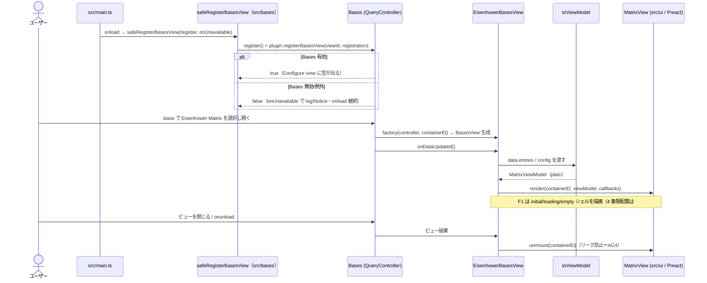

# Bases アダプタ層 設計

> Issue #18（F1）・#19（F2）で実装した現状を反映。churn しやすい Bases API 接触面を本領域（`src/bases/`）に隔離する設計の真実源。API 事実は要件定義書「9. 未決事項」に接地する。**#20（F3）でドラッグ書き戻し（`MatrixCallbacks.onMoveCard` ＋ `processFrontMatter`）を実装し `status: active` に確定した。** **#33 で absent 判定を `toString()===null`（スパイク #16 の誤観測）から `instanceof NullValue`（型同一性）へ是正した（実機 `scripts/e2e` プローブで確定）。** **#21（F4）で軸プロパティ設定 UI（ビュー options＝主・プラグイン設定＝デフォルトのハイブリッド）を本領域に積み増した: `registerBasesView` の `options` に `note.*` のみ選択可の軸プロパティセレクタを 2 つ宣言し、選択時（`filter`）・読み取り時・書き戻し時の 3 面で「書き戻せる `note.*` 軸」を単一述語 `isWritableAxisProperty` で判定する。** **#22（F5）でカード操作（開く/新タブ/プレビュー）を本領域に積み増した: `MatrixCallbacks` に `onOpenCard`/`onHoverCard` を追加し、アダプタが `workspace.getLeaf(...).openFile` と `workspace.trigger("hover-link", …)` を実装する（UI は修飾キー→`newLeaf` の plain データを渡すだけ＝AC5 維持。UI 側の相互作用設計は `ui.md`）。** **#34（fix）で軸値正規化を v1 の boolean 軸限定まで狭めた: `note.*` 接頭辞ガード（書き戻し可能性）に加え、値の型が `BooleanValue` の軸だけを 4 象限に分類し、非 boolean（数値 `NumberValue`／文字列 `StringValue` 等）や absent（`NullValue`）は未分類へ退避する（正の許可リスト `instanceof BooleanValue`）。これで非 boolean `note.*` 軸が 4 象限へ自動配置されてドラッグ露出する（無操作で上書き可能になる）経路を断つ。未分類からの手動ドラッグ書き戻しの無効化（書き戻し側の boolean ガード）は F4/#21 の範囲として残す（読み取り側のみ boolean に狭めた非対称）。**
>
> **#104（F8 カード追加プロパティ表示）を実装し `status: active` に確定した（2026-07-10・人間承認済み）**: カードに**読み取り専用**の追加プロパティ（期日・タグ・プロジェクト等）を最大 3 個までバッジ表示する。書き戻し軸（`note.*` 限定）と違い**別サーフェス（読み取り専用）**のため `formula.*`／`file.*` も選択可。境界契約 `MatrixEntry.badges`（`{ label; text; emphasized? }[]` の plain データ＝`readBadges.ts` の `Badge`）を追加し、アダプタ（`toViewModel`）が `entry.getValue` で読み Value→表示文字列へ正規化して載せ、`NoteCard` が控えめに描画する（UI は Bases 非依存を維持＝AC5）。**値の正規化・例外退避（`entry.getValue`→表示文字列）は `readBadges.ts` 側に独立して持つ**（`readBadgeText` は `readAxisValueSafely` と**同型だが別実装**＝バッジ＝表示文字列／軸＝boolean と正規化の意味が逆のため surface を結合させない）。一方、**汎用の option-key→propertyId リゾルバ `safeGetAsPropertyId`（`config.getAsPropertyId` の throw 境界防御）は `readAxis` から import して共有する**（値の意味を持たない純粋な境界ラッパで、別実装だと例外時のログ有無が乖離する＝v0.2 レビューで是正）。さらに**失敗ログの log-once 方針だけは `readAxis.logChurnFailureOnce`（キー単位で 1 回 `console.error`）に集約**し、全境界ガード（`safeGetAsPropertyId`／`readAxisValueSafely`／`readBadgeText`／`safeGetOption`）が委譲する（try/catch と戻り値センチネルは用途別に各ガードへ残すが、観測性ポリシーの変更が全接触点へ一斉に効く＝v0.2 レビュー。`readBadgeText` も churn 例外を一度ログして「本当に空」と「読み取り失敗」を切り分け可能にした）。共有するのは「解決の境界防御」と「ログ方針」で、値の意味づけ〔normalize〕は依然サーフェス別。日付強調（AC4）は純ロジック `isEmphasizedDate(text, today)`（`src/logic/dateEmphasis.ts`）で判定し、`today`（ローカル日付 ISO）はアダプタ `EisenhowerBasesView.todayIso()` が注入する（`Date.now()` を純ロジックに持ち込まない）。**選択 UI は独自セレクタ方式（案 a）を採用**（下記「主要な設計判断」に案 b＝Bases ネイティブ Properties の却下理由）。
>
> **#105（F10 カード上の完了トグル）を実装し `status: active` に確定した（2026-07-10・人間承認済み）**: 完了は **boolean 単一プロパティ書き戻し**で v1 の boolean 軸限定制約と同じ型面に収まり、既存の書き戻し（`writeCompletion`）・locked 機構・境界防御を流用する。**undo 記録を 2 軸固定形からキーリスト形（`UndoRecord.entries[]`）へ一般化**（設計オプション比較で本 Issue 内実施に決定・基盤 Issue を切り出さない）＝ドラッグ書き戻し＝2 要素・完了トグル＝1 要素が同じ「直前 1 手」機構を共有する（挙動不変の内部リファクタ）。3 キー衝突ガードは、軸×軸を `axesShareWritableKey`（**2 軸直接比較**）で、軸×完了を `resolveCompletionId` の pairwise 比較で判定する（かつて N キー版 `firstSharedWritableKey` へ一般化したが本番未使用の YAGNI だったため v0.2 レビューで 2 軸直接比較へ戻した）。完了ノートの表示/非表示は **Bases 委譲**（`done != true` フィルタ）で自前フィルタしない。詳細は下記「カード上の完了トグル」節。

Obsidian Bases のカスタムビューとして Eisenhower マトリクスを登録し、Bases API（`registerBasesView`／`BasesView`／`QueryController`／`BasesEntry.getValue`／ビュー設定）への接触を 1 領域に集約する。各エントリを **Bases 非依存の ViewModel** に変換して UI（`src/ui`）へ渡し、UI・純ロジック（`src/logic`）が Bases 型へ直接依存しないようにする（疎結合化＝AC5）。

F1（#18）の範囲は **登録・graceful 失敗処理・描画経路・解除（リーク防止）・境界契約**まで。#19（F2）で**各エントリの軸値読み取り（absent 判定）と 4 象限＋未分類への事前グルーピング**を追加した（`readAxis.ts`／`toViewModel.ts`）。ドラッグ書き戻しは #20（F3）、軸プロパティ設定 UI は #21（F4）で本領域に積み増す。

## 構成要素（主要コンポーネント／モジュール）

```mermaid
flowchart TD
    main["src/main.ts<br/>onload: safeRegisterBasesView 経由で<br/>registerBasesView を呼び factory に EisenhowerBasesView を配線"]
    main -->|register コールバック注入| reg["src/bases/registerView.ts<br/>safeRegisterBasesView（false/例外を graceful 処理）＋VIEW_ID/NAME/ICON"]
    main -->|factory| view["src/bases/EisenhowerBasesView.ts<br/>BasesView サブクラス"]
    view -->|onDataUpdated| map["src/bases/toViewModel.ts<br/>entries → MatrixViewModel 変換"]
    map --> vm["MatrixViewModel（Bases 非依存の plain データ）"]
    view -->|render(container, vm, callbacks)| ui["src/ui/MatrixView.tsx<br/>Preact render（F1: シェル＋状態表示）"]
    view -->|onunload で unmount| unmount["preact unmount + container クリア"]
    ui --> logic["src/logic/（classifyQuadrant 等・#19 で接続）"]
```

- **`src/bases/registerView.ts`** — ビュー定数（`VIEW_ID`/`VIEW_NAME`/`VIEW_ICON`）と **`safeRegisterBasesView(register, onUnavailable)`**。`register`（＝`plugin.registerBasesView(...)`）をコールバックで受け、戻り値 `false`（Bases 無効）や API 例外を `console`／`Notice` で握って `onload` を継続させる（AC2）。obsidian ランタイムに依存しない純ラッパなので単体テスト可能。実際の `registerBasesView` 呼び出しと factory 配線は `src/main.ts` が行う（手動/結合で担保）。
- **`src/bases/EisenhowerBasesView.ts`** — `BasesView` サブクラス。コンストラクタで loading シェルを描画し、`onDataUpdated()` で `data.data`（`BasesEntry[]`）から `toViewModel` で ViewModel を組み `MatrixView` の `render()` を呼ぶ（AC3）。`onunload()` で Preact ルートを `unmount` する（AC4）。`extends BasesView`＝obsidian ランタイム必須のため単体テスト対象外。
- **`src/bases/toViewModel.ts`** — `BasesEntry[]` を **`MatrixViewModel`** へ変換する純関数（`import type` のみで obsidian 非依存＝単体テスト可能）。entry の `id`（file.path）/`title`（file.basename）と state（empty/ready）に加え、#19 で各 entry の軸値を読み `classifyQuadrant` で **4 象限＋未分類に事前グルーピング**した `placements` を組む（**配置対象は Markdown ノート `file.extension === "md"` のみ**＝`.base` 自己エントリ・`.canvas`・画像等の非 md は `isPlaceableNote` で事前除外し、残る md ノートのうち軸欠損は両軸 absent → 未分類に落とす。md ノートが 0 件なら `state: "empty"`）。`config`（ビュー options）と設定を受け取り {@link resolveAxisPropertyIds} で軸 propertyId を解決する。
- **`src/bases/readAxis.ts`** — 軸プロパティの解決と軸値の正規化（#19・absent 判定は #33 で是正）。`resolveAxisPropertyIds(config, settings)` がビュー options（`config.getAsPropertyId`・主）→設定デフォルト（`note.<name>`）の順で両軸 propertyId を解決し、`readAxisValues(entry, ids)` が `entry.getValue` の `Value` を **absent（NullValue・`value instanceof NullValue`）/true/false** に正規化する。NullValue（値）を obsidian から import するため（実機は外部提供・esbuild external）、単体テストは vitest が obsidian の値 import を `src/test-support/obsidianStub.ts` へ解決する（型は `import type`）。**読み取り側も書き戻し可能な `note.*` のみを有効軸とし、`formula.*`／`file.*` が設定された軸は値があっても absent（undefined）扱いにして未分類へ落とす**（書き戻し側 `toFrontmatterKey` ガードと対称化＝「4 象限に並ぶのにドラッグすると必ず失敗するカード」を作らない）。**#21（F4）で「書き戻せる `note.*` 軸か」の判定を単一述語 `isWritableAxisProperty`（本ファイル＝`readAxis.ts` に配置）に集約し、`toFrontmatterKey` はこの述語を再利用する（options の `filter`・読み取り `readSingleAxis`・書き戻し `writeBackAxes` の 3 面が同一定義を共有＝軸許容ルールの二重管理を無くす）。述語を `readAxis.ts` に置くのは、`viewOptions.ts` が options キー（`URGENT_OPTION_KEY`/`IMPORTANT_OPTION_KEY`）と述語を `readAxis` から一方向 import できる形にし、`readAxis`↔`viewOptions` の循環依存を避けるため（`readAxis` が既に `NOTE_PROPERTY_PREFIX`・キー・`toFrontmatterKey` を持つ自然な置き場）。書き戻しの実行時ガードは `resolveWritableAxisKeys(config, settings)`（両軸を解決し、両方が書込可能 `note.*` なら frontmatter キー `{urgent, important}`、片方でも非 `note.*`、または**両軸が同一 frontmatter キー**〔リリース前レビューの question 対応。同一キーだと書き戻しが 2 度書いて後勝ちで潰れ、カードが意図しない象限へ飛ぶため弾く〕なら `null`）に切り出し、`EisenhowerBasesView.writeBackAxes` はこれが `null` のとき `processFrontMatter` を呼ぶ前に Notice で弾く（AC3＝frontmatter を壊さない）。ガード判定の純度を `readAxis` の単体テストに逃がした（`writeBackAxes` は `extends BasesView` で単体対象外）。** **#34（fix）で `normalizeAxis` を「値が `BooleanValue` のときだけ `isTruthy()` で boolean 化、それ以外（`NullValue`＝absent・`NumberValue`・`StringValue` 等）は `undefined`（未分類）」の正の許可リストに狭めた（v1 boolean 軸限定の型ガード。`BooleanValue` を obsidian から値 import＝`NullValue` と同じ流儀。`instanceof NullValue` 個別チェックは非 `BooleanValue` 退避に包含されるため撤去）。** **リリース前の詰めで `isUnsupportedAxisValue`／`hasUnsupportedAxisValue` を追加**（書込可能 `note.*` 軸に**非 boolean 値**を持つカードを検出し `toViewModel` が `MatrixEntry.locked` を立て UI がドラッグ不可にする＝未分類からの手動ドロップ破壊を封鎖。absent〔`NullValue`/null〕・`BooleanValue` は false で「欠損＝分類可」と区別する）。**収束レビューで `axesShareWritableKey(ids)` を追加**（両軸が**同一の書き戻し可能 `note.*` キー**を指す設定ミスを読み取り側で検出し、`toViewModel` が当該ビューの全カードに `locked` を立てる。同一キーだと両軸値が常に同値になりカードは do/delete に載って掴めるが書き戻しは `resolveWritableAxisKeys` の `urgent === important` ガードで毎回失敗するため、「掴めるのに必ず失敗する」状態を UI で断つ＝書込前ガードと対称の読み取り側ガード・レビュー指摘）。
- **`src/bases/viewOptions.ts`（#21 F4）** — `registerBasesView` に渡す**軸プロパティセレクタ options の純ビルダー**。`buildAxisViewOptions(): BasesPropertyOption[]` は緊急度・重要度の 2 軸ぶんのビュー option 定義（`key`＝`URGENT_OPTION_KEY`/`IMPORTANT_OPTION_KEY`、`type: "property"`、`displayName`、`placeholder`、`filter: isWritableAxisProperty`）を返す。軸許容ルールの述語 `isWritableAxisProperty` とキーは `readAxis.ts` から import する（真実源は 1 つ・循環回避）。`extends BasesView` 本体・`main.ts` の登録呼び出しは obsidian ランタイム依存で単体対象外のため、テスト可能な純度（キー・型・`filter` 挙動）をこのビルダーへ逃がす（`registerView.ts` の `safeRegisterBasesView` と同じ「純ラッパを切り出す」流儀）。`main.ts` は `registerBasesView(VIEW_ID, { name, icon, factory, options: () => buildAxisViewOptions() })` で配線する（`options` は `(config) => BasesAllOptions[]` の関数形。本ビューの options は config 非依存のため config を無視する）。
- **`src/bases/types.ts`** — 境界 ViewModel 型（`MatrixViewModel`/`MatrixEntry`/`MatrixState`/`MatrixCallbacks`）。`src/ui` はこの型のみに依存し、`obsidian`/Bases 型を import しない（AC5。`MatrixCallbacks` は F1 では空で、F3/F5 で操作を足す）。

## データフロー・主要シーケンス



## 外部依存・インターフェース

- **Obsidian Plugin API**（スパイク #16 で実機確定。型は obsidian 1.13.x 型定義に存在）:
  - `Plugin.registerBasesView(viewId: string, registration): boolean`（`false`＝Bases 無効）
  - `BasesViewFactory = (controller: QueryController, containerEl: HTMLElement) => BasesView`
  - `BasesView`（抽象）: `config: BasesViewConfig`・`allProperties: BasesPropertyId[]`・`data: BasesQueryResult`・`abstract onDataUpdated()`
  - `BasesEntry.getValue(propertyId): Value | null`・`BasesEntry.file: TFile`（軸読み取りは #19）
- **境界 ViewModel 型（`src/bases/types.ts`・本契約が AC5 の核）** — `src/ui` はこの型にのみ依存する:
  ```ts
  // Bases 非依存。obsidian 型を一切含めない（file は TFile を直接出さず、
  // 開く操作に必要な情報＋コールバック経由でアダプタに委譲する）。
  export interface MatrixEntry {
    id: string;        // 安定キー（file.path 等）
    title: string;     // 表示名
    // urgent/important（boolean | undefined）は #19 で追加
    // locked?（#34）: 非 boolean 軸値でドラッグ不可
    // badges?（#104 F8）: カード追加プロパティの読み取り専用バッジ（解決済み plain データ）
    badges?: Array<{
      label: string;       // 表示ラベル（プロパティ表示名。i18n 済み or プロパティ名）
      text: string;        // 正規化済み表示文字列（例外・absent は空文字へ退避）
      emphasized?: boolean; // 厳格 ISO 日付が今日以前 × 強調トグル on のときだけ true（AC4）
    }>;
  }
  export type MatrixState = "loading" | "empty" | "ready";
  export interface MatrixViewModel {
    state: MatrixState;
    entries: MatrixEntry[];   // F1 ではシェル表示用（配置は #19）
    diagnostics?: MatrixDiagnostics;  // #103 F7: 既存解決結果の転送（Bases 新規接触なし）
  }
  // #103 F7: 設定ミス診断・解決済み軸の可視化（既存の resolveAxisPropertyIds／axesShareWritableKey の結果を転送）
  export interface MatrixDiagnostics {
    axesShareWritableKey: boolean;  // 両軸が同一の書き戻し可能 note.* キー（設定ミス確定）
    sharedAxisKey?: string;         // 上が true のとき共有キー（frontmatter キー表記・例 "urgent"）
    urgentAxis: string;             // 解決済み緊急度軸名（frontmatter キー表記・非 note.* は生 id フォールバック）
    importantAxis: string;          // 解決済み重要度軸名（同上）
  }
  export interface MatrixCallbacks {
    // F3（#20）でドラッグ書き戻し、F5（#22）で開く/プレビューを追加。いずれも UI は plain データを
    // 渡すだけで、TFile 解決・processFrontMatter・workspace 操作はアダプタ（EisenhowerBasesView）が
    // 担う（UI は obsidian 型に触れない＝AC5）。本ブロックは F3/F5 時点の抜粋で、#105 の
    // onToggleCompletion 等を含む現行の全契約は下記「境界契約の追加」節（src/bases/types.ts）を正とする。
    onMoveCard?(entryId: string, axisValues: { urgent: boolean; important: boolean }): Promise<void>;
    onOpenCard?(entryId: string, opts: { newLeaf: boolean }): void;                       // #22 F5
    onHoverCard?(entryId: string, targetEl: HTMLElement, event: MouseEvent): void;        // #22 F5
    onUndoMove?(expectedEntryId?: string): void;                                          // undo（最小実装・トースト起動時の expectedEntryId ガードは下記 undo 節）
  }
  ```
- **UI 入口**: `render(containerEl: HTMLElement, viewModel: MatrixViewModel, callbacks: MatrixCallbacks): void`（Preact `render()` を内部で呼ぶ命令的橋渡し）。`unmount(containerEl)` で破棄。
- **書き戻し（#20 F3）**: `EisenhowerBasesView` が `onMoveCard` を実装し、`entryId`（file.path）→ `app.vault.getAbstractFileByPath` で `TFile` を解決、解決済み軸 propertyId（`note.<key>`）から frontmatter キー（`<key>`）を取り出し、`app.fileManager.processFrontMatter(file, fm => { fm[urgentKey] = urgent; fm[importantKey] = important; })` で**両軸を明示 `true/false`** 書き込みする（`delete` しない＝v1 boolean 軸）。読み取り（`getValue`）と書き込み（`processFrontMatter`）は別系統。`processFrontMatter` が reject したら UI 側がロールバック＋`Notice`（`ui.md` のシーケンス参照）。
- **開く/プレビュー（#22 F5）**: `EisenhowerBasesView` が `onOpenCard`/`onHoverCard` を実装する。開く: `entryId`（file.path）→ 共通 `resolveTargetFile`（`getAbstractFileByPath`＋`instanceof TFile`。書き戻しと共有・欠落は `Notice`）で `TFile` を解決し、`app.workspace.getLeaf(newLeaf ? "tab" : false).openFile(file)`（素=現在リーフ／Mod+=新タブ）。プレビュー: `app.workspace.trigger("hover-link", { event, source: VIEW_ID, hoverParent: this, targetEl, linktext: entryId, sourcePath: entryId })` でコア page-preview を発火（表示可否はユーザーのコア設定に委ねる）。読み取り（`getValue`）とは別系統で、UI は `obsidian` 型に触れない。
- **undo（直前1手の元に戻す・最小実装）**: ドラッグ書き戻し（#20）が破壊的（両軸を `true/false` 上書き）なため、移動前の frontmatter 値を捕捉して復元する最小 undo を足す。純ロジックは `src/logic/undo.ts`（obsidian 非依存・単体テスト対象）、実機接触（`processFrontMatter`・`getAbstractFileByPath`・`addCommand`）はアダプタ／プラグインに隔離する。
  - **捕捉（`writeBackAxes` 内）**: `processFrontMatter` のコールバック内で**上書き前に**両軸キーの現在値を `buildUndoEntries(frontmatter, writes)`（各キーごとに `capturePreviousValue` が `hasOwnProperty` で absent と `false`/`undefined` を区別・値は verbatim 保持）で捕捉し、`UndoRecord { entryId, title(file.basename), entries: UndoEntry[] }` を組む（各 `UndoEntry` は書き込むキー・書込値・復元用の前値を持ち、復元前の同一性照合に使う）。書き込み成功後に `UndoManager.record(record)` で「直前 1 手」として保存（既存記録は上書き＝保持は 1 手のみ）。
  - **記録の所有（`UndoManager`・`src/logic/undo.ts`）**: プラグイン（`main.ts`）が単一の `UndoManager` を持ち、各 `EisenhowerBasesView` に注入する。コマンド（プラグイン全体）とビュー内トーストの双方がこの 1 記録を共有し「直前の移動」を一意に指す（複数ビューでは最後の移動を指す＝最小実装の割り切り）。
  - **復元（`runUndo(app, undoManager, messages, expectedEntryId?)`）**: `UndoManager` の記録を取り、`record.entryId` から `TFile` を解決（欠落は記録 `clear`＋`Notice`）し、`processFrontMatter(file, fm => { if (isUndoApplicable(fm, record)) applyUndo(fm, record) })` で present は代入・absent は delete。成否に関わらず `clear`（適用時は `undone`、非適用時は `noUndo` の `Notice`）。純関数 `applyUndo`/`buildUndoEntries`（前値捕捉は `capturePreviousValue`）/`isUndoApplicable` を単体テストし、`extends BasesView`／`app` 接触面（`runUndo`）は手動/結合で担保する（`writeBackAxes` と同じ切り分け）。`onDataUpdated` 自動再発火で再配置され、手動再描画は不要。**`expectedEntryId` ガード（複数ビュー誤爆対策・code-reviewer 指摘）**: トーストは特定ノートを名指しするため、トースト起動時は名指しノートの entryId を渡し、**現在の記録がその entry の移動でない場合（別ビューの移動で記録が置き換わった等）は戻さず `Notice`** を出す（無言で別ノートを undo しない）。コマンド起動は `expectedEntryId` を省略し「直前 1 手」を無条件に戻す。**同一性ガード（パス再利用/外部改変対策・2 段・レビュー指摘）**: undo は `entryId`（=file.path）でノートを再解決するため、移動後にそのパスが**別ノートで再利用**されていたり、ユーザー/他プラグインが軸値を書き換えていた場合、`previous` を適用すると無関係な値を上書き/`delete` しうる（undo は**唯一の delete 経路**のため影響が大きい）。2 段で塞ぐ:
    - **① 記録の無効化（`UndoManager.clearIfEntry`＋vault イベント）**: `main.ts` が `registerEvent` で `vault.on("delete")`／`vault.on("rename")` を購読し、記録した path のファイルが削除/リネームされたら `undoManager.clearIfEntry(path)` で記録を破棄する（rename は旧 path で判定）。パスが再利用される**前提条件（元ファイルの消滅）**の時点で記録を捨て、「削除→同名で作り直し→undo」で別ノートを壊す経路を根本から断つ。**フォルダ対応**: Obsidian はフォルダの delete/rename を**フォルダ 1 件のイベント**として発火し配下ファイルごとには発火しないため、`clearIfEntry` は完全一致に加え記録 path が `entryId + "/"` 配下（削除/リネームされたフォルダの中）でも破棄する（親フォルダ操作での取り残し防止・Gemini レビュー指摘）。
    - **② 値照合（`isUndoApplicable`）**: ①をすり抜ける「削除/リネームを伴わない外部改変」に対し、復元前に `processFrontMatter` 内で「両軸が記録時に自分が書いた値（`record.wrote`）のままか」を照合し、不一致なら**復元せず記録を破棄**する（`noUndo`）。①で path 再利用は断つが、②は同一象限（同じ boolean 値）の別ノートまでは区別できない残存があり、file.path が唯一の安定キーである以上の割り切り（delete 経路は①で実質封鎖済み）。
  - **トリガー（コマンド＋トースト）**: `main.ts` が `addCommand({ id: "undo-last-move", name: messages.undoCommandName, callback })` を登録（ホットキーはユーザーが割当・Ctrl+Z 以外＝ネイティブ undo 非統合）。ビュー内トーストの「元に戻す」は `MatrixCallbacks.onUndoMove` 経由で同じ復元経路を呼ぶ（コマンドとトーストで `runUndo` を単一化＝重複させない）。記録が無いときは `Notice`（`messages.noUndo`）。
  - **コマンド経由 undo の楽観オーバーレイ落とし（レビュー指摘 #6）**: `runUndo` は**実際に復元した `entryId`（file.path）を返す**（未復元＝記録なし/名指し不一致/ファイル欠落/値不一致/書込失敗は `null`）。トースト undo は UI 内で `dropPending` して楽観オーバーレイを落とせるが、**コマンド undo は `MatrixView` を経由しない**ため、書込成功直後の在庫レース窓で残った `pending` を落とせずカードが移動先象限へ貼り付く（トースト経路との非対称）。`MatrixView` はマウント時に「pending を落とす関数」を `MatrixCallbacks.registerPendingDropper`（plain function 型＝AC5 維持・アンマウントで `null` 解除）でアダプタへ登録し、`EisenhowerBasesView` がそれを `dropPendingOverlay(entryId)` として保持する。`main.ts` の `undoLastMoveFromCommand` は `runUndo` の戻り値（`entryId`）で生存ビュー（`liveViews`）の `dropPendingOverlay` を呼び、各ビューの `pending` を落として表示をサーバ値へ戻す（トースト経路と対称化）。
- **ビルド**: esbuild（`main.js`）。`minAppVersion` 1.12.0・`isDesktopOnly: true`（確定）。

## 主要な設計判断（現行の理由）

- **境界契約は「ViewModel 変換」を採用（#18 設計オプション比較で選択）**: アダプタが各 `BasesEntry` を Bases 非依存の `MatrixViewModel`（plain データ）へ変換し、UI は単一の `render(container, viewModel, callbacks)` 入口だけを受ける。`src/ui`・`src/logic` に `obsidian`/Bases 型を一切漏らさず AC5 の疎結合を構造で保証し、変換ロジックを純度高くテストできる。
  - **却下: 生 entries＋アクセサ注入** — 変換コードは減るが `BasesEntry` 型が UI 近傍に漏れ、AC5「UI/logic は Bases 型に直接依存しない」を弱める。Bases API churn（1.12 で options 破壊的変更の実績）が UI まで波及する。
  - **却下: ハイブリッド（薄い橋＋遅延読取）** — 中間案だが「どこまでが Bases 依存か」の境界が曖昧になり、テスト時に Bases モックが UI 側へ侵食する。
- **`registerBasesView=false` を graceful 処理**: Bases 無効 Vault でも例外を投げず log/Notice に留め、設定ロード等の他機能を壊さない（AC2）。
- **解除は Preact `unmount` を明示**: ビュー破棄・`onunload` で Preact ルートを `unmount` し DOM/購読リークを防ぐ（AC4）。
- **F1 で境界型を先に確定**（`MatrixCallbacks` は空でも置く）: F2〜F5 が同じ境界に積み増せるよう、契約面を最初に固定して後続の手戻りを避ける。
- **手動再描画は持たない**: 書き戻し→`onDataUpdated` 自動再発火で反応ループが閉じる（スパイク #16 確定）。F1 は描画経路の確立まで。
- **診断情報は既存解決結果の「転送」に徹する（#103 F7・churn 耐性）**: `toViewModel` が既に計算している `resolveAxisPropertyIds`（軸解決）と `axesShareWritableKey`（同一キー設定ミス）の結果を `MatrixViewModel.diagnostics`（plain string／boolean）へ載せるだけで、Bases API への**新規接触点を一切増やさない**（既存の `safeGetAsPropertyId` 経由の解決値の再利用）。UI（`MatrixView`）はこの plain データを描画するだけで `obsidian`/Bases 型に触れない（AC5 維持）。軸名は書き戻しキー（`toFrontmatterKey` の `<key>`＝利用者が設定タブ・Bases options で編集する表記）で持ち、非 `note.*`（`formula.*`/`file.*`＝`toFrontmatterKey` が `null`）は生の property id をフォールバック表示する（`"null"` を出さない）。**empty 分岐でも diagnostics を計算する**（現状 `toViewModel` は notes 0 件で `ids` 計算前に return するため、empty 分岐に `resolveAxisPropertyIds`＋`axesShareWritableKey` の算出を追加＝空状態でも軸名・設定ミスを提示できる。既存関数の再利用のため新規接触ではない）。却下「UI が axesShareWritableKey を再計算」: 同一ロジックの二重実装で乖離リスク。却下「Bases options から警告文言を引く」: Bases API 接触面を増やし churn 耐性方針に反する。
- **書き戻しはアダプタに隔離（#20）**: `MatrixCallbacks.onMoveCard` は両軸の boolean だけを受け、`TFile` 解決・frontmatter キー算出・`app.fileManager.processFrontMatter` 実行をアダプタ（`EisenhowerBasesView`）が担う。UI・logic に `obsidian` 型を漏らさず（AC5 維持）、書き込み経路を読み取り経路（`getValue`）と同じく 1 領域へ集約する。frontmatter キーの取り出し（`note.urgent`→`urgent`）は純関数として切り出し単体テスト対象にする（`extends BasesView` 本体は obsidian ランタイム必須で対象外のため、テスト可能な純度をキー算出に逃がす）。
- **開く/プレビューもアダプタに隔離（#22 F5）**: `onOpenCard`/`onHoverCard` は UI から plain データ（`entryId`・`newLeaf`・`targetEl`）だけを受け、`TFile` 解決・`workspace.openFile`・`hover-link` 発火をアダプタが担う（`onMoveCard` と同じ疎結合＝AC5 維持）。TFile 解決は書き戻しと共通の `resolveTargetFile` に集約して重複を避ける（#22 リファクタで抽出）。ホバープレビューはコア page-preview へ委譲し（`workspace.trigger("hover-link", …)`）プラグイン側で preview UI を再実装しない（表示可否はユーザーのコア設定に従う）。`extends BasesView` 本体は obsidian ランタイム必須で単体テスト対象外のため、開く/プレビューの往復は手動/結合で担保し、UI 側の意図算出（修飾キー→`newLeaf`・Enter 判定）は純関数（`src/ui/cardInteraction.ts`）として単体テストする。
- **absent 判定は型同一性 `instanceof NullValue`（#33）**: 欠損プロパティの `getValue` は **NullValue（singleton）** を返す。これを `value instanceof NullValue` で検出し、明示 `false`（BooleanValue・`isTruthy()===false`）と区別する。
  - **却下: `toString()===null`（旧実装・スパイク #16 の誤観測）** — 実機の `NullValue.toString()` は型契約どおり**文字列 `"null"`** を返す（JS `null` ではない）ため判定が機能せず、absent が false に誤判定され欠損ノートが Delete 象限に落ちていた（`scripts/e2e` の getValue プローブで `toStringType:"string"`・`toString:"null"` を実測）。
  - **却下: `constructor.name === "NullValue"`** — 実機ランタイムは minify 済みで constructor 名は `"t"`（プローブで実測）。名前依存は壊れる。型同一性（instanceof）は prototype チェーンで成立し、minify・文字列表現に依存しない。
  - **テスト容易性の代償**: readAxis に obsidian の**値** import（`NullValue`）が入り「`import type` のみ」ではなくなる。vitest は obsidian の値 import を最小スタブ（`src/test-support/obsidianStub.ts`）へ alias して単体テスト可能性を保つ（型は本物の `obsidian.d.ts`）。実機での成立は `scripts/e2e` の placements 検証で担保（absent/partial が未分類へ入る）。
- **v1 は boolean 軸限定＝正の許可リスト `instanceof BooleanValue`（#34）**: `note.*` 接頭辞ガード（書き戻し可能性）に加え、**値の型が `BooleanValue` の軸だけ** `isTruthy()` で boolean 化し、それ以外（`NullValue`＝absent・`NumberValue`・`StringValue` 等）は `undefined`（未分類）へ退避する。非 boolean の `note.*`（例: 数値 `note.priority: 3`）を軸に向けても 4 象限に並ばず未分類へ落ちるため、**無操作での自動配置＝ドラッグ露出**（4 象限のカードがそのまま掴めてドロップで `true/false` 上書き→数値/文字列破壊）という最も起きやすい経路を断つ。
  - **未分類からの手動ドラッグ破壊を UI ロックで封鎖（リリース前の詰めで解消）**: #34 は**読み取り側**（`normalizeAxis`）を boolean に狭めて 4 象限への自動配置＝ドラッグ露出は断ったが、未分類ゾーンのカードは `useDraggable` のままで、手動で 4 象限へドロップすると書き戻し側ガード `resolveWritableAxisKeys` は `note.*` を書込可能と判定して通過し（boolean 型を検査しない）非 boolean 値が破壊されうる残存点があった（当初 F4/#21 送り）。リリース前レビューで data-loss として再提起され封鎖した: `hasUnsupportedAxisValue(entry, ids)`（書込可能 `note.*` 軸に非 boolean 値を持つか。`isUnsupportedAxisValue` が `NullValue`/null と `BooleanValue` を false にして「absent」と「非 boolean 在中」を区別）で検出し `MatrixEntry.locked` を立て、`NoteCard` が locked カードを `useDraggable({disabled:true})`＝**ドラッグ不可**にして淡色＋鍵アイコンでマークする（クリックで開く導線は残しユーザーが値を直せる）。真に absent なカード（欠損）は `locked` を付けず従来どおり分類ドラッグ可。これで読み取り側（未分類化）＋ UI 側（ドラッグ不可）＋書き戻し側（`resolveWritableAxisKeys` の note.* ガード）で非 boolean 破壊経路を塞いだ（UI 詳細は `ui.md`、検証は `readAxis.test.ts`／`NoteCard.test.tsx`）。
  - **却下: 負の拒否リスト（`isTruthy()` を残し非 boolean 型を列挙除外）** — 既知の非 boolean 型（`NumberValue`/`StringValue`/…）を毎回列挙する必要があり、Obsidian が新しい Value 型を足すと既定で「分類される」（危険側に倒れる）。正の許可リストは未知/新規の型を既定で未分類にする（安全側に倒れる）。
  - **却下: 文字列/duck-typing（`toString()` が "true"/"false" か）** — #33 で是正した文字列表現依存への逆戻り（minify 済み constructor 名・ロケールに非依存でない）。型同一性 `instanceof` は minify にも文字列表現にも依存しない。
  - **テスト**: obsidian スタブ（`src/test-support/obsidianStub.ts`）に `BooleanValue`（`isTruthy()` を返す実クラス）と非 boolean Value 相当（`NumberValue`/`StringValue` の最小スタブ）を足し、非 boolean Value が未分類化されることを `readAxis.test.ts` で固定する。実機での `instanceof BooleanValue` 成立は `scripts/e2e` の placements 検証で担保（スタブ＝実機の同値性は単体では検証不能＝`NullValue` と同型の限界）。
  - **v2 余地**: 数値/タグ軸の型別解釈は v2 で設計する。本ガードは v1 の安全弁（非 boolean を触らせない）であり、許可リストに型別ブランチを足す形で自然に拡張できる。
- **配置対象は Markdown ノートのみ＝`file.extension === "md"`（リリース前の詰め・要件 §9）**: Bases のクエリ結果には（フィルタ未設定時に）Base 自身の `.base` ファイルや `.canvas`・画像等の非ノートが混ざりうる。v1 は boolean **frontmatter** 軸のみ扱うため、`toViewModel` の入口で `isPlaceableNote`（`file.extension === "md"`）により非 md を除外し、象限にも未分類にも出さない。当初は「`.base` は両軸 absent → 未分類に落ちるので特別なフィルタは持たない」としていたが、`.base` 自身が未分類カードとして現れるのは利用者に無意味な混乱を与えるため、明示除外へ改めた。
  - **却下: `.base`（`extension === "base"`）だけを名指し除外** — 問題を `.base` に限定できるが、`.canvas`・画像等の他の非 md も未分類に残る。frontmatter 軸を持ちうるのは md ノートのみ（v1）なので、**正の許可リスト（md のみ通す）** の方が「未知/新規の非ノート型を既定で除外する」安全側に倒れる（`instanceof BooleanValue` の許可リストと同じ思想）。
  - **却下: 除外せず未分類に残す（従来）** — `.base` 自己エントリが常に未分類ゾーンのカードとして現れ、ドロップ不可の“分類できないカード”をユーザーに見せ続ける。
  - **テスト**: `toViewModel.test.ts` で file スタブの `extension` を path 末尾から導出し、`.base`／`.canvas`／`.png` がカード化されないこと・md 0 件で `state: "empty"` を固定する。実機の非 md 混入は `docs/test/` の手動チェックリストで確認する。
- **Bases 接触点（`getValue`／`getAsPropertyId`）の例外を境界で退避しビュー全体を守る（churn 耐性・レビュー指摘 #3・収束レビュー #2/#3）**: 軸読み取り `entry.getValue(id)` と軸解決 `config.getAsPropertyId(key)` は churn 対象の Bases API 接触点で、型契約は `Value | null`／`BasesPropertyId | null` だが未対応プロパティ型・内部状態不整合・API 破壊的変更で throw しうる。読み取り例外が `toViewModel`→`renderCurrent`→`onDataUpdated` まで伝播すると**マトリクス全体の再描画が壊れ**、正常カードも巻き添えになる。
  - **`getValue`**: `readAxisValueSafely(entry, id)` で try/catch し、成功は `{ ok:true, value }`・**例外は `{ ok:false }`** で返す（「値が `null`＝absent だった」と「読み取り自体が throw した＝型を確証できない」を区別）。呼び出し側は**用途ごとに安全側の既定**へ倒す: 配置 `readSingleAxis` は throw→`undefined`（未分類）、**ロック判定 `isUnsupportedOnWritableAxis` は throw→`true`（ロック）**。後者が重要で、読み取り（`getValue`）と書き戻し（`processFrontMatter`）は**別系統**（書き戻しは `getValue` を経由せず生 frontmatter を `true/false` 上書き）のため、throw を absent と同一視してロックし損ねると非 boolean 値を持つカードがドラッグ可能になり上書き破壊しうる（#34/`hasUnsupportedAxisValue` が塞いだ経路の再開＝収束レビュー #2 で是正）。同一 `propertyId` の失敗は `loggedGetValueFailures`（Set）で一度だけ `console.error` する（再描画毎・軸毎のログ洪水抑制＝収束レビュー #4）。
  - **`getAsPropertyId`**: `safeGetAsPropertyId(config, key)` で try/catch し、例外時は `null`（未設定相当）へ倒して設定デフォルト `note.<name>` フォールバックに載せる（軸解決が壊れても既定軸で描画継続）。`resolveAxisPropertyIds` は描画経路と書き戻し経路の双方から呼ばれるため、per-card degradation より重い全件失敗を防ぐ（`getValue` 防御と粒度を揃える＝収束レビュー #3）。
  - `isPlaceableNote`（`entry?.file?.extension`）・`isWritableAxisProperty`（`typeof string`）の「Bases 境界で throw させない」防御と同じ流儀を、同期 read の両接触点へ対称に敷く（純度は `readAxis.test.ts` の「getValue throw→読みは undefined・書込可能軸はロック」「getAsPropertyId throw→既定軸フォールバック」で固定）。
- **軸許容ルールは単一述語 `isWritableAxisProperty`（`readAxis.ts`）に集約（#21 F4）**: 「書き戻せる `note.*` 軸か」の判定を 1 つの純関数に集約し、**options の `filter`（選択時に弾く）・読み取り `readSingleAxis`（非 note.* 軸を未分類へ）・書き戻し `writeBackAxes`（Notice で弾く）の 3 面が同じ定義を共有**する。選択・読み取り・書き戻しでルールがずれると「選べるのに壊れる」「読めるのに書けない」非対称が生まれるため、churn 面（options 宣言）と実行面（読み書き）を 1 述語で対称化する。述語は `readAxis.ts`（`NOTE_PROPERTY_PREFIX`・option キー・`toFrontmatterKey` の置き場）に置き、`viewOptions.ts` が一方向 import する（`readAxis`↔`viewOptions` の循環依存を避ける＝実装時の設計ドラフトから調整した点）。
  - **却下: 各面で `startsWith("note.")` をインライン** — 記述は最小だが 3 箇所に散り、v2 で数値/タグ軸の許容ルールを足すとき同期漏れが起きる。
  - **却下: 述語を `viewOptions.ts` に置く（初期ドラフト案）** — `viewOptions` が `readAxis` のキーを import し、`readAxis` が `viewOptions` の述語を import する双方向依存（循環）になる。ESM live-binding で動きはするが code smell のため、依存を一方向（`viewOptions`→`readAxis`）に正した。
- **options 宣言は純ビルダー `buildAxisViewOptions()` に切り出す（#21 F4）**: `registerBasesView` の `options` 配列を `main.ts` にインラインせず純関数へ逃がし、`filter` 挙動・option キー（`config.getAsPropertyId` が読むキーと一致）・`type` を単体テストで固定する。`main.ts`／`extends BasesView` は obsidian ランタイム必須で単体対象外のため、テスト可能な純度をビルダーへ寄せる（`safeRegisterBasesView` と同じ設計判断の踏襲）。churn しやすい options 型は実装時に実機 `obsidian.d.ts`（1.13.x）に照合済み: `options?: (config: BasesViewConfig) => BasesAllOptions[]`（関数形）・`BasesPropertyOption`（`type:'property'`・`key`・`displayName`・`filter?: (prop: BasesPropertyId) => boolean`）。スパイクは読み取り `getAsPropertyId` のみ確定だったが、options 登録型は型定義で確定した（AC ヒント `filter: (prop) => prop.startsWith("note.")` と一致）。
- **undo は純ロジック（捕捉/復元/1手保持）とアダプタ隔離（実機接触）に分ける**: 「何を捕捉し、どう復元するか」（`buildUndoEntries`〔前値捕捉 `capturePreviousValue`〕/`applyUndo`/`UndoManager`）を `src/logic/undo.ts` の obsidian 非依存な純関数・純状態に切り出して単体テストで固定し、`processFrontMatter`/`getAbstractFileByPath`/`addCommand` の実機接触は `writeBackAxes`（捕捉）・`runUndo`（復元）・`main.ts`（コマンド登録）に隔離する。`writeBackAxes` の破壊性テスト不能面（`extends BasesView`）に純ロジックを逃がす既存流儀（`resolveWritableAxisKeys`・`cardInteraction`）を踏襲。捕捉値は boolean に限定せず verbatim で持ち、万一非 boolean 値が書き込まれても undo で可逆に戻せる（#34 のデータ破壊防止を undo でも二重化）。
- **undo の記録は単一 `UndoManager` をプラグインが所有しビューへ注入**: コマンド（プラグイン全体）とビュー内トーストの双方が同一の「直前 1 手」を指すよう、記録の真実源を 1 箇所（プラグインの `UndoManager`）に置く。ビューは書き込み成功時に `record`、トリガーは `runUndo` で復元して `clear`。却下「ビューごとに記録を持つ」: コマンドがどのビューの記録を指すか曖昧になり、複数ビューで不整合。却下「トーストのローカル状態だけで復元」: コマンド経路と二重管理になる。複数ビューで別々に動かした場合は「最後の移動」を指す割り切り（最小実装・redo/多段なし）。**ただしトーストは特定ノートを名指しするため、`onUndoMove(expectedEntryId)` のガードで「記録が名指しの移動でなければ戻さず `Notice`」とし、無言で別ノートを undo する鋭いハザードだけは塞ぐ（code-reviewer 指摘）。コマンドは名指ししないため無条件に「直前 1 手」を戻す。**
- **AC1/AC4 の UI はすべて Bases ネイティブ（独自 Preact コンポーネントを持たない）（#21 F4）**: 軸選択 UI は Bases の Configure view が options 宣言から自動描画し、options 変更→`onDataUpdated` 自動再発火で再配置される（手動再描画なし）。書込不可軸のガードは既存 Notice を流用。ゆえに F4 は `src/ui` に差分を持たず、ビジュアル/UX 検証はロジック（filter/ガード/再解決）の単体テストと結合（実機 Configure view 操作）で担保する。

- **カード追加プロパティ表示は「独自セレクタ＋ViewModel 拡張」を採用（#104 F8・実装済み）**: カードに表示する追加プロパティ（読み取り専用）を、既存の軸セレクタ（`buildAxisViewOptions`）と**同型の property セレクタ**を常に最大 3 個（`MAX_BADGE_PROPERTIES`）宣言して選ばせ（`buildBadgeViewOptions(messages)`＝`viewOptions.ts`。可変 `count` は持たず常に固定数を宣言。`displayName` は `messages.badgeOption(n)` で i18n）、`resolveBadgePropertyIds(config, settings)`（`config.getAsPropertyId('badgeProperty1..N')` 主・プラグイン設定 `cardBadgeProperties` デフォルト）で解決する。解決の境界防御は **`readAxis` の `safeGetAsPropertyId` を共有**し（別実装の複製を持たない＝ログ挙動の乖離を防ぐ・v0.2 レビュー）、**同一 propertyId は除去してから最大 3 個で丸める**（同じプロパティを複数指定しても同じバッジが二重表示されず表示枠を無駄にしない・v0.2 レビュー）。この dedup＋cap は**読み取り側の権威的ガードである本関数に一本化**する（設定タブ入口〔`settingsTab`〕は trim/空除去のみ・ビュー options も入力源になるため read 側 dedup は必須。入口で slice すると dedup→slice の順の read 側と食い違い、重複が 1 枠を消費して別プロパティを押し出す＝入口では丸めず read に委譲する・v0.2 レビュー）。読み取り専用サーフェスのため `filter` は `note.*` に限定せず**全プロパティ許可**（`formula.*`／`file.*` も可＝軸の書き戻し `isWritableAxisProperty` 制約とは別サーフェス。UI 文言でこの違いを明示）。`toViewModel` が各 entry ぶん `readBadges(entry, ids, { today, emphasizePastDates })` を呼び、`entry.getValue`→表示文字列へ正規化して `MatrixEntry.badges` に載せる。Value 正規化は**軸読み取りと同型の境界防御**（`readBadgeText`＝`readAxisValueSafely` と対称の try/catch。例外・absent は空文字 `text:""` へ退避しビュー全体は壊さない＝AC2）で、`toString()` ベース＋型別分岐は最小限（churn 耐性）。**既定は表示 0 個**（`cardBadgeProperties: []`）＝`badges` は空でカード密度は現状維持（AC3）。
  - **却下: 案 b＝Bases ネイティブのビュー別 Properties 設定を `config` から読む** — コア Cards ビューが使う表示プロパティリストを流用できればネイティブ UX 整合・churn 面縮小で優位だが、**その表示プロパティリストを `config` から取得できる公開 API があるかが未確認**。着手前ミニスパイク（実機 `.base` で `config` の該当アクセサを調査）が必要だが、本実装環境に obsidian ランタイム/実 `.d.ts` が無く**実機検証ができない**ため、確実に着手できる案 a を採用した。将来 `config` が表示プロパティリストの公開アクセサを提供することが確認できたら、`resolveBadgePropertyIds` の解決元を差し替える形で案 b へ移行できる余地を残す（`readBadges`・`MatrixEntry.badges` 契約・UI は不変）。
  - **却下: 軸セレクタ（`buildAxisViewOptions`）に相乗り** — 軸は書き戻し（`note.*` 限定・boolean）でバッジは読み取り専用（全プロパティ・任意型）と**述語・型制約が逆**。同一ビルダーに混ぜると `filter` が二重定義になり「選べるのに壊れる」非対称（#21 で単一述語に集約した思想）を再び崩す。別ビルダー・別キー空間（`badgeProperty*`）に分ける。
  - **日付強調は純ロジックに隔離（`src/logic`・AC4）**: 「厳格 ISO（`YYYY-MM-DD`）かつ今日以前」を純関数 `isEmphasizedDate(text, today)`（`today` は ISO 文字列で注入＝`Date.now()` 非依存で単体テスト可能）で判定し、`toString()`／ロケール依存の緩いパースはしない。**Bases の filter/formula の再実装には踏み込まない**（将来これを条件付き書式 DSL に育てない＝v1 は厳格 ISO 判定 1 種のみ。線引きを設計書に固定）。強調トグル（`emphasizePastDates`）は**既定オフ**。
  - **バッジの SR 読み上げは「ラベル＋値」（AC・人間承認済み）**: カードのアクセシブル名はノート名（title）を保ち、バッジはその後に**補足として読み上げる**（`aria-hidden` にしない）。Do↔Schedule 判断材料（期日）を SR 利用者にも届ける。UI 詳細（描画・コントラスト・レスポンシブ）は `ui.md`。
  - **新規/変更モジュール（#104）**: `viewOptions.ts`（`buildBadgeViewOptions` 追加）・`readAxis.ts` 隣に `readBadges.ts`（バッジ解決・読み取り・正規化。`readBadgeText` の境界防御）・`toViewModel.ts`（`badges` 算出を載せる）・`src/logic/`（`isEmphasizedDate` 純関数）・`settings.ts`（`cardBadgeProperties: string[]`・`emphasizePastDates: boolean` を追加＋`mergeSettings` の既定補完）・`i18n.ts`（バッジ設定/セレクタ文言を en/ja に追加）・`types.ts`（`MatrixEntry.badges` 契約）。

## カード上の完了トグル（#105 F10・`status: active`）

> **#105 を実装し `status: active` に確定した（2026-07-10・人間承認済み）**。UI／操作／a11y は `ui.md` の同名節が正。本節は完了プロパティ解決・単一キー書き戻し・undo 一般化・衝突/非 boolean ガード・Bases 委譲を扱う。**実装で確定した点**: 非 boolean ガードは 2 面で二重化する — 読み取り側は `readCompletionState`（`isUnsupportedAxisValue` 流用で `completionUnsupported` を UI に伝えボタンを disabled 化）、**書き込み側は `writeCompletion` が `processFrontMatter` 内で生値の `typeof !== "boolean"` を確認して上書きせず Notice**（UI disabled と独立した最後の砦・元値破壊を断つ）。この保護経路（描画後〜書込前に外部で非 boolean 化した TOCTOU）に入ったとき、`writeCompletion` は **`Promise<boolean>` で `false`（＝保護・未書込）を返し**、呼び出し側 `MatrixView` が aria-live へ偽の成功（`completionSucceeded`）ではなく保護中（`completionUnsupported`）を読み上げられるようにする（`true`＝書込成功／reject＝ハード失敗と 3 分岐・v0.2 レビュー確定）。

Do のライフサイクル（分類→着手→完了）をビュー内で閉じる。完了は **boolean 単一プロパティ書き込み**で v1 の「boolean 軸限定」制約と同じ型面に収まり、既存の書き戻し（`writeBackAxes`）・locked 機構・境界防御をそのまま流用する。

**完了プロパティの解決（軸と同型のハイブリッド）**: 設定 `completionProperty: string`（既定 `""`＝機能オフの opt-in）＋ビュー option `COMPLETION_OPTION_KEY = "completionProperty"`。**設定の読込（`mergeSettings`）は書き戻しに使うプロパティ名（軸・完了）を `mergePropertyName` で前後トリム**する（設定タブの入力時トリムと一致させ、手編集 data.json の `"done "` 等が propertyId 完全一致で解決されず `frontmatter["done "]` のような空白付きゴミキーへ書き込まれるのを防ぐ・v0.2 レビュー）。`resolveCompletionKey(config, settings)` が `config.getAsPropertyId` 主・設定デフォルトで解決し、**書き戻し可能な `note.<key>` のみ**（`isWritableAxisProperty` を共有）frontmatter キーを返す。空・非 `note.*`・軸と衝突（下記 3 キーガード）なら `null`＝機能無効（チェックボタンを出さない）。Configure view セレクタは `buildCompletionViewOption(messages)`（`buildAxisViewOptions` と同型・`filter: isWritableAxisProperty`）。

**単一キー書き戻し（`writeCompletion`）**: `EisenhowerBasesView.writeCompletion(entryId, done)` が `resolveCompletionKey` でキーを解決し、共通 `resolveTargetFile` で `TFile` を解決、`processFrontMatter(file, fm => { …capture…; fm[key] = done })` で**単一 boolean を明示書き込み**（`true`⇄`false`・`delete` しない＝AC1/AC4）。`onDataUpdated` 自動再発火で反映。失敗は `Notice`＋reject（UI は楽観状態をロールバック）。読み取り（`getValue`）とは別系統なのは既存書き戻しと同じ。

**undo 一般化（記録形式のキーリスト化・本 Issue 内で実施・設計オプション比較で選択・人間承認済み）**: 完了トグルも「直前 1 手」の undo 対象にするため、2 軸固定形の `UndoRecord` を**キーリスト形**へ一般化する（既存の「前値 verbatim 捕捉＋値照合＋1 手保持」の思想は不変・型だけ一般化）:

```ts
// before（2 軸固定）
interface UndoRecord { keys:{urgent,important}; previous:{urgent,important}; wrote:{urgent:boolean;important:boolean}; … }
// after（キーリスト）
interface UndoEntry  { key: string; previous: PreviousAxisValue; wrote: unknown }
interface UndoRecord { entryId; title; entries: UndoEntry[]; … }
```

- `capturePreviousAxes(fm, keys)` → 汎用 `buildUndoEntries(fm, writes: AxisWrite[]): UndoEntry[]`（各 `{key, value}` について書き込み前の値を既存 `capturePreviousValue` で捕捉し、書き込む値 `value` を `wrote` に対にする）。
- `applyUndo(fm, record)` → `record.entries.forEach(e => restoreKey(fm, e.key, e.previous))`（present は代入・absent は `delete`）。
- `isUndoApplicable(fm, record)` → `record.entries.every(e => fm[e.key] === e.wrote)`（全キー一致で適用・別ノート誤爆防止は不変）。
- 呼び出し側: `writeBackAxes` は **2 entries**（urgent/important）、`writeCompletion` は **1 entry**（completion key）で同じ記録を組む。`UndoManager`・`runUndo`・`clearIfEntry`・`expectedEntryId` ガード・vault の delete/rename 購読は**不変**（記録の中身だけ一般化）。`wrote` の型は `boolean`→`unknown` に緩め、将来の数値軸（#88）に備えて verbatim 照合にする。
- **挙動を変えない内部リファクタ**（2 軸移動＝2 要素で従来と同一の復元）。既存 `undo.test.ts`／`undoWriteBack` の振る舞いを保ちつつ、新規に「単一キー完了トグルの undo」テストを足す。#93 多段 undo・#88 数値軸・#98 複数選択の共通基盤になる（今回は 1 手保持のまま）。
- **却下**（設計オプション比較）: ① 基盤 Issue 先行切り出し＝#105 が直列依存でブロック・プロセス増／③ 完了トグル専用の別 undo＝2 機構が「直前 1 手」を奪い合い drift・#93/#88/#98 で結局一般化が要る。2 つ目の具体ユースケース（#105）を得た今が一般化の好機、かつ #105 を自己完結（`> 依存:` 追加なし）に保てる本案（②→採択の① 本 Issue 内一般化）を採る。

**3 キー衝突ガード（AC3）**: 完了プロパティが緊急/重要のどちらかと同一 `note.*` キーだと、完了書き込みが軸値を巻き添えに壊す/象限が飛ぶ。**軸×軸の衝突は `axesShareWritableKey(ids)` が 2 軸を直接比較**（両軸とも書込可能な `note.*` で同一キー＝F7 診断バナーの経路）、**軸×完了の衝突は `resolveCompletionId` が pairwise `===` 比較**（完了キー == 緊急キー or == 重要キー）で検出し `null` を返して**完了トグルを静かに無効化**する（チェックボタンを出さない）。※#105 で一時 N キー版 `firstSharedWritableKey` へ一般化したが、本番は 2 キー固定・軸×完了は pairwise（`[u,i,c]` の 3 要素重複判定では `u===i` のとき完了が別キーでも無効化され意味が異なる＝単純置換不可）で N 化が使われなかったため、v0.2 レビューで 2 軸直接比較へ戻した。`resolveCompletionId(config, settings, axes?)` は**解決済み軸を任意引数で受け取り、衝突判定に再利用する**（`toViewModel` は既に `resolveAxisPropertyIds` を済ませているため、渡さないと 1 レンダーで軸の `getAsPropertyId` を 2 度引く冗長解決になる・v0.2 レビュー。省略時は従来どおり内部解決＝書き戻し経路 `resolveCompletionKey` は解決済み軸を持たないため）。`resolveCompletionId`／`resolveCompletionKey` は**内部 `resolveCompletion`（`{ id, key }` を 1 度だけ組む）へ委譲**し、`key` を `id` から再計算しない（`resolveCompletionId` が検証時に組んだ `key` を `resolveCompletionKey` が再利用・v0.2 レビュー）。**実行時の Notice/診断バナーは持たない**（全カードをロックする軸×軸の設定ミスと違い影響が opt-in 機能に限定されるため）＝設定ミスの気づきは設定タブの説明文（`completionDesc`＝軸と同一キー不可）で config 時に伝える（`ui.md` 同名節）。

**非 boolean 完了値のガード（`isUnsupportedAxisValue` 流用・AC2）**: Obsidian は完了を日付型（`completed: 2026-07-06`）で持つ運用が多く、非 boolean への `true` 上書きはデータ破壊。完了キー軸の値を `readAxisValueSafely`＋`isUnsupportedAxisValue` で判定し、非 boolean（`getValue` の throw も安全側で）なら `MatrixEntry.completionUnsupported=true` を立てて UI がチェックボタンを**無効化**（押下＝書き込み経路自体を塞ぐ）。既存 `isUnsupportedOnWritableAxis`（軸ロック）と同型の per-card 判定を完了キーにも敷く。

**Bases 委譲（自前フィルタしない）**: 完了ノートの表示/非表示は**ビュー側でフィルタせず Bases に委譲**する。Base に `done != true` を張れば書込→再クエリ→`onDataUpdated` でカードが消える（README に推奨フィルタ例を記載）。フィルタを張らない利用者向けに「完了を淡色表示」（`dimCompleted`）だけ持つ。**④ フィルタ意味論プローブ（要実機確認・この環境では検証不可）**: 「`done` 未定義のノートが `done != true` を通過するか」の Bases フィルタ意味論は実機（Obsidian）でしか確認できないため、**README 推奨フィルタ文言の確定は手動/結合フェーズの実機 1 プローブに委ねる**（コア実装はブロックしない。要件定義書「未決事項」に記録する）。

**境界契約の追加（`src/bases/types.ts`）**: `MatrixEntry.completed?: boolean`（`done:true`）・`MatrixEntry.completionUnsupported?: boolean`（非 boolean done）／`MatrixViewModel.completionEnabled?: boolean`（完了プロパティ有効）・`dimCompleted?: boolean`／`MatrixCallbacks.onToggleCompletion?(entryId: string, done: boolean): Promise<boolean>`（戻り値の 3 分岐＝`true`=書込／`false`=非 boolean 保護で未書込／reject=ハード失敗は本節上部 180 行を正とする）。いずれも Bases 非依存の plain データ＝AC5 維持。

**新規/変更モジュール（#105・予定）**: `settings.ts`（`completionProperty`・`dimCompleted` ＋ `mergeSettings` 既定補完）・`readAxis.ts`（`COMPLETION_OPTION_KEY`・`resolveCompletionKey`／`resolveCompletionId`〔軸×完了 pairwise 衝突判定〕。※軸×軸は既存 `axesShareWritableKey` の 2 軸直接比較を流用＝当初検討した N キー汎用ヘルパは上記のとおり不採用）・`viewOptions.ts`（`buildCompletionViewOption`）・`logic/undo.ts`（`UndoRecord` キーリスト一般化・`capturePrevious`・`applyUndo`/`isUndoApplicable`）・`EisenhowerBasesView.ts`（`writeCompletion`・undo 捕捉の一般化）・`toViewModel.ts`（`completed`/`completionUnsupported`/`completionEnabled`/`dimCompleted` 算出）・`types.ts`（契約追加）・`i18n.ts`（完了トグル文言 en/ja）・`NoteCard.tsx`（チェックボタン＋`x` キー＋`stopPropagation`＋淡色）。テスト: `undo.test.ts`／`readAxis.test.ts`／`NoteCard.test.tsx`／`i18n.test.ts`／`toViewModel.test.ts`／`settings.test.ts`。

## 滞留インジケータ（mtime ヒューリスティック・#106 F9）

> #106 で実装した現状を反映（`status: active`）。着手前の設計合意（設計オプション比較・人間承認）を実装の現状に合わせて確定した。

Schedule / Delegate は「置いたきり忘れる」象限で、古いカードの沈殿がマトリクス運用崩壊の典型。全カードが同じ見た目だと「どれを見直すべきか」の手がかりが無いため、**最終更新から N 日を超えたカードに控えめな滞留マーク**（時計 + 経過日数バッジ）を付ける。読み取り専用ヒューリスティックで、**書き込みゼロ・ネットワークゼロ**（v1 の「boolean のみ書く」原則を守り、分類日時のタイムスタンプ書き戻しはしない）。

### 責務分担（純ロジック / アダプタ / UI）

- **純ロジック（`src/logic/stagnation.ts`・新規・単体 TDD 対象）**: 「今日 − mtime」から滞留の有無と経過日数を求める純関数。Obsidian 非依存で `now` を注入する。

  ```ts
  export interface StagnationResult {
    /** しきい値超過で滞留とみなすか（thresholdDays<=0 のときは常に false）。 */
    stagnant: boolean;
    /** 経過日数（Math.floor((now - mtime) / 1 日)）。バッジ表示に使う。 */
    days: number;
  }
  // 境界: stagnant = thresholdDays > 0 && days > thresholdDays（超過のみ滞留＝ちょうど N 日はセーフ）。
  export function evaluateStagnation(
    mtime: number, now: number, thresholdDays: number,
  ): StagnationResult;
  ```

- **アダプタ（`toViewModel` / `readAxis` 近傍）**: `entry.file.stat.mtime`（`TFile.stat.mtime`＝スパイク #16 で確定した安定コア API）を読み、`resolveStagnationThresholdDays(config, settings)` で解決したしきい値と注入した `now` で `evaluateStagnation` を呼び、結果を `MatrixEntry.stagnant` / `MatrixEntry.stagnantDays`（**滞留時のみ設定**＝`locked?` と同じ optional 流儀）に載せる。`entry.file`/`stat` 欠落は境界防御（`isPlaceableNote` と同流儀）で滞留なし（false）へ倒す。
- **UI（`NoteCard`）**: `stagnant` のカードにのみ時計 + 経過日数バッジを `--text-muted` で描画する（レイアウトは `ui.md`）。

### しきい値の解決（ビュー options 主 + グローバル既定＝ハイブリッド・#106 で選択）

軸プロパティ（F4/#21）と同じ**ハイブリッド**を採る（`resolveStagnationThresholdDays`・`src/bases/stagnationThreshold.ts`）: ビュー設定（`config.get(STAGNATION_OPTION_KEY)`）を主とし、未設定・不正ならプラグイン設定 `stagnationThresholdDays`（既定 14）にフォールバックする。Base ごとに性質が違う（例: Someday 用の Base はしきい値を長く）ため Base 単位で上書きできる設計。`config.get` は軸解決の `getAsPropertyId` と並ぶ churn 対象の接触点のため、`safeGetOption`（try/catch）で throw を境界退避し、ビュー全体の再描画を壊さず設定既定へ倒す。`safeGetOption` の失敗ログは**兄弟ラッパー（`safeGetAsPropertyId`／`readAxisValueSafely`）と対称にキー単位で 1 回へ間引く**（再描画毎に呼ばれるため throw が続くとコンソールを埋める・v0.2 レビュー）。options 値は「有限・0 以上・floor」に正規化し（`toThresholdDays`。負・非数値は null＝フォールバック要求）、`0` は機能オフ（滞留判定を常に false）。**この `toThresholdDays` は設定読込側（`settings.mergeStagnationThresholdDays`＝`toThresholdDays(raw) ?? DEFAULT`）とも共有し、同じ unknown を同じ規則で正規化する二重管理を避ける**（`0` は `??` で保持されオフ設定が既定に潰れない・v0.2 レビュー）。設定タブのテキスト入力は `parseThresholdInput`（**全角数字を半角へ正規化した上で厳密な非負整数 `/^\d+$/` のみ受理**・`null`＝空・非数値・負値・小数は現在値を保持＝無効化は `0` を明示入力）で解釈する。`Number.parseInt` はプレフィックス受理（`"1e3"→1`・`"14x"→14`・`"0x10"→0`）で「非数値は保持」の意図に反するため正規表現で先に弾く。加えて日本語 IME の全角入力（`"３０"`）を半角化してから判定し、一次利用者の有効入力を silent-drop しない（v0.2 レビュー確定）。

> **v1 の実装状況（Configure view の UI コントロールは未提供）**: 解決ロジックはビュー設定値を主に読むが、**しきい値を Configure view から編集する専用 UI コントロール（数値/slider オプション）は `buildAxisViewOptions` に未登録**。したがって v1 の主動線は**設定タブのグローバル値**で、Base 単位の上書きは `.base` の view config に本キーを手で置いたときに効く。GUI コントロールの登録は Bases options round-trip の実機スパイク（CLAUDE.md「着手前スパイク必須」の Bases UI 方針）を経てから別 Issue で行う。`resolveStagnationThresholdDays` は当該オプション登録時に無改修で GUI 値を主に採れる前方互換にしてある。

### 再計算タイミング（`toViewModel` 実行時のみ・#106 で選択）

滞留判定は **`toViewModel` 実行時にのみ**再計算する（`now` はアダプタが実行時に注入）。ビューを開きっぱなしのまま日付境界を跨いでもバッジは次の `onDataUpdated`／再描画まで更新されない。**日単位粒度のため実害は小さい**と判断し、日次タイマー（`setInterval`＋`onunload` クリーンアップ）は持たない（複雑さとライフサイクル管理の増加を避ける）。この制約は既知の割り切りとして本節に明記する。

### mtime 近似の明示（#106 論点①）

mtime は「分類した日」ではなく「最後に**更新**された日」の近似で、Linter / Templater / 同期などの**自動処理でも滞留がリセット**される。設定タブの説明文と README で「編集」だけでなく「自動処理でも更新される」旨を明示する。ドラッグ再分類も mtime を更新するが「触った＝レビュー済み」として妥当。

### テスト方針（TDD 対象）

単体（`npm test`）で ① `evaluateStagnation` の 超過/境界ちょうど/しきい値0オフ/経過日数（`now` 注入のテーブル駆動）、② `toViewModel` が `stat.mtime` から `stagnant`/`stagnantDays` を載せること（file スタブに `stat.mtime` を足す）、③ しきい値解決のハイブリッド（options 主・設定既定フォールバック・0 オフ）を赤→緑で固める。実機の mtime 反映は `docs/test/` の手動チェックリストで確認する。

## UI/画面設計（F1 範囲＝シェル＋状態表示）

F1 が描画するのは Matrix ビューの **シェルと状態表示**のみ（2×2 グリッドの実レイアウト・カード配置は #19＝`ui.md` のワイヤーフレームが正）。

| 状態 | F1 の表示 |
|------|----------|
| 初期/ローディング | entries 取得中のプレースホルダ（「読み込み中…」） |
| 空（entries 0 件） | 空状態プレースホルダ（「表示するノートがありません」） |
| ready | コンテナを確保しマトリクス領域の枠を描画（カード配置は #19 で充填） |

- Obsidian テーマ変数（`--background-*`／`--text-*`）に追従しライト/ダーク両対応。`role`/`aria-label` を持たせ、キーボードフォーカス可能なランドマークにする。
- 詳細な画面構成・2×2 レイアウト・カード操作・a11y は `ui.md`（kind:ui）を真実源とし、本領域はアダプタ↔UI の橋渡し契約に責務を限定する。
