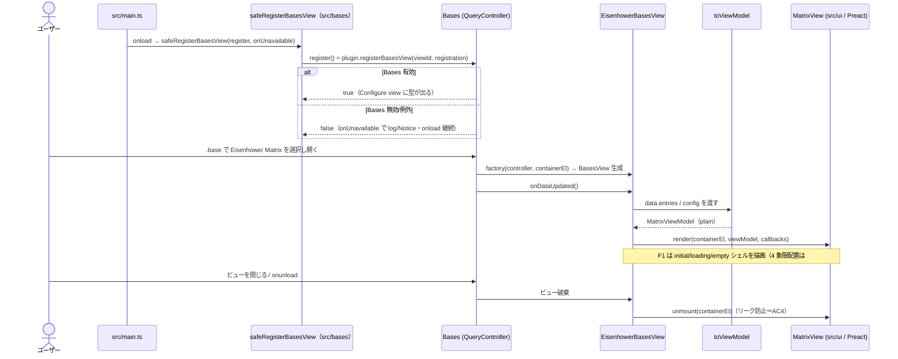

# Bases アダプタ層 設計

> Issue #18（F1）・#19（F2）で実装した現状を反映。churn しやすい Bases API 接触面を本領域（`src/bases/`）に隔離する設計の真実源。API 事実は要件定義書「9. 未決事項（スパイク #16 確定）」に接地する。ドラッグ書き戻し（#20）、軸プロパティ設定 UI（#21）は本領域に積み増す。

## 責務（このユニットは何をするか）

Obsidian Bases のカスタムビューとして Eisenhower マトリクスを登録し、Bases API（`registerBasesView`／`BasesView`／`QueryController`／`BasesEntry.getValue`／ビュー設定）への接触を 1 領域に集約する。各エントリを **Bases 非依存の ViewModel** に変換して UI（`src/ui`）へ渡し、UI・純ロジック（`src/logic`）が Bases 型へ直接依存しないようにする（疎結合化＝AC5）。

F1（#18）の範囲は **登録・graceful 失敗処理・描画経路・解除（リーク防止）・境界契約**まで。#19（F2）で**各エントリの軸値読み取り（absent 判定）と 4 象限＋未分類への事前グルーピング**を追加した（`readAxis.ts`／`toViewModel.ts`）。ドラッグ書き戻しは #20（F3）、軸プロパティ設定 UI は #21（F4）で本領域に積み増す。

## 構成要素（主要コンポーネント／モジュール）

```mermaid
flowchart TD
    main["src/main.ts<br/>onload: safeRegisterBasesView 経由で<br/>registerBasesView を呼び factory に EisenhowerBasesView を配線"]
    main -->|register コールバック注入| reg["src/bases/registerView.ts<br/>safeRegisterBasesView（false/例外を graceful 処理）＋VIEW_ID/NAME/ICON"]
    main -->|factory| view["src/bases/EisenhowerBasesView.ts<br/>BasesView サブクラス"]
    view -->|onDataUpdated| map["src/bases/toViewModel.ts<br/>entries → MatrixViewModel 変換"]
    map --> vm["MatrixViewModel（Bases 非依存の plain データ）"]
    view -->|render(container, vm, callbacks)| ui["src/ui/MatrixView.tsx<br/>Preact render（F1: シェル＋状態表示）"]
    view -->|onunload で unmount| unmount["preact unmount + container クリア"]
    ui --> logic["src/logic/（classifyQuadrant 等・#19 で接続）"]
```

- **`src/bases/registerView.ts`** — ビュー定数（`VIEW_ID`/`VIEW_NAME`/`VIEW_ICON`）と **`safeRegisterBasesView(register, onUnavailable)`**。`register`（＝`plugin.registerBasesView(...)`）をコールバックで受け、戻り値 `false`（Bases 無効）や API 例外を `console`／`Notice` で握って `onload` を継続させる（AC2）。obsidian ランタイムに依存しない純ラッパなので単体テスト可能。実際の `registerBasesView` 呼び出しと factory 配線は `src/main.ts` が行う（手動/結合で担保）。
- **`src/bases/EisenhowerBasesView.ts`** — `BasesView` サブクラス。コンストラクタで loading シェルを描画し、`onDataUpdated()` で `data.data`（`BasesEntry[]`）から `toViewModel` で ViewModel を組み `MatrixView` の `render()` を呼ぶ（AC3）。`onunload()` で Preact ルートを `unmount` する（AC4）。`extends BasesView`＝obsidian ランタイム必須のため単体テスト対象外。
- **`src/bases/toViewModel.ts`** — `BasesEntry[]` を **`MatrixViewModel`** へ変換する純関数（`import type` のみで obsidian 非依存＝単体テスト可能）。entry の `id`（file.path）/`title`（file.basename）と state（empty/ready）に加え、#19 で各 entry の軸値を読み `classifyQuadrant` で **4 象限＋未分類に事前グルーピング**した `placements` を組む（`.base` 自己エントリ・軸欠損ノートは両軸 absent → 未分類に落ちるため特別なフィルタは持たない）。`config`（ビュー options）と設定を受け取り {@link resolveAxisPropertyIds} で軸 propertyId を解決する。
- **`src/bases/readAxis.ts`** — 軸プロパティの解決と軸値の正規化（#19）。`resolveAxisPropertyIds(config, settings)` がビュー options（`config.getAsPropertyId`・主）→設定デフォルト（`note.<name>`）の順で両軸 propertyId を解決し、`readAxisValues(entry, ids)` が `entry.getValue` の `Value` を **absent（NullValue: `toString()===null`）/true/false** に正規化する（`import type` のみで単体テスト可能）。
- **`src/bases/types.ts`** — 境界 ViewModel 型（`MatrixViewModel`/`MatrixEntry`/`MatrixState`/`MatrixCallbacks`）。`src/ui` はこの型のみに依存し、`obsidian`/Bases 型を import しない（AC5。`MatrixCallbacks` は F1 では空で、F3/F5 で操作を足す）。

## データフロー・主要シーケンス



## 外部依存・インターフェース

- **Obsidian Plugin API**（スパイク #16 で実機確定。型は obsidian 1.13.x 型定義に存在）:
  - `Plugin.registerBasesView(viewId: string, registration): boolean`（`false`＝Bases 無効）
  - `BasesViewFactory = (controller: QueryController, containerEl: HTMLElement) => BasesView`
  - `BasesView`（抽象）: `config: BasesViewConfig`・`allProperties: BasesPropertyId[]`・`data: BasesQueryResult`・`abstract onDataUpdated()`
  - `BasesEntry.getValue(propertyId): Value | null`・`BasesEntry.file: TFile`（軸読み取りは #19）
- **境界 ViewModel 型（`src/bases/types.ts`・本契約が AC5 の核）** — `src/ui` はこの型にのみ依存する:
  ```ts
  // Bases 非依存。obsidian 型を一切含めない（file は TFile を直接出さず、
  // 開く操作に必要な情報＋コールバック経由でアダプタに委譲する）。
  export interface MatrixEntry {
    id: string;        // 安定キー（file.path 等）
    title: string;     // 表示名
    // urgent/important（boolean | undefined）は #19 で追加
  }
  export type MatrixState = "loading" | "empty" | "ready";
  export interface MatrixViewModel {
    state: MatrixState;
    entries: MatrixEntry[];   // F1 ではシェル表示用（配置は #19）
  }
  export interface MatrixCallbacks {
    // F3（#20）でドラッグ書き戻し、F5（#22）でカードを開く導線を足す。
    // F1 は空オブジェクトでよい（境界を先に確定させておく）。
  }
  ```
- **UI 入口**: `render(containerEl: HTMLElement, viewModel: MatrixViewModel, callbacks: MatrixCallbacks): void`（Preact `render()` を内部で呼ぶ命令的橋渡し）。`unmount(containerEl)` で破棄。
- **ビルド**: esbuild（`main.js`）。`minAppVersion` 1.12.0・`isDesktopOnly: true`（確定）。

## 主要な設計判断（現行の理由）

- **境界契約は「ViewModel 変換」を採用（#18 設計オプション比較で選択）**: アダプタが各 `BasesEntry` を Bases 非依存の `MatrixViewModel`（plain データ）へ変換し、UI は単一の `render(container, viewModel, callbacks)` 入口だけを受ける。`src/ui`・`src/logic` に `obsidian`/Bases 型を一切漏らさず AC5 の疎結合を構造で保証し、変換ロジックを純度高くテストできる。
  - **却下: 生 entries＋アクセサ注入** — 変換コードは減るが `BasesEntry` 型が UI 近傍に漏れ、AC5「UI/logic は Bases 型に直接依存しない」を弱める。Bases API churn（1.12 で options 破壊的変更の実績）が UI まで波及する。
  - **却下: ハイブリッド（薄い橋＋遅延読取）** — 中間案だが「どこまでが Bases 依存か」の境界が曖昧になり、テスト時に Bases モックが UI 側へ侵食する。
- **`registerBasesView=false` を graceful 処理**: Bases 無効 Vault でも例外を投げず log/Notice に留め、設定ロード等の他機能を壊さない（AC2）。
- **解除は Preact `unmount` を明示**: ビュー破棄・`onunload` で Preact ルートを `unmount` し DOM/購読リークを防ぐ（AC4）。
- **F1 で境界型を先に確定**（`MatrixCallbacks` は空でも置く）: F2〜F5 が同じ境界に積み増せるよう、契約面を最初に固定して後続の手戻りを避ける。
- **手動再描画は持たない**: 書き戻し→`onDataUpdated` 自動再発火で反応ループが閉じる（スパイク #16 確定）。F1 は描画経路の確立まで。

## UI/画面設計（F1 範囲＝シェル＋状態表示）

F1 が描画するのは Matrix ビューの **シェルと状態表示**のみ（2×2 グリッドの実レイアウト・カード配置は #19＝`ui.md` のワイヤーフレームが正）。

| 状態 | F1 の表示 |
|------|----------|
| 初期/ローディング | entries 取得中のプレースホルダ（「読み込み中…」） |
| 空（entries 0 件） | 空状態プレースホルダ（「表示するノートがありません」） |
| ready | コンテナを確保しマトリクス領域の枠を描画（カード配置は #19 で充填） |

- Obsidian テーマ変数（`--background-*`／`--text-*`）に追従しライト/ダーク両対応。`role`/`aria-label` を持たせ、キーボードフォーカス可能なランドマークにする。
- 詳細な画面構成・2×2 レイアウト・カード操作・a11y は `ui.md`（kind:ui）を真実源とし、本領域はアダプタ↔UI の橋渡し契約に責務を限定する。
