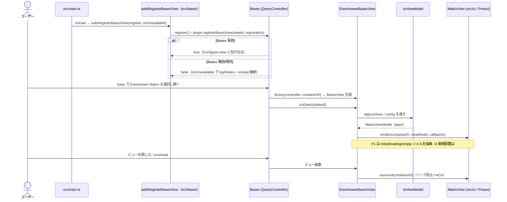

# Bases アダプタ層 設計

> Issue #18（F1）・#19（F2）で実装した現状を反映。churn しやすい Bases API 接触面を本領域（`src/bases/`）に隔離する設計の真実源。API 事実は要件定義書「9. 未決事項」に接地する。**#20（F3）でドラッグ書き戻し（`MatrixCallbacks.onMoveCard` ＋ `processFrontMatter`）を実装し `status: active` に確定した。** **#33 で absent 判定を `toString()===null`（スパイク #16 の誤観測）から `instanceof NullValue`（型同一性）へ是正した（実機 `scripts/e2e` プローブで確定）。** **#21（F4）で軸プロパティ設定 UI（ビュー options＝主・プラグイン設定＝デフォルトのハイブリッド）を本領域に積み増した: `registerBasesView` の `options` に `note.*` のみ選択可の軸プロパティセレクタを 2 つ宣言し、選択時（`filter`）・読み取り時・書き戻し時の 3 面で「書き戻せる `note.*` 軸」を単一述語 `isWritableAxisProperty` で判定する。** **#22（F5）でカード操作（開く/新タブ/プレビュー）を本領域に積み増した: `MatrixCallbacks` に `onOpenCard`/`onHoverCard` を追加し、アダプタが `workspace.getLeaf(...).openFile` と `workspace.trigger("hover-link", …)` を実装する（UI は修飾キー→`newLeaf` の plain データを渡すだけ＝AC5 維持。UI 側の相互作用設計は `ui.md`）。** **#34（fix）で軸値正規化を v1 の boolean 軸限定まで狭めた: `note.*` 接頭辞ガード（書き戻し可能性）に加え、値の型が `BooleanValue` の軸だけを 4 象限に分類し、非 boolean（数値 `NumberValue`／文字列 `StringValue` 等）や absent（`NullValue`）は未分類へ退避する（正の許可リスト `instanceof BooleanValue`）。これで非 boolean `note.*` 軸が 4 象限へ自動配置されてドラッグ露出する（無操作で上書き可能になる）経路を断つ。未分類からの手動ドラッグ書き戻しの無効化（書き戻し側の boolean ガード）は F4/#21 の範囲として残す（読み取り側のみ boolean に狭めた非対称）。**

## 責務（このユニットは何をするか）

Obsidian Bases のカスタムビューとして Eisenhower マトリクスを登録し、Bases API（`registerBasesView`／`BasesView`／`QueryController`／`BasesEntry.getValue`／ビュー設定）への接触を 1 領域に集約する。各エントリを **Bases 非依存の ViewModel** に変換して UI（`src/ui`）へ渡し、UI・純ロジック（`src/logic`）が Bases 型へ直接依存しないようにする（疎結合化＝AC5）。

F1（#18）の範囲は **登録・graceful 失敗処理・描画経路・解除（リーク防止）・境界契約**まで。#19（F2）で**各エントリの軸値読み取り（absent 判定）と 4 象限＋未分類への事前グルーピング**を追加した（`readAxis.ts`／`toViewModel.ts`）。ドラッグ書き戻しは #20（F3）、軸プロパティ設定 UI は #21（F4）で本領域に積み増す。

## 構成要素（主要コンポーネント／モジュール）

```mermaid
flowchart TD
    main["src/main.ts<br/>onload: safeRegisterBasesView 経由で<br/>registerBasesView を呼び factory に EisenhowerBasesView を配線"]
    main -->|register コールバック注入| reg["src/bases/registerView.ts<br/>safeRegisterBasesView（false/例外を graceful 処理）＋VIEW_ID/NAME/ICON"]
    main -->|factory| view["src/bases/EisenhowerBasesView.ts<br/>BasesView サブクラス"]
    view -->|onDataUpdated| map["src/bases/toViewModel.ts<br/>entries → MatrixViewModel 変換"]
    map --> vm["MatrixViewModel（Bases 非依存の plain データ）"]
    view -->|render(container, vm, callbacks)| ui["src/ui/MatrixView.tsx<br/>Preact render（F1: シェル＋状態表示）"]
    view -->|onunload で unmount| unmount["preact unmount + container クリア"]
    ui --> logic["src/logic/（classifyQuadrant 等・#19 で接続）"]
```

- **`src/bases/registerView.ts`** — ビュー定数（`VIEW_ID`/`VIEW_NAME`/`VIEW_ICON`）と **`safeRegisterBasesView(register, onUnavailable)`**。`register`（＝`plugin.registerBasesView(...)`）をコールバックで受け、戻り値 `false`（Bases 無効）や API 例外を `console`／`Notice` で握って `onload` を継続させる（AC2）。obsidian ランタイムに依存しない純ラッパなので単体テスト可能。実際の `registerBasesView` 呼び出しと factory 配線は `src/main.ts` が行う（手動/結合で担保）。
- **`src/bases/EisenhowerBasesView.ts`** — `BasesView` サブクラス。コンストラクタで loading シェルを描画し、`onDataUpdated()` で `data.data`（`BasesEntry[]`）から `toViewModel` で ViewModel を組み `MatrixView` の `render()` を呼ぶ（AC3）。`onunload()` で Preact ルートを `unmount` する（AC4）。`extends BasesView`＝obsidian ランタイム必須のため単体テスト対象外。
- **`src/bases/toViewModel.ts`** — `BasesEntry[]` を **`MatrixViewModel`** へ変換する純関数（`import type` のみで obsidian 非依存＝単体テスト可能）。entry の `id`（file.path）/`title`（file.basename）と state（empty/ready）に加え、#19 で各 entry の軸値を読み `classifyQuadrant` で **4 象限＋未分類に事前グルーピング**した `placements` を組む（**配置対象は Markdown ノート `file.extension === "md"` のみ**＝`.base` 自己エントリ・`.canvas`・画像等の非 md は `isPlaceableNote` で事前除外し、残る md ノートのうち軸欠損は両軸 absent → 未分類に落とす。md ノートが 0 件なら `state: "empty"`）。`config`（ビュー options）と設定を受け取り {@link resolveAxisPropertyIds} で軸 propertyId を解決する。
- **`src/bases/readAxis.ts`** — 軸プロパティの解決と軸値の正規化（#19・absent 判定は #33 で是正）。`resolveAxisPropertyIds(config, settings)` がビュー options（`config.getAsPropertyId`・主）→設定デフォルト（`note.<name>`）の順で両軸 propertyId を解決し、`readAxisValues(entry, ids)` が `entry.getValue` の `Value` を **absent（NullValue・`value instanceof NullValue`）/true/false** に正規化する。NullValue（値）を obsidian から import するため（実機は外部提供・esbuild external）、単体テストは vitest が obsidian の値 import を `src/test-support/obsidianStub.ts` へ解決する（型は `import type`）。**読み取り側も書き戻し可能な `note.*` のみを有効軸とし、`formula.*`／`file.*` が設定された軸は値があっても absent（undefined）扱いにして未分類へ落とす**（書き戻し側 `toFrontmatterKey` ガードと対称化＝「4 象限に並ぶのにドラッグすると必ず失敗するカード」を作らない）。**#21（F4）で「書き戻せる `note.*` 軸か」の判定を単一述語 `isWritableAxisProperty`（本ファイル＝`readAxis.ts` に配置）に集約し、`toFrontmatterKey` はこの述語を再利用する（options の `filter`・読み取り `readSingleAxis`・書き戻し `writeBackAxes` の 3 面が同一定義を共有＝軸許容ルールの二重管理を無くす）。述語を `readAxis.ts` に置くのは、`viewOptions.ts` が options キー（`URGENT_OPTION_KEY`/`IMPORTANT_OPTION_KEY`）と述語を `readAxis` から一方向 import できる形にし、`readAxis`↔`viewOptions` の循環依存を避けるため（`readAxis` が既に `NOTE_PROPERTY_PREFIX`・キー・`toFrontmatterKey` を持つ自然な置き場）。書き戻しの実行時ガードは `resolveWritableAxisKeys(config, settings)`（両軸を解決し、両方が書込可能 `note.*` なら frontmatter キー `{urgent, important}`、片方でも非 `note.*`、または**両軸が同一 frontmatter キー**〔リリース前レビューの question 対応。同一キーだと書き戻しが 2 度書いて後勝ちで潰れ、カードが意図しない象限へ飛ぶため弾く〕なら `null`）に切り出し、`EisenhowerBasesView.writeBackAxes` はこれが `null` のとき `processFrontMatter` を呼ぶ前に Notice で弾く（AC3＝frontmatter を壊さない）。ガード判定の純度を `readAxis` の単体テストに逃がした（`writeBackAxes` は `extends BasesView` で単体対象外）。** **#34（fix）で `normalizeAxis` を「値が `BooleanValue` のときだけ `isTruthy()` で boolean 化、それ以外（`NullValue`＝absent・`NumberValue`・`StringValue` 等）は `undefined`（未分類）」の正の許可リストに狭めた（v1 boolean 軸限定の型ガード。`BooleanValue` を obsidian から値 import＝`NullValue` と同じ流儀。`instanceof NullValue` 個別チェックは非 `BooleanValue` 退避に包含されるため撤去）。** **リリース前の詰めで `isUnsupportedAxisValue`／`hasUnsupportedAxisValue` を追加**（書込可能 `note.*` 軸に**非 boolean 値**を持つカードを検出し `toViewModel` が `MatrixEntry.locked` を立て UI がドラッグ不可にする＝未分類からの手動ドロップ破壊を封鎖。absent〔`NullValue`/null〕・`BooleanValue` は false で「欠損＝分類可」と区別する）。
- **`src/bases/viewOptions.ts`（#21 F4）** — `registerBasesView` に渡す**軸プロパティセレクタ options の純ビルダー**。`buildAxisViewOptions(): BasesPropertyOption[]` は緊急度・重要度の 2 軸ぶんのビュー option 定義（`key`＝`URGENT_OPTION_KEY`/`IMPORTANT_OPTION_KEY`、`type: "property"`、`displayName`、`placeholder`、`filter: isWritableAxisProperty`）を返す。軸許容ルールの述語 `isWritableAxisProperty` とキーは `readAxis.ts` から import する（真実源は 1 つ・循環回避）。`extends BasesView` 本体・`main.ts` の登録呼び出しは obsidian ランタイム依存で単体対象外のため、テスト可能な純度（キー・型・`filter` 挙動）をこのビルダーへ逃がす（`registerView.ts` の `safeRegisterBasesView` と同じ「純ラッパを切り出す」流儀）。`main.ts` は `registerBasesView(VIEW_ID, { name, icon, factory, options: () => buildAxisViewOptions() })` で配線する（`options` は `(config) => BasesAllOptions[]` の関数形。本ビューの options は config 非依存のため config を無視する）。
- **`src/bases/types.ts`** — 境界 ViewModel 型（`MatrixViewModel`/`MatrixEntry`/`MatrixState`/`MatrixCallbacks`）。`src/ui` はこの型のみに依存し、`obsidian`/Bases 型を import しない（AC5。`MatrixCallbacks` は F1 では空で、F3/F5 で操作を足す）。

## データフロー・主要シーケンス



## 外部依存・インターフェース

- **Obsidian Plugin API**（スパイク #16 で実機確定。型は obsidian 1.13.x 型定義に存在）:
  - `Plugin.registerBasesView(viewId: string, registration): boolean`（`false`＝Bases 無効）
  - `BasesViewFactory = (controller: QueryController, containerEl: HTMLElement) => BasesView`
  - `BasesView`（抽象）: `config: BasesViewConfig`・`allProperties: BasesPropertyId[]`・`data: BasesQueryResult`・`abstract onDataUpdated()`
  - `BasesEntry.getValue(propertyId): Value | null`・`BasesEntry.file: TFile`（軸読み取りは #19）
- **境界 ViewModel 型（`src/bases/types.ts`・本契約が AC5 の核）** — `src/ui` はこの型にのみ依存する:
  ```ts
  // Bases 非依存。obsidian 型を一切含めない（file は TFile を直接出さず、
  // 開く操作に必要な情報＋コールバック経由でアダプタに委譲する）。
  export interface MatrixEntry {
    id: string;        // 安定キー（file.path 等）
    title: string;     // 表示名
    // urgent/important（boolean | undefined）は #19 で追加
  }
  export type MatrixState = "loading" | "empty" | "ready";
  export interface MatrixViewModel {
    state: MatrixState;
    entries: MatrixEntry[];   // F1 ではシェル表示用（配置は #19）
  }
  export interface MatrixCallbacks {
    // F3（#20）でドラッグ書き戻し、F5（#22）で開く/プレビューを追加。いずれも UI は plain データを
    // 渡すだけで、TFile 解決・processFrontMatter・workspace 操作はアダプタ（EisenhowerBasesView）が
    // 担う（UI は obsidian 型に触れない＝AC5）。
    onMoveCard?(entryId: string, axisValues: { urgent: boolean; important: boolean }): Promise<void>;
    onOpenCard?(entryId: string, opts: { newLeaf: boolean }): void;                       // #22 F5
    onHoverCard?(entryId: string, targetEl: HTMLElement, event: MouseEvent): void;        // #22 F5
    onUndoMove?(): void;                                                                  // undo（最小実装）
  }
  ```
- **UI 入口**: `render(containerEl: HTMLElement, viewModel: MatrixViewModel, callbacks: MatrixCallbacks): void`（Preact `render()` を内部で呼ぶ命令的橋渡し）。`unmount(containerEl)` で破棄。
- **書き戻し（#20 F3）**: `EisenhowerBasesView` が `onMoveCard` を実装し、`entryId`（file.path）→ `app.vault.getAbstractFileByPath` で `TFile` を解決、解決済み軸 propertyId（`note.<key>`）から frontmatter キー（`<key>`）を取り出し、`app.fileManager.processFrontMatter(file, fm => { fm[urgentKey] = urgent; fm[importantKey] = important; })` で**両軸を明示 `true/false`** 書き込みする（`delete` しない＝v1 boolean 軸）。読み取り（`getValue`）と書き込み（`processFrontMatter`）は別系統。`processFrontMatter` が reject したら UI 側がロールバック＋`Notice`（`ui.md` のシーケンス参照）。
- **開く/プレビュー（#22 F5）**: `EisenhowerBasesView` が `onOpenCard`/`onHoverCard` を実装する。開く: `entryId`（file.path）→ 共通 `resolveTargetFile`（`getAbstractFileByPath`＋`instanceof TFile`。書き戻しと共有・欠落は `Notice`）で `TFile` を解決し、`app.workspace.getLeaf(newLeaf ? "tab" : false).openFile(file)`（素=現在リーフ／Mod+=新タブ）。プレビュー: `app.workspace.trigger("hover-link", { event, source: VIEW_ID, hoverParent: this, targetEl, linktext: entryId, sourcePath: entryId })` でコア page-preview を発火（表示可否はユーザーのコア設定に委ねる）。読み取り（`getValue`）とは別系統で、UI は `obsidian` 型に触れない。
- **undo（直前1手の元に戻す・最小実装）**: ドラッグ書き戻し（#20）が破壊的（両軸を `true/false` 上書き）なため、移動前の frontmatter 値を捕捉して復元する最小 undo を足す。純ロジックは `src/logic/undo.ts`（obsidian 非依存・単体テスト対象）、実機接触（`processFrontMatter`・`getAbstractFileByPath`・`addCommand`）はアダプタ／プラグインに隔離する。
  - **捕捉（`writeBackAxes` 内）**: `processFrontMatter` のコールバック内で**上書き前に**両軸キーの現在値を `capturePreviousAxes(frontmatter, keys)` で捕捉し（`hasOwnProperty` で absent と `false`/`undefined` を区別・値は verbatim 保持）、`UndoRecord { entryId, title(file.basename), keys, previous, wrote }` を組む（`wrote` は今回書き込んだ両軸 boolean＝復元前の同一性照合用）。書き込み成功後に `UndoManager.record(record)` で「直前 1 手」として保存（既存記録は上書き＝保持は 1 手のみ）。
  - **記録の所有（`UndoManager`・`src/logic/undo.ts`）**: プラグイン（`main.ts`）が単一の `UndoManager` を持ち、各 `EisenhowerBasesView` に注入する。コマンド（プラグイン全体）とビュー内トーストの双方がこの 1 記録を共有し「直前の移動」を一意に指す（複数ビューでは最後の移動を指す＝最小実装の割り切り）。
  - **復元（`runUndo(app, undoManager, messages, expectedEntryId?)`）**: `UndoManager` の記録を取り、`record.entryId` から `TFile` を解決（欠落は記録 `clear`＋`Notice`）し、`processFrontMatter(file, fm => { if (isUndoApplicable(fm, record)) applyUndo(fm, record) })` で present は代入・absent は delete。成否に関わらず `clear`（適用時は `undone`、非適用時は `noUndo` の `Notice`）。純関数 `applyUndo`/`capturePreviousAxes`/`isUndoApplicable` を単体テストし、`extends BasesView`／`app` 接触面（`runUndo`）は手動/結合で担保する（`writeBackAxes` と同じ切り分け）。`onDataUpdated` 自動再発火で再配置され、手動再描画は不要。**`expectedEntryId` ガード（複数ビュー誤爆対策・code-reviewer 指摘）**: トーストは特定ノートを名指しするため、トースト起動時は名指しノートの entryId を渡し、**現在の記録がその entry の移動でない場合（別ビューの移動で記録が置き換わった等）は戻さず `Notice`** を出す（無言で別ノートを undo しない）。コマンド起動は `expectedEntryId` を省略し「直前 1 手」を無条件に戻す。**同一性ガード（パス再利用/外部改変対策・2 段・レビュー指摘）**: undo は `entryId`（=file.path）でノートを再解決するため、移動後にそのパスが**別ノートで再利用**されていたり、ユーザー/他プラグインが軸値を書き換えていた場合、`previous` を適用すると無関係な値を上書き/`delete` しうる（undo は**唯一の delete 経路**のため影響が大きい）。2 段で塞ぐ:
    - **① 記録の無効化（`UndoManager.clearIfEntry`＋vault イベント）**: `main.ts` が `registerEvent` で `vault.on("delete")`／`vault.on("rename")` を購読し、記録した path のファイルが削除/リネームされたら `undoManager.clearIfEntry(path)` で記録を破棄する（rename は旧 path で判定）。パスが再利用される**前提条件（元ファイルの消滅）**の時点で記録を捨て、「削除→同名で作り直し→undo」で別ノートを壊す経路を根本から断つ。
    - **② 値照合（`isUndoApplicable`）**: ①をすり抜ける「削除/リネームを伴わない外部改変」に対し、復元前に `processFrontMatter` 内で「両軸が記録時に自分が書いた値（`record.wrote`）のままか」を照合し、不一致なら**復元せず記録を破棄**する（`noUndo`）。①で path 再利用は断つが、②は同一象限（同じ boolean 値）の別ノートまでは区別できない残存があり、file.path が唯一の安定キーである以上の割り切り（delete 経路は①で実質封鎖済み）。
  - **トリガー（コマンド＋トースト）**: `main.ts` が `addCommand({ id: "undo-last-move", name: messages.undoCommandName, callback })` を登録（ホットキーはユーザーが割当・Ctrl+Z 以外＝ネイティブ undo 非統合）。ビュー内トーストの「元に戻す」は `MatrixCallbacks.onUndoMove` 経由で同じ復元経路を呼ぶ（コマンドとトーストで `runUndo` を単一化＝重複させない）。記録が無いときは `Notice`（`messages.noUndo`）。
- **ビルド**: esbuild（`main.js`）。`minAppVersion` 1.12.0・`isDesktopOnly: true`（確定）。

## 主要な設計判断（現行の理由）

- **境界契約は「ViewModel 変換」を採用（#18 設計オプション比較で選択）**: アダプタが各 `BasesEntry` を Bases 非依存の `MatrixViewModel`（plain データ）へ変換し、UI は単一の `render(container, viewModel, callbacks)` 入口だけを受ける。`src/ui`・`src/logic` に `obsidian`/Bases 型を一切漏らさず AC5 の疎結合を構造で保証し、変換ロジックを純度高くテストできる。
  - **却下: 生 entries＋アクセサ注入** — 変換コードは減るが `BasesEntry` 型が UI 近傍に漏れ、AC5「UI/logic は Bases 型に直接依存しない」を弱める。Bases API churn（1.12 で options 破壊的変更の実績）が UI まで波及する。
  - **却下: ハイブリッド（薄い橋＋遅延読取）** — 中間案だが「どこまでが Bases 依存か」の境界が曖昧になり、テスト時に Bases モックが UI 側へ侵食する。
- **`registerBasesView=false` を graceful 処理**: Bases 無効 Vault でも例外を投げず log/Notice に留め、設定ロード等の他機能を壊さない（AC2）。
- **解除は Preact `unmount` を明示**: ビュー破棄・`onunload` で Preact ルートを `unmount` し DOM/購読リークを防ぐ（AC4）。
- **F1 で境界型を先に確定**（`MatrixCallbacks` は空でも置く）: F2〜F5 が同じ境界に積み増せるよう、契約面を最初に固定して後続の手戻りを避ける。
- **手動再描画は持たない**: 書き戻し→`onDataUpdated` 自動再発火で反応ループが閉じる（スパイク #16 確定）。F1 は描画経路の確立まで。
- **書き戻しはアダプタに隔離（#20）**: `MatrixCallbacks.onMoveCard` は両軸の boolean だけを受け、`TFile` 解決・frontmatter キー算出・`app.fileManager.processFrontMatter` 実行をアダプタ（`EisenhowerBasesView`）が担う。UI・logic に `obsidian` 型を漏らさず（AC5 維持）、書き込み経路を読み取り経路（`getValue`）と同じく 1 領域へ集約する。frontmatter キーの取り出し（`note.urgent`→`urgent`）は純関数として切り出し単体テスト対象にする（`extends BasesView` 本体は obsidian ランタイム必須で対象外のため、テスト可能な純度をキー算出に逃がす）。
- **開く/プレビューもアダプタに隔離（#22 F5）**: `onOpenCard`/`onHoverCard` は UI から plain データ（`entryId`・`newLeaf`・`targetEl`）だけを受け、`TFile` 解決・`workspace.openFile`・`hover-link` 発火をアダプタが担う（`onMoveCard` と同じ疎結合＝AC5 維持）。TFile 解決は書き戻しと共通の `resolveTargetFile` に集約して重複を避ける（#22 リファクタで抽出）。ホバープレビューはコア page-preview へ委譲し（`workspace.trigger("hover-link", …)`）プラグイン側で preview UI を再実装しない（表示可否はユーザーのコア設定に従う）。`extends BasesView` 本体は obsidian ランタイム必須で単体テスト対象外のため、開く/プレビューの往復は手動/結合で担保し、UI 側の意図算出（修飾キー→`newLeaf`・Enter 判定）は純関数（`src/ui/cardInteraction.ts`）として単体テストする。
- **absent 判定は型同一性 `instanceof NullValue`（#33）**: 欠損プロパティの `getValue` は **NullValue（singleton）** を返す。これを `value instanceof NullValue` で検出し、明示 `false`（BooleanValue・`isTruthy()===false`）と区別する。
  - **却下: `toString()===null`（旧実装・スパイク #16 の誤観測）** — 実機の `NullValue.toString()` は型契約どおり**文字列 `"null"`** を返す（JS `null` ではない）ため判定が機能せず、absent が false に誤判定され欠損ノートが Delete 象限に落ちていた（`scripts/e2e` の getValue プローブで `toStringType:"string"`・`toString:"null"` を実測）。
  - **却下: `constructor.name === "NullValue"`** — 実機ランタイムは minify 済みで constructor 名は `"t"`（プローブで実測）。名前依存は壊れる。型同一性（instanceof）は prototype チェーンで成立し、minify・文字列表現に依存しない。
  - **テスト容易性の代償**: readAxis に obsidian の**値** import（`NullValue`）が入り「`import type` のみ」ではなくなる。vitest は obsidian の値 import を最小スタブ（`src/test-support/obsidianStub.ts`）へ alias して単体テスト可能性を保つ（型は本物の `obsidian.d.ts`）。実機での成立は `scripts/e2e` の placements 検証で担保（absent/partial が未分類へ入る）。
- **v1 は boolean 軸限定＝正の許可リスト `instanceof BooleanValue`（#34）**: `note.*` 接頭辞ガード（書き戻し可能性）に加え、**値の型が `BooleanValue` の軸だけ** `isTruthy()` で boolean 化し、それ以外（`NullValue`＝absent・`NumberValue`・`StringValue` 等）は `undefined`（未分類）へ退避する。非 boolean の `note.*`（例: 数値 `note.priority: 3`）を軸に向けても 4 象限に並ばず未分類へ落ちるため、**無操作での自動配置＝ドラッグ露出**（4 象限のカードがそのまま掴めてドロップで `true/false` 上書き→数値/文字列破壊）という最も起きやすい経路を断つ。
  - **未分類からの手動ドラッグ破壊を UI ロックで封鎖（リリース前の詰めで解消）**: #34 は**読み取り側**（`normalizeAxis`）を boolean に狭めて 4 象限への自動配置＝ドラッグ露出は断ったが、未分類ゾーンのカードは `useDraggable` のままで、手動で 4 象限へドロップすると書き戻し側ガード `resolveWritableAxisKeys` は `note.*` を書込可能と判定して通過し（boolean 型を検査しない）非 boolean 値が破壊されうる残存点があった（当初 F4/#21 送り）。リリース前レビューで data-loss として再提起され封鎖した: `hasUnsupportedAxisValue(entry, ids)`（書込可能 `note.*` 軸に非 boolean 値を持つか。`isUnsupportedAxisValue` が `NullValue`/null と `BooleanValue` を false にして「absent」と「非 boolean 在中」を区別）で検出し `MatrixEntry.locked` を立て、`NoteCard` が locked カードを `useDraggable({disabled:true})`＝**ドラッグ不可**にして淡色＋鍵アイコンでマークする（クリックで開く導線は残しユーザーが値を直せる）。真に absent なカード（欠損）は `locked` を付けず従来どおり分類ドラッグ可。これで読み取り側（未分類化）＋ UI 側（ドラッグ不可）＋書き戻し側（`resolveWritableAxisKeys` の note.* ガード）で非 boolean 破壊経路を塞いだ（UI 詳細は `ui.md`、検証は `readAxis.test.ts`／`NoteCard.test.tsx`）。
  - **却下: 負の拒否リスト（`isTruthy()` を残し非 boolean 型を列挙除外）** — 既知の非 boolean 型（`NumberValue`/`StringValue`/…）を毎回列挙する必要があり、Obsidian が新しい Value 型を足すと既定で「分類される」（危険側に倒れる）。正の許可リストは未知/新規の型を既定で未分類にする（安全側に倒れる）。
  - **却下: 文字列/duck-typing（`toString()` が "true"/"false" か）** — #33 で是正した文字列表現依存への逆戻り（minify 済み constructor 名・ロケールに非依存でない）。型同一性 `instanceof` は minify にも文字列表現にも依存しない。
  - **テスト**: obsidian スタブ（`src/test-support/obsidianStub.ts`）に `BooleanValue`（`isTruthy()` を返す実クラス）と非 boolean Value 相当（`NumberValue`/`StringValue` の最小スタブ）を足し、非 boolean Value が未分類化されることを `readAxis.test.ts` で固定する。実機での `instanceof BooleanValue` 成立は `scripts/e2e` の placements 検証で担保（スタブ＝実機の同値性は単体では検証不能＝`NullValue` と同型の限界）。
  - **v2 余地**: 数値/タグ軸の型別解釈は v2 で設計する。本ガードは v1 の安全弁（非 boolean を触らせない）であり、許可リストに型別ブランチを足す形で自然に拡張できる。
- **配置対象は Markdown ノートのみ＝`file.extension === "md"`（リリース前の詰め・要件 §9）**: Bases のクエリ結果には（フィルタ未設定時に）Base 自身の `.base` ファイルや `.canvas`・画像等の非ノートが混ざりうる。v1 は boolean **frontmatter** 軸のみ扱うため、`toViewModel` の入口で `isPlaceableNote`（`file.extension === "md"`）により非 md を除外し、象限にも未分類にも出さない。当初は「`.base` は両軸 absent → 未分類に落ちるので特別なフィルタは持たない」としていたが、`.base` 自身が未分類カードとして現れるのは利用者に無意味な混乱を与えるため、明示除外へ改めた。
  - **却下: `.base`（`extension === "base"`）だけを名指し除外** — 問題を `.base` に限定できるが、`.canvas`・画像等の他の非 md も未分類に残る。frontmatter 軸を持ちうるのは md ノートのみ（v1）なので、**正の許可リスト（md のみ通す）** の方が「未知/新規の非ノート型を既定で除外する」安全側に倒れる（`instanceof BooleanValue` の許可リストと同じ思想）。
  - **却下: 除外せず未分類に残す（従来）** — `.base` 自己エントリが常に未分類ゾーンのカードとして現れ、ドロップ不可の“分類できないカード”をユーザーに見せ続ける。
  - **テスト**: `toViewModel.test.ts` で file スタブの `extension` を path 末尾から導出し、`.base`／`.canvas`／`.png` がカード化されないこと・md 0 件で `state: "empty"` を固定する。実機の非 md 混入は `docs/test/` の手動チェックリストで確認する。
- **軸許容ルールは単一述語 `isWritableAxisProperty`（`readAxis.ts`）に集約（#21 F4）**: 「書き戻せる `note.*` 軸か」の判定を 1 つの純関数に集約し、**options の `filter`（選択時に弾く）・読み取り `readSingleAxis`（非 note.* 軸を未分類へ）・書き戻し `writeBackAxes`（Notice で弾く）の 3 面が同じ定義を共有**する。選択・読み取り・書き戻しでルールがずれると「選べるのに壊れる」「読めるのに書けない」非対称が生まれるため、churn 面（options 宣言）と実行面（読み書き）を 1 述語で対称化する。述語は `readAxis.ts`（`NOTE_PROPERTY_PREFIX`・option キー・`toFrontmatterKey` の置き場）に置き、`viewOptions.ts` が一方向 import する（`readAxis`↔`viewOptions` の循環依存を避ける＝実装時の設計ドラフトから調整した点）。
  - **却下: 各面で `startsWith("note.")` をインライン** — 記述は最小だが 3 箇所に散り、v2 で数値/タグ軸の許容ルールを足すとき同期漏れが起きる。
  - **却下: 述語を `viewOptions.ts` に置く（初期ドラフト案）** — `viewOptions` が `readAxis` のキーを import し、`readAxis` が `viewOptions` の述語を import する双方向依存（循環）になる。ESM live-binding で動きはするが code smell のため、依存を一方向（`viewOptions`→`readAxis`）に正した。
- **options 宣言は純ビルダー `buildAxisViewOptions()` に切り出す（#21 F4）**: `registerBasesView` の `options` 配列を `main.ts` にインラインせず純関数へ逃がし、`filter` 挙動・option キー（`config.getAsPropertyId` が読むキーと一致）・`type` を単体テストで固定する。`main.ts`／`extends BasesView` は obsidian ランタイム必須で単体対象外のため、テスト可能な純度をビルダーへ寄せる（`safeRegisterBasesView` と同じ設計判断の踏襲）。churn しやすい options 型は実装時に実機 `obsidian.d.ts`（1.13.x）に照合済み: `options?: (config: BasesViewConfig) => BasesAllOptions[]`（関数形）・`BasesPropertyOption`（`type:'property'`・`key`・`displayName`・`filter?: (prop: BasesPropertyId) => boolean`）。スパイクは読み取り `getAsPropertyId` のみ確定だったが、options 登録型は型定義で確定した（AC ヒント `filter: (prop) => prop.startsWith("note.")` と一致）。
- **undo は純ロジック（捕捉/復元/1手保持）とアダプタ隔離（実機接触）に分ける**: 「何を捕捉し、どう復元するか」（`capturePreviousAxes`/`applyUndo`/`UndoManager`）を `src/logic/undo.ts` の obsidian 非依存な純関数・純状態に切り出して単体テストで固定し、`processFrontMatter`/`getAbstractFileByPath`/`addCommand` の実機接触は `writeBackAxes`（捕捉）・`runUndo`（復元）・`main.ts`（コマンド登録）に隔離する。`writeBackAxes` の破壊性テスト不能面（`extends BasesView`）に純ロジックを逃がす既存流儀（`resolveWritableAxisKeys`・`cardInteraction`）を踏襲。捕捉値は boolean に限定せず verbatim で持ち、万一非 boolean 値が書き込まれても undo で可逆に戻せる（#34 のデータ破壊防止を undo でも二重化）。
- **undo の記録は単一 `UndoManager` をプラグインが所有しビューへ注入**: コマンド（プラグイン全体）とビュー内トーストの双方が同一の「直前 1 手」を指すよう、記録の真実源を 1 箇所（プラグインの `UndoManager`）に置く。ビューは書き込み成功時に `record`、トリガーは `runUndo` で復元して `clear`。却下「ビューごとに記録を持つ」: コマンドがどのビューの記録を指すか曖昧になり、複数ビューで不整合。却下「トーストのローカル状態だけで復元」: コマンド経路と二重管理になる。複数ビューで別々に動かした場合は「最後の移動」を指す割り切り（最小実装・redo/多段なし）。**ただしトーストは特定ノートを名指しするため、`onUndoMove(expectedEntryId)` のガードで「記録が名指しの移動でなければ戻さず `Notice`」とし、無言で別ノートを undo する鋭いハザードだけは塞ぐ（code-reviewer 指摘）。コマンドは名指ししないため無条件に「直前 1 手」を戻す。**
- **AC1/AC4 の UI はすべて Bases ネイティブ（独自 Preact コンポーネントを持たない）（#21 F4）**: 軸選択 UI は Bases の Configure view が options 宣言から自動描画し、options 変更→`onDataUpdated` 自動再発火で再配置される（手動再描画なし）。書込不可軸のガードは既存 Notice を流用。ゆえに F4 は `src/ui` に差分を持たず、ビジュアル/UX 検証はロジック（filter/ガード/再解決）の単体テストと結合（実機 Configure view 操作）で担保する。

## UI/画面設計（F1 範囲＝シェル＋状態表示）

F1 が描画するのは Matrix ビューの **シェルと状態表示**のみ（2×2 グリッドの実レイアウト・カード配置は #19＝`ui.md` のワイヤーフレームが正）。

| 状態 | F1 の表示 |
|------|----------|
| 初期/ローディング | entries 取得中のプレースホルダ（「読み込み中…」） |
| 空（entries 0 件） | 空状態プレースホルダ（「表示するノートがありません」） |
| ready | コンテナを確保しマトリクス領域の枠を描画（カード配置は #19 で充填） |

- Obsidian テーマ変数（`--background-*`／`--text-*`）に追従しライト/ダーク両対応。`role`/`aria-label` を持たせ、キーボードフォーカス可能なランドマークにする。
- 詳細な画面構成・2×2 レイアウト・カード操作・a11y は `ui.md`（kind:ui）を真実源とし、本領域はアダプタ↔UI の橋渡し契約に責務を限定する。
