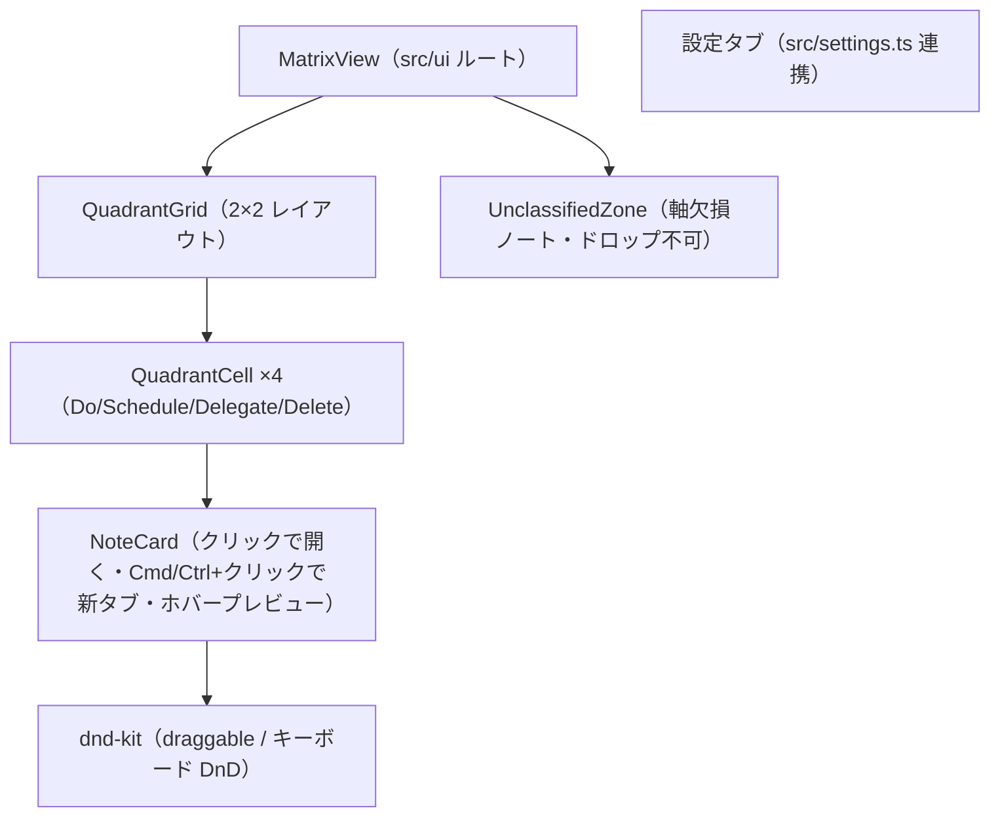
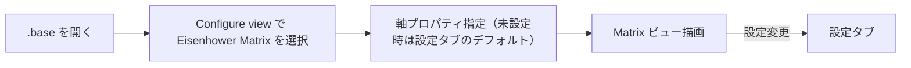

# UI 設計（draft）

> `status: draft`。実装着手時の「実装前設計」で画面構成・状態設計を確定し、実装後に `status: active` へ更新する。起点は `docs/要件定義書.md`「UI/UX 方針」節。

## 責務（このユニットは何をするか）

Bases のエントリを 2×2 Eisenhower マトリクス（＋未分類ゾーン）として描画し、カードのドラッグ（マウス／キーボード）で象限間を移動させ、frontmatter 書き戻しの結果を反映する。ライト/ダーク両テーマに追従するネイティブ馴染みの見た目を提供する。

## 構成要素（主要コンポーネント／モジュール）



## UI/画面設計

### 画面一覧と画面遷移

1. **Eisenhower Matrix ビュー** — 2×2 グリッド＋未分類ゾーン。各セルに軸ラベル（緊急/重要の有無）を明示し、カード一覧を表示。
2. **プラグイン設定タブ** — デフォルト軸プロパティ・象限ラベル/色・欠損ノート表示・i18n 言語。
3. **Bases の Configure view 内の軸プロパティ選択 UI** — ビュー単位の軸指定（書込不可プロパティは選択時に弾く＋Notice）。



### レイアウト（ワイヤーフレーム）

```
+-----------------------------+-----------------------------+
| 重要 × 緊急   [Do]          | 重要 × 非緊急 [Schedule]     |
|  - NoteCard                 |  - NoteCard                 |
|  - NoteCard                 |                             |
+-----------------------------+-----------------------------+
| 非重要 × 緊急 [Delegate]    | 非重要 × 非緊急 [Delete]     |
|  - NoteCard                 |  - NoteCard                 |
+-----------------------------+-----------------------------+
| 未分類ゾーン（軸欠損・ドロップ不可）:  - NoteCard ...        |
+-----------------------------------------------------------+
```

> 軸の向き（緊急を左右どちらに置くか）・ラベル文言・色は設定可能（向き反転は v2）。未決事項は `docs/要件定義書.md`「未決事項」。

### 状態設計（初期・ローディング・空・成功・エラー）

> **F1（#18）実装済みの範囲＝ビューのシェル＋状態表示**（`src/ui/MatrixView.tsx` の `render`/`unmount`）。2×2 グリッドの実レイアウトとカード配置は #19 で充填する。スクリーンショット: `docs/screenshots/18-matrix-shell-{desktop,mobile}-after.png`（ライト/ダーク×loading/empty/ready）。
>
> **#19 接続時に確定する申し送り（F1 のレビューで挙がった暫定）**:
> - **`empty` の表現**: F1 はシェル全体に 1 つのプレースホルダ文言（「表示するノートがありません」）を出す暫定。#19 でグリッド充填後は本表の「各象限に空プレースホルダ」へ作り替える。
> - **`ready` の支援技術への状態伝達**: F1 の `ready` シェルは `aria-label` 付きグループ＋空グリッド（`aria-hidden`）のみ。#19 でグリッドに意味を持つ要素が入るまでの間、状態遷移の連続性（読み込み完了が SR に伝わるか）を #19 着手時に再確認する。
> - **シェルの高さ依存**: `.eisenhower-matrix` は `min-height: 100%`＋`flex: 1 1 auto` で親（Bases ビューペイン）の高さに依存する。実機ペインが高さ 0 を与える場合に潰れないか #19 着手時に実機確認し、必要なら `ready` シェルにフォールバック `min-height` を入れる。

| 状態 | 表示 |
|------|------|
| 初期/ローディング | Bases から entries 取得中のプレースホルダ（F1: `role=status`／`aria-live=polite`） |
| 空（該当ノート 0 件） | 各象限に空プレースホルダ（F1 暫定: シェル全体に 1 文。#19 で象限別へ） |
| 軸欠損ノートあり | 未分類ゾーンに表示（ドロップ不可。設定で非表示可） |
| ドラッグ中 | 楽観的にカードを移動（書き込み確定前） |
| 書き戻し成功 | `onDataUpdated` で debounce 再描画して整合 |
| 書き戻し失敗 | 再描画でロールバック＋Notice 表示 |
| 書込不可プロパティ選択 | 選択を弾く＋Notice |

### デザイントークン参照

Obsidian テーマ変数を使用（ハードコードしない）: `--background-primary` / `--background-secondary` / `--text-normal` / `--text-muted` / `--interactive-accent` 等。4 象限は控えめなアクセント色で区別し、ライト/ダーク両テーマに追従する。

### アクセシビリティ

- **キーボード DnD**（dnd-kit 標準）でマウスなしでも象限間移動が可能。
- フォーカス可視・WCAG AA コントラスト（テーマ変数に追従）・aria/ラベル付与。

### コンポーネントカタログ

Obsidian 実機ロードを前提とするビュー本体は Storybook での再現が難しいため、**ロジックを含む純 UI 部品（NoteCard 等）に限り**カタログ化を検討する。実機前提の統合ビューはカタログ対象外とし、その opt-out 理由を本節に記す（要件定義書「UI/UX 方針」の合意に沿う）。スクリーンショットは `frontend-reviewer` が `docs/screenshots/` に保存した分を相対参照する。

## 主要な設計判断（現行の理由）

- **未分類ゾーンを独立領域にする**: absent（未定義）と `false`（最低象限 Delete）を視覚的に区別するため。欠損はドロップ不可（書き戻しは両軸明示が前提）。
- **楽観的更新＋ロールバック**: ドラッグの即応性を確保しつつ、書き込み失敗時は再描画で整合を取る。
- **テーマ変数追従**: 独自配色を持たず Obsidian テーマに馴染ませることで、ライト/ダーク両対応とコントラストをテーマ側に委ねる。
