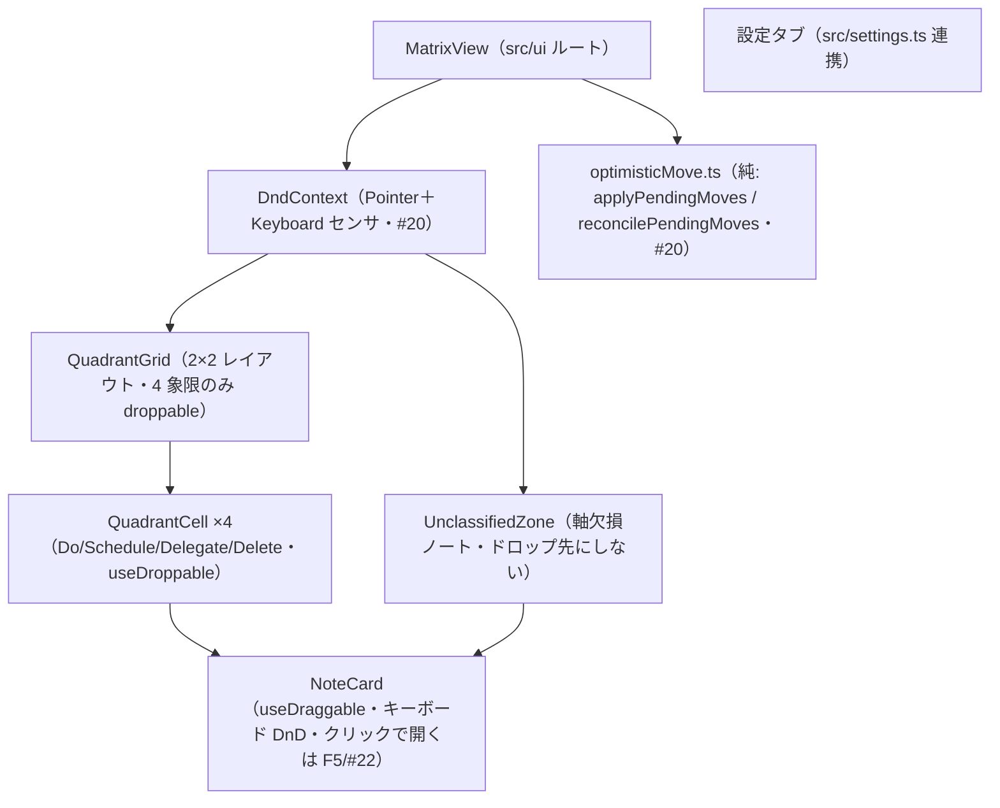
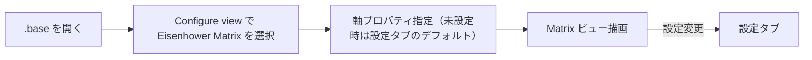
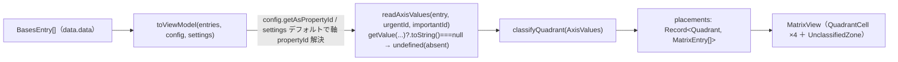
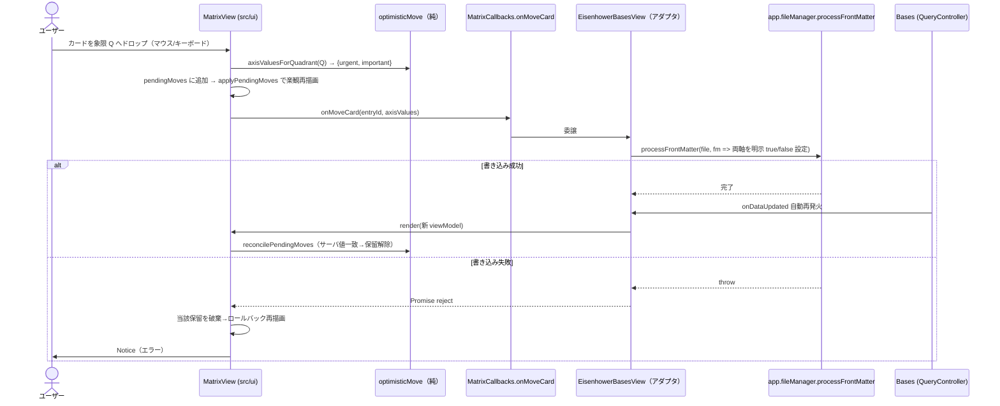

# UI 設計

> 起点は `docs/要件定義書.md`「UI/UX 方針」節。F1（#18）のシェル＋状態表示に続き、#19（F2）で 2×2 グリッド＋未分類ゾーンの配置を実装し `status: active` に確定した。**#20（F3）のドラッグ書き戻しを実装し `status: active` に確定した。**
>
> **#20（F3）の確定事項（2026-06-30・人間承認済み）**: ① レイアウトは #19 から据え置き（2×2 グリッド＋下部フル幅の未分類行）。F3 はドラッグ/ドロップのフィードバックとフォーカス可視を上乗せするだけ（新規ワイヤーフレーム比較なし）。② 楽観移動＋ロールバックは**純レデューサ抽出**＝`applyPendingMoves`（placements に保留中の移動を重ねる純関数）と `reconcilePendingMoves`（到着 props と突合して確定済みを落とす純関数）を `src/ui` の単体テスト対象として切り出す。dnd-kit 配線とドラッグ実操作は手動/`frontend-reviewer` で担保（DoD「軸値算出=単体、DnD往復=手動/結合」）。③ **4 象限のみドロップ可。未分類ゾーンはドロップ先にしない（AC4）。** ④ **未分類ゾーンのカード（両軸 absent）も象限へドラッグ可**＝ドロップで両軸を明示 `true/false` 書き込みして分類する（書き戻しは「両軸明示・`delete` しない」方針と整合）。⑤ AC2「ちらつき抑制」＝楽観移動で書込前から目的象限に見せ、`onDataUpdated` 再描画は `file.path` keyed 差分で吸収。「スクロール位置保持」＝コンテナ DOM を破棄せず Preact 差分更新する（`unmount` はビュー破棄時のみ）。⑥ 書き込み失敗は保留移動を取り消して再描画でロールバックし、`Notice` でエラー表示（AC3）。
>
> **#19（F2）の確定事項（2026-06-30・人間承認済み）**: ① レイアウトは「2×2 グリッド＋下部フル幅の未分類行」（下記ワイヤーフレーム）。② ViewModel は**事前グルーピング**＝アダプタ（`toViewModel`）が象限ごとに entries を振り分け、UI は dumb に描画する。③ `.base` 自身・軸プロパティ無しノートは**未分類ゾーンに表示**（両軸 absent → 自然に未分類へ落ちるため特別なフィルタは持たない）。④ absent 判定はスパイク #16 確定の `getValue(...)?.toString() === null`（NullValue）で行い、`false` と区別する（`isTruthy()` だけでは区別不可＝最低象限 Delete への誤分類バグになる）。⑤ 各象限の `aria-label` は「象限名（軸ラベル）」（件数は可視ヘッダで読み上げ）、空状態「なし」は AA を満たす `--text-muted`。

## 責務（このユニットは何をするか）

Bases のエントリを 2×2 Eisenhower マトリクス（＋未分類ゾーン）として描画し、カードのドラッグ（マウス／キーボード）で象限間を移動させ、frontmatter 書き戻しの結果を反映する。ライト/ダーク両テーマに追従するネイティブ馴染みの見た目を提供する。

## 構成要素（主要コンポーネント／モジュール）



## UI/画面設計

### 画面一覧と画面遷移

1. **Eisenhower Matrix ビュー** — 2×2 グリッド＋未分類ゾーン。各セルに軸ラベル（緊急/重要の有無）を明示し、カード一覧を表示。
2. **プラグイン設定タブ** — デフォルト軸プロパティ・象限ラベル/色・欠損ノート表示・i18n 言語。
3. **Bases の Configure view 内の軸プロパティ選択 UI** — ビュー単位の軸指定（書込不可プロパティは選択時に弾く＋Notice）。



### レイアウト（ワイヤーフレーム）

```
+-----------------------------+-----------------------------+
| 重要 × 緊急   [Do]          | 重要 × 非緊急 [Schedule]     |
|  - NoteCard                 |  - NoteCard                 |
|  - NoteCard                 |                             |
+-----------------------------+-----------------------------+
| 非重要 × 緊急 [Delegate]    | 非重要 × 非緊急 [Delete]     |
|  - NoteCard                 |  - NoteCard                 |
+-----------------------------+-----------------------------+
| 未分類ゾーン（軸欠損・ドロップ不可）:  - NoteCard ...        |
+-----------------------------------------------------------+
```

> 軸の向き（緊急を左右どちらに置くか）・ラベル文言・色は設定可能（向き反転は v2）。未決事項は `docs/要件定義書.md`「未決事項」。

### アダプタ → UI の境界（ViewModel 事前グルーピング・#19 確定）

`toViewModel` が各 entry の両軸値を読んで `classifyQuadrant`（`src/logic`）で象限を決め、**象限ごとに振り分けた構造**を ViewModel に組む。UI は振り分け済みデータを描画するだけ（グルーピング・件数・空状態の判定はアダプタ＝tested 層に集約）。



- **軸 propertyId 解決**: ビュー options（`config.getAsPropertyId(key)`）を主とし、未設定時は設定タブのデフォルト（`settings.defaultUrgencyProperty` / `defaultImportanceProperty`）にフォールバック（要件定義書 F4）。
- **absent 判定**: `entry.getValue(propertyId)?.toString() === null` で absent（NullValue）を検出し `undefined` に正規化。`true`/`false` は `isTruthy()` で boolean 化。片方でも absent なら `classifyQuadrant` が `unclassified` を返す。
- **`.base` 自身・軸無しノート**: 両軸 absent → `unclassified` に落ちるため特別扱い不要（カードとして未分類ゾーンに表示。AC6）。

### ドラッグ書き戻し（楽観更新＋ロールバック・#20 F3）

カードを別象限へドラッグ→ドロップすると、ドロップ先象限から `axisValuesForQuadrant`（`src/logic`）で両軸値を求め、**楽観的にカードを移動**してから `MatrixCallbacks.onMoveCard(entryId, axisValues)` でアダプタへ委譲する。アダプタは `app.fileManager.processFrontMatter` で**両軸を明示 `true/false`** 書き込み（`delete` しない）。成功時は Bases の `onDataUpdated` 自動再発火で整合し、失敗時は保留移動を取り消してロールバック＋`Notice`。

- **DnD**: `DndContext`（dnd-kit）に `PointerSensor`＋`KeyboardSensor` を載せ、マウス・キーボード双方で操作（AC5）。各 `NoteCard` は `useDraggable`（**未分類ゾーンのカードも draggable**＝ドロップで分類）、各 `QuadrantCell`（4 象限）は `useDroppable`。**未分類ゾーンは droppable にしない**ため、未分類への移動経路自体が存在しない（AC4。`axisValuesForQuadrant("unclassified")` の `null` も二重ガード）。
- **楽観状態（純レデューサ抽出）**: `MatrixView` は保留中の移動を `pendingMoves: Map<entryId, AxisValues>` で保持し、描画用 placements は純関数 `applyPendingMoves(props.placements, pendingMoves)` で算出する（保留 entry を目的象限へ移し両軸値を上書き）。新しい props（`onDataUpdated` 由来）が来たら `reconcilePendingMoves(pendingMoves, props.entries)` で**サーバ値が保留と一致した移動を落とす**（確定）。両関数は Bases 非依存の純関数として `src/ui/optimisticMove.ts` に切り出し単体テストする。
- **ロールバック**: `onMoveCard` の Promise が reject したら、その entry の保留移動を破棄して再描画（＝サーバ値の元象限へ戻る）し `Notice` を出す（AC3）。
- **ちらつき/スクロール（AC2）**: 楽観移動で書込前から目的象限に見えるため空白期間が出ない。カードは `file.path` を `key` にした keyed 差分で、`onDataUpdated` 再描画でも DOM が作り直されず位置・スクロールが保たれる（コンテナの `unmount` はビュー破棄時のみ）。



### 状態設計（初期・ローディング・空・成功・エラー）

> **F1（#18）実装済みの範囲＝ビューのシェル＋状態表示**（`src/ui/MatrixView.tsx` の `render`/`unmount`）。2×2 グリッドの実レイアウトとカード配置は #19 で充填する。スクリーンショット: `docs/screenshots/18-matrix-shell-{desktop,mobile}-after.png`（ライト/ダーク×loading/empty/ready）。
>
> **#19（F2）で解消した F1 申し送り**:
> - **`empty` の表現**: F1 のシェル全体 1 文プレースホルダ（「表示するノートがありません」＝entries 0 件）は維持しつつ、`ready` 時は**各象限セルが 0 件なら象限内に控えめな空プレースホルダ**を出す（象限別の空状態）。
> - **`ready` の支援技術への状態伝達**: グリッドに意味を持つ要素（4 象限セル＝`region`＋見出し、未分類ゾーン）が入ったため `aria-hidden` を外す。各象限は `aria-label`（**象限名＋軸ラベル**＝例「Do（重要 × 緊急）」）を持つランドマークにし、ランドマーク移動時に軸の文脈が伝わるようにする（件数は名前に含めず、ヘッダ内の可視テキストとして読み上げる＝変化する値を landmark 名に焼かない）。
> - **シェルの高さ依存**: グリッドは CSS Grid（`grid-template-columns: 1fr 1fr` / `1fr 1fr` 行）。親ペイン高さに追従しつつ、各セルに `min-height` を与えて高さ 0 ペインでも潰れないようにする。

| 状態 | 表示 |
|------|------|
| 初期/ローディング | Bases から entries 取得中のプレースホルダ（F1: `role=status`／`aria-live=polite`） |
| 空（entries 0 件） | シェル全体に 1 文プレースホルダ（「表示するノートがありません」） |
| ready・象限 0 件 | 該当象限セル内に控えめな空プレースホルダ（#19 で象限別に追加） |
| 軸欠損ノートあり | 未分類ゾーンに表示（ドロップ不可）。#19 時点では**常時表示**（`settings.showUnclassified` は定義済みだが未配線＝設定での非表示は設定タブ〔F6/#23〕整備時に honor する） |
| ドラッグ中 | ドラッグ元/ドロップ可象限を視覚フィードバック（#20）。ドロップで楽観的にカードを移動（書き込み確定前＝`applyPendingMoves`） |
| 書き戻し成功 | `onDataUpdated` 自動再発火で再描画し `reconcilePendingMoves` が保留を解除して整合（keyed 差分でちらつき/スクロール維持＝#20） |
| 書き戻し失敗 | 当該保留移動を破棄して再描画でロールバック＋`Notice` 表示（#20） |
| 書込不可プロパティ選択 | 選択を弾く＋Notice（F4/#21） |

### デザイントークン参照

Obsidian テーマ変数を使用（ハードコードしない）: `--background-primary` / `--background-secondary` / `--text-normal` / `--text-muted` / `--interactive-accent` 等。4 象限は控えめなアクセント色で区別し、ライト/ダーク両テーマに追従する。

### アクセシビリティ

- **キーボード DnD**（dnd-kit 標準）でマウスなしでも象限間移動が可能。カードは dnd-kit の `attributes` で `role="button"`・`tabindex`・`aria-roledescription` を持つ（キーボードで掴んで移動）。
- **カードは `role="button"`（`listitem` ではない）**: dnd-kit のドラッグ可能要素は `role=button` を付与するため `<ul><li>` の暗黙 `listitem` ロールは上書きされ、リスト件数の読み上げは失われる。件数は各象限ヘッダの可視テキスト＋`aria-label="N 件"` で補う（#20 のトレードオフ＝ドラッグ操作性を優先）。
- フォーカス可視（`:focus-visible` のアクセントリング。親の `overflow` で切れないよう**インセット** `outline-offset`）・WCAG AA コントラスト（テーマ変数に追従）・象限は region ランドマーク＋`aria-label`「象限名（軸ラベル）」。

### コンポーネントカタログ

Obsidian 実機ロードを前提とするビュー本体は Storybook での再現が難しいため、**ロジックを含む純 UI 部品（NoteCard 等）に限り**カタログ化を検討する。実機前提の統合ビューはカタログ対象外とし、その opt-out 理由を本節に記す（要件定義書「UI/UX 方針」の合意に沿う）。スクリーンショットは `frontend-reviewer` が `docs/screenshots/` に保存した分を相対参照する。

## 主要な設計判断（現行の理由）

- **ViewModel 事前グルーピング（#19 設計オプション比較で選択）**: `toViewModel` が象限ごとに entries を振り分け件数まで組む（`placements`）。配置・absent 区別・件数・空状態を Bases 非依存の純関数で単体テストでき、UI は描画に専念する。却下「フラット＋`quadrant` フィールド」: 型変更は最小だがグルーピング/件数判定が UI に漏れテストしにくい。
- **未分類ゾーンを独立領域にする**: absent（未定義）と `false`（最低象限 Delete）を視覚的に区別するため。欠損はドロップ不可（書き戻しは両軸明示が前提）。レイアウトは 2×2 グリッドの下にフル幅で常時表示（#19 で「下部フル幅 vs 折りたたみ」を比較し、常時表示の単純さ・縦積みのレスポンシブ性で前者を採択）。
- **`.base` 自身・軸無しノートは未分類に表示（除外しない）**: AC6「未分類（誤配置しない）」の literal な解釈。両軸 absent → `classifyQuadrant` が `unclassified` を返すため特別なフィルタを持たず、誤分類経路を増やさない（#19 で確認）。
- **未分類ゾーンの非表示設定（`showUnclassified`）は #19 では配線しない**: 設定値は `settings.ts` に定義済み（既定 true）だが、切替 UI（設定タブ＝F6/#23）が未実装で現状ユーザーが値を変える手段が無いため、消費側の honor は F6 着手時に入れる（#19 の AC スコープ＝象限配置・absent 区別に集中し、デッド挙動を作らない）。
- **楽観的更新＋ロールバック（#20）**: ドラッグの即応性を確保しつつ、書き込み失敗時は再描画で整合を取る。
- **楽観移動ロジックを純レデューサに抽出（#20 設計オプション比較で選択）**: `applyPendingMoves`／`reconcilePendingMoves` を Bases・dnd-kit 非依存の純関数（`src/ui/optimisticMove.ts`）として切り出し単体テストする。dnd-kit のドラッグ実操作は jsdom で再現困難なため、移動の状態遷移（楽観適用・確定・ロールバック）だけを純関数として赤→緑で固め、配線・実操作は手動/`frontend-reviewer` で担保する（DoD「軸値算出=単体、DnD 往復=手動/結合」と整合）。却下「コンポーネントレベルで dnd-kit イベント擬似発火」: jsdom で脆く、却下「手動のみ」: 状態遷移の回帰を自動で守れない。
- **ドロップ可は 4 象限のみ・未分類はドロップ先にしない（#20・AC4）**: 未分類ゾーンを `useDroppable` にしないことで「未分類への書き戻し」経路を構造的に消す。`axisValuesForQuadrant("unclassified")` の `null` 返却も二重ガードとして残す（書き戻しは両軸明示が前提）。
- **未分類カードも象限へドラッグ可＝分類できる（#20・人間承認）**: 両軸 absent のカードを象限へドロップすると両軸を明示 `true/false` 書き込みして分類する（「両軸明示・`delete` しない」方針と整合し、未分類ノートを片付ける自然な導線になる）。AC4 の「ドロップ不可」は未分類を**ドロップ先**にしないことを指し、未分類カードを**ドラッグ元**にすることは妨げない。
- **書き戻しは `processFrontMatter`（読みと別系統）**: 読み取りは Bases `getValue`、書き込みは標準 `app.fileManager.processFrontMatter`。アダプタ（`EisenhowerBasesView`）が `MatrixCallbacks.onMoveCard` を実装し、解決済み軸 propertyId（`note.<key>`）から frontmatter キー（`<key>`）を取り出して両軸を設定する。UI は `obsidian` 型に触れず、書き込み経路もアダプタ層に隔離（AC5 維持）。
- **テーマ変数追従**: 独自配色を持たず Obsidian テーマに馴染ませることで、ライト/ダーク両対応とコントラストをテーマ側に委ねる。
