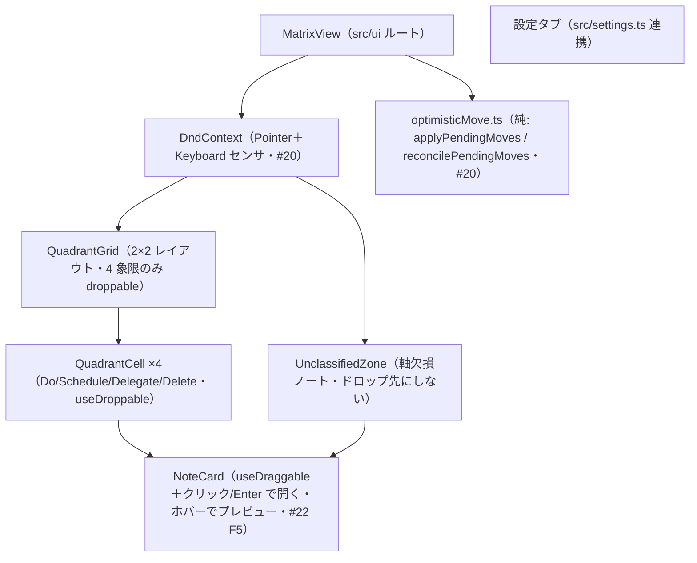
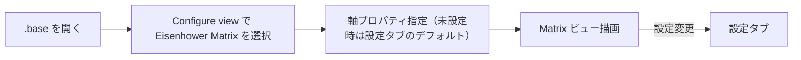
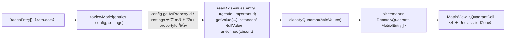
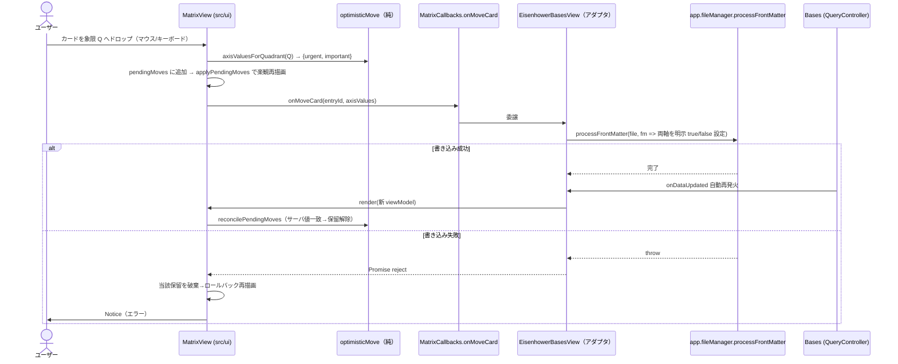
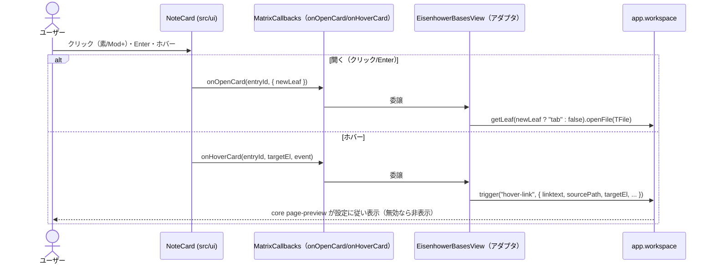

# UI 設計

> 起点は `docs/要件定義書.md`「UI/UX 方針」節。F1（#18）のシェル＋状態表示に続き、#19（F2）で 2×2 グリッド＋未分類ゾーンの配置を実装し `status: active` に確定した。**#20（F3）のドラッグ書き戻しを実装し `status: active` に確定した。** **#22（F5）のカード操作（開く/新タブ/プレビュー/キーボード）を実装し `status: active` に確定した。** **#23（F6）の設定タブ（デフォルト軸・象限ラベル/色・欠損表示・i18n 言語）を実装し `status: active` に確定した。**
>
> **undo（直前1手の元に戻す・最小実装）を実装し `status: active` に確定した（2026-07-02）**: ドラッグ書き戻しは破壊的（両軸を `true/false` 上書き）なため、**直前 1 手だけ**を元に戻す最小の undo を足した。トリガーは **(a) Obsidian コマンド（ホットキー割当可・パレット表示）と (b) 移動直後にビュー内へ出すトースト**の**両方**（人間承認済み）。いずれも **Obsidian ネイティブの Ctrl+Z とは非統合**（独自コマンドとして登録し、ネイティブ undo をフックしない）。復元は **完全復元**＝移動前の frontmatter 値を捕捉し、present は値を代入、**absent はキーを delete して未分類へ戻す**（人間承認済み。`delete` はこの undo 経路のみで、分類ドラッグは引き続き delete しない＝v1 boolean 軸限定の制約を崩さない）。トーストは分離コンポーネント `UndoToast`（`role="group"`＋aria-label＝二重読み上げ回避・明示 focus-visible）で、frontend-reviewer 指摘を反映済み。詳細な捕捉/復元の配線（`UndoRecord`・`UndoManager`・`runUndo`・コマンド登録）は `bases.md`。
>
> **#23（F6）の確定事項（2026-07-01・人間承認済み・実装済み）**: 設定タブ（`PluginSettingTab`＝`src/settingsTab.ts`）でデフォルト軸プロパティ・欠損ノート表示トグル・象限ラベル/色・表示言語を編集し `saveData` で永続化する（AC5。再読込は `mergeSettings` が浅い `Object.assign` の欠損を補完）。確定した設計判断: ① **データフローは ViewModel 拡張**＝`toViewModel` が解決済みの象限ラベル（カスタム or 言語既定）・色・UI 文言を `MatrixViewModel.presentation`（`src/bases/presentation.ts`）に載せ、UI は受領値を描画（既存 `showUnclassified` と同一経路・UI は Bases 非依存維持・単体テスト可）。② **i18n は Auto 追従＋手動上書き**＝既定は Obsidian のアプリ言語（en/ja）に追従し、設定の言語ドロップダウン（Auto/English/日本語）で明示上書き可。翻訳テーブルは `src/i18n.ts`（`en`/`ja`）に集約し `MatrixView.tsx` のハードコード文言を置換（同ファイル冒頭コメントが起点と明示）。〔後日拡張: リリース前レビューで設定タブ・Bases 軸セレクタ displayName・アダプタ Notice・件数/括弧ジョイナも i18n 化。下記「設定タブ設計」を正とする〕③ **色は象限ごとカラーピッカー＋リセット**＝4 象限それぞれ hex を設定でき ↺ でカスタムを消しテーマ既定へ戻せる。**未設定象限はテーマの `--interactive-accent`（ライト/ダーク追従）で描画し、既定色を独自定数で持たない**（プラグインの「配色をハードコードしない」方針と整合。カスタム値の AA 確保はユーザー責務）。設定タブのカラーピッカーは未設定時にテーマの `--interactive-accent`（hex 時）を初期スウォッチに出し、設定画面と実描画の食い違いを防ぐ。④ **設定タブはセクション区分レイアウト**（`setHeading` で 軸／表示／象限ラベル・色／言語 を区分）。⑤ **反映タイミング**＝設定変更時に開いている Eisenhower ビューを再描画し即時反映（AC1/AC2。プラグインが live ビュー登録簿 `Set<EisenhowerBasesView>` を保持し、各ビューの `constructor` で登録・`onunload` で解除・`saveSettings` 後に `refresh`）。⑥ **ラベル×言語の相互作用**＝カスタムラベルは空（空白のみを含む）＝言語既定にフォールバック。言語切替は空項目の既定文言のみ変え、明示入力したカスタムラベルは保持（リセット ↺ でカスタムを消し言語既定へ戻す）。⑦ **軸の向き反転は対象外**（v2・要件「未決事項」）。
>
> **#22（F5）の確定事項（2026-07-01・人間承認済み）**: ① **相互作用モデルはカード全体**＝カード本体が「ドラッグ元」かつ「開く対象」を兼ねる（専用ドラッグハンドルは設けない＝レイアウト据え置き・新規ワイヤーフレーム比較なし。#20 と同様に F5 は操作の上乗せのみ）。② **キーボードは Enter=開く / Space=掴む**に整理する＝dnd-kit `KeyboardSensor` の起動キーを **Space のみ**に remap し、AC4 の Enter を「開く」に解放する（#20 の「Enter/Space どちらでも掴む」から変更。読み上げ説明も「スペースで掴み…」へ更新）。③ **クリックとドラッグの両立**のため `PointerSensor` に距離活性化制約（`activationConstraint: { distance: 5 }`）を足す＝微小移動は掴みにならずクリック（開く）として成立させる。④ **開く/プレビューはコールバック委譲**＝`MatrixCallbacks` に `onOpenCard(entryId, { newLeaf })`・`onHoverCard(entryId, targetEl)` を追加し、UI は修飾キーから `newLeaf` を算出して plain データで渡す（`TFile` 解決・`workspace` 操作・`hover-link` 発火はアダプタ。UI は `obsidian` 型に触れない＝AC5 維持）。⑤ **ホバープレビューはコア設定に委譲**＝ホバーで `app.workspace.trigger("hover-link", …)` を発火し、実際に出すか否かはユーザーのコア「ページプレビュー」設定に委ねる（プラグイン側でプレビューを再実装しない）。native `title` ツールチップは二重表示回避のため撤去する。
>
> **#20（F3）の確定事項（2026-06-30・人間承認済み）**: ① レイアウトは #19 から据え置き（2×2 グリッド＋下部フル幅の未分類行）。F3 はドラッグ/ドロップのフィードバックとフォーカス可視を上乗せするだけ（新規ワイヤーフレーム比較なし）。② 楽観移動＋ロールバックは**純レデューサ抽出**＝`applyPendingMoves`（placements に保留中の移動を重ねる純関数）と `reconcilePendingMoves`（到着 props と突合して確定済みを落とす純関数）を `src/ui` の単体テスト対象として切り出す。dnd-kit 配線とドラッグ実操作は手動/`frontend-reviewer` で担保（DoD「軸値算出=単体、DnD往復=手動/結合」）。③ **4 象限のみドロップ可。未分類ゾーンはドロップ先にしない（AC4）。** ④ **未分類ゾーンのカード（両軸 absent）も象限へドラッグ可**＝ドロップで両軸を明示 `true/false` 書き込みして分類する（書き戻しは「両軸明示・`delete` しない」方針と整合）。⑤ AC2「ちらつき抑制」＝楽観移動で書込前から目的象限に見せ、`onDataUpdated` 再描画は `file.path` keyed 差分で吸収。「スクロール位置保持」＝コンテナ DOM を破棄せず Preact 差分更新する（`unmount` はビュー破棄時のみ）。⑥ 書き込み失敗は保留移動を取り消して再描画でロールバックし、`Notice` でエラー表示（AC3）。
>
> **#19（F2）の確定事項（2026-06-30・人間承認済み）**: ① レイアウトは「2×2 グリッド＋下部フル幅の未分類行」（下記ワイヤーフレーム）。② ViewModel は**事前グルーピング**＝アダプタ（`toViewModel`）が象限ごとに entries を振り分け、UI は dumb に描画する。③ 軸プロパティ無しノートは**未分類ゾーンに表示**（両軸 absent → 自然に未分類へ落ちる）。〔後日改定: `.base` 自身・非 md は `isPlaceableNote`（`file.extension === "md"`）で配置対象から除外＝未分類にも出さない。現行は下記「主要な設計判断」を正とする〕④ absent 判定は `getValue(...) instanceof NullValue`（型同一性）で行い、`false` と区別する（`isTruthy()` だけでは区別不可＝最低象限 Delete への誤分類バグになる。#33 で `toString()===null` から是正＝スパイク #16 の誤観測。詳細は `bases.md`）。⑤ 各象限の `aria-label` は「象限名（軸ラベル）」（件数は可視ヘッダで読み上げ）、空状態「なし」は AA を満たす `--text-muted`。

## 責務（このユニットは何をするか）

Bases のエントリを 2×2 Eisenhower マトリクス（＋未分類ゾーン）として描画し、カードのドラッグ（マウス／キーボード）で象限間を移動させ、frontmatter 書き戻しの結果を反映する。ライト/ダーク両テーマに追従するネイティブ馴染みの見た目を提供する。

## 構成要素（主要コンポーネント／モジュール）



## UI/画面設計

### 画面一覧と画面遷移

1. **Eisenhower Matrix ビュー** — 2×2 グリッド＋未分類ゾーン。各セルに軸ラベル（緊急/重要の有無）を明示し、カード一覧を表示。
2. **プラグイン設定タブ** — デフォルト軸プロパティ・象限ラベル/色・欠損ノート表示・i18n 言語。
3. **Bases の Configure view 内の軸プロパティ選択 UI** — ビュー単位の軸指定（書込不可プロパティは選択時に弾く＋Notice）。



### レイアウト（ワイヤーフレーム）

```
+-----------------------------+-----------------------------+
| 重要 × 緊急   [Do]          | 重要 × 非緊急 [Schedule]     |
|  - NoteCard                 |  - NoteCard                 |
|  - NoteCard                 |                             |
+-----------------------------+-----------------------------+
| 非重要 × 緊急 [Delegate]    | 非重要 × 非緊急 [Delete]     |
|  - NoteCard                 |  - NoteCard                 |
+-----------------------------+-----------------------------+
| 未分類ゾーン（軸欠損・ドロップ不可）:  - NoteCard ...        |
+-----------------------------------------------------------+
```

> 軸の向き（緊急を左右どちらに置くか）・ラベル文言・色は設定可能（向き反転は v2）。未決事項は `docs/要件定義書.md`「未決事項」。

### 設定タブ設計（F6/#23）

`PluginSettingTab`（`src/settingsTab.ts`）を `main.ts` の `onload` で `addSettingTab` 登録する。Obsidian 標準 `Setting` を用い、`setHeading` で 4 区分（軸／表示／象限ラベル・色／言語）に分ける（ワイヤーフレーム案 A・人間承認済み）。

```
▸ 軸（デフォルト）
  緊急度プロパティ         [ urgent      ]
  重要度プロパティ         [ important   ]
▸ 表示
  欠損ノートを未分類に表示   [ ●── ON ]
▸ 象限ラベル・色
  Do（重要×緊急）      [ Do       ] [🎨#e5786d] [↺]
  Schedule（重要×非緊急）[ Schedule ] [🎨#4a9d8e] [↺]
  Delegate（非重要×緊急）[ Delegate ] [🎨#d9a441] [↺]
  Delete（非重要×非緊急）[ Delete   ] [🎨#8a8f98] [↺]
▸ 言語
  表示言語               [ Auto ▾ ]  (Auto / English / 日本語)
```

**設定スキーマ（`src/settings.ts` 拡張）**

```ts
type QuadrantKey = "do" | "schedule" | "delegate" | "delete";
interface EisenhowerSettings {
  defaultUrgencyProperty: string;              // 既存（F4）
  defaultImportanceProperty: string;           // 既存（F4）
  showUnclassified: boolean;                   // 既存（トグル UI を F6 で追加）
  language: "auto" | "en" | "ja";              // F6: 既定 "auto"（Obsidian 言語追従）
  quadrantLabels: Record<QuadrantKey, string>; // F6: 空文字/空白のみ="言語既定にフォールバック"
  quadrantColors: Record<QuadrantKey, string>; // F6: 空文字="テーマ既定（--interactive-accent）にフォールバック"
}
```

**i18n（`src/i18n.ts` 新規）**: `en`/`ja` の言語別メッセージ束（`Messages`）と、`resolveLanguage(setting, appLang)`（`auto` → `appLang`〔`main.ts` の `getObsidianLanguage()` が `localStorage['language']` を読む〕が `ja` 系なら ja、それ以外・未知・未設定は en にフォールバック）、束を返す `messagesFor(lang)` を持つ。`MatrixView.tsx` のハードコード文言（`MATRIX_LABEL`/`LOADING_TEXT`/`EMPTY_TEXT`/`EMPTY_QUADRANT_TEXT`／象限の既定ラベル・軸ラベル／未分類ラベル／SR 操作説明・アナウンス）を `Messages` のフィールド経由に置換する。**言語解決とメッセージ束の確定はアダプタ側**（`main.ts` の `resolveMessages()`）で行い、`toViewModel` が確定済み文字列を `MatrixViewModel.presentation` に載せる（UI は `language` を知らず dumb を維持＝AC5 の疎結合を崩さない）。

**i18n スコープの拡張（リリース前の詰め）**: 当初 F6 は i18n を `MatrixView` 文言に限定していたが、英語圏配布で設定タブ・軸セレクタ・Notice が日本語のまま残る不整合をレビューで検出し、次も `Messages` 経由に広げた: **① 設定タブ**（`settingsTab.ts` の見出し・設定名・説明・リセットツールチップ。`display()` は解決済み `messages` から出す）、**② Bases Configure view の軸セレクタ `displayName`**（`viewOptions.buildAxisViewOptions(messages)`。`main.ts` は options 評価時点の `resolveMessages()` を渡して言語追従させる）、**③ アダプタ層 `Notice`**（ファイル欠落〔移動/オープン〕・非 note.* 軸・書戻し失敗・オープン失敗＝`EisenhowerBasesView` が `getMessages()` で出す。Bases 無効時の登録失敗 Notice〔`main.ts`〕も `resolveMessages()` 経由で言語追従。undo 系 Notice と同じ流儀）、**④ 象限の件数 `aria-label`**（`messages.itemCount(n)`。英 "5 items"／日 "5 件"）、**⑤「ラベル（軸ラベル）」の括弧ジョイナ**（`messages.labelWithAxis`＝英は半角括弧 `( )`・日は全角 `（ ）`。`QuadrantCell` 領域名と設定行名で共有し、英語文脈への全角括弧混入を断つ）。UI/設定は解決済み文字列（または `itemCount`/`labelWithAxis` の関数）を受け取り、`language` 非依存を維持する。

**色の適用**: 解決済みの象限色を `MatrixViewModel` に載せ、`QuadrantCell` が当該セルへ**インライン CSS 変数** `--eisenhower-quadrant-accent` として付与、`styles.css` は `border-inline-start-color: var(--eisenhower-quadrant-accent, var(--interactive-accent))` で参照する。**空文字は変数を付けず、テーマの `--interactive-accent`（ライト/ダーク追従）にフォールバックする**（既定色を独自定数で持たない）。背景・文字はテーマ変数追従を維持し、アクセント色のみ上書きする。設定タブのカラーピッカーは未設定象限に対し、実描画と一致させるためテーマの `--interactive-accent`（hex 時）を初期スウォッチに出す。

**反映タイミング（AC1/AC2）**: 設定タブの各 `Setting.onChange` が `saveSettings()` を呼んだ後、**プラグインが保持する live な `EisenhowerBasesView` 群を再描画**する（各ビューの `render(toViewModel(this.data, this.config, getSettings()))` を再実行）。プラグインは生存中のビューを登録簿（`Set<EisenhowerBasesView>`）で保持し、ビューの `constructor` で登録・`onunload` で解除する。次の `onDataUpdated` 待ちにせず即時反映する。

**永続化（AC5）**: 既存 `saveSettings()`＝`saveData(this.settings)` を流用。拡張フィールドも同一 `data.json` に保存され、再起動後は `loadSettings`（`Object.assign(DEFAULT_SETTINGS, loadData())`）で復元される。`DEFAULT_SETTINGS` に F6 追加フィールドの既定（`language:"auto"`・ラベル/色は空文字）を足す。

**テスト方針（TDD 対象）**: 単体（`npm test`）で ① i18n 解決（`resolveLanguage` の auto/明示/未知フォールバック・`messagesFor` の言語別ラベル差）、② ラベル解決（カスタム空/空白→言語既定、非空→上書き）、③ 色解決（空→空文字＝テーマ既定、非空→上書き）、④ 設定読み書き（`mergeSettings` のフィールド/ネスト欠損の既定補完・不正 language フォールバック）を赤→緑で固める。設定タブ UI の実描画（`PluginSettingTab`・Obsidian 実機）とビュー再描画の往復は `frontend-reviewer`／手動で担保（アダプタ層と同じ「純ロジック=単体、実機配線=手動」の切り分け）。

**スクリーンショット（frontend-reviewer 確認済み・#23）**: マトリクス側のカスタム色・i18n ラベル・カスタムラベル上書きは harness（`scripts/preview`）でブラウザ描画して取得＝`docs/screenshots/23-matrix-{desktop,mobile}-{light,dark}-after.png`（カスタム色＋ja 既定ラベル＋カスタム do「今すぐやる」）・`23-matrix-i18n-en-desktop-light-after.png`（英語切替）・`23-matrix-desktop-light-before.png`（F6 前の基線）。設定タブ本体は Obsidian 標準 `Setting`（実機外で描画不可）のためコードレビュー＋実機目視で担保する。

### アダプタ → UI の境界（ViewModel 事前グルーピング・#19 確定）

`toViewModel` が各 entry の両軸値を読んで `classifyQuadrant`（`src/logic`）で象限を決め、**象限ごとに振り分けた構造**を ViewModel に組む。UI は振り分け済みデータを描画するだけ（グルーピング・件数・空状態の判定はアダプタ＝tested 層に集約）。



- **軸 propertyId 解決**: ビュー options（`config.getAsPropertyId(key)`）を主とし、未設定時は設定タブのデフォルト（`settings.defaultUrgencyProperty` / `defaultImportanceProperty`）にフォールバック（要件定義書 F4）。
- **absent 判定**: `entry.getValue(propertyId) instanceof NullValue` で absent（NullValue singleton）を検出し `undefined` に正規化（#33 で `toString()===null` から是正＝実機の `NullValue.toString()` は文字列 "null" を返すため。詳細は `bases.md`）。**値が `BooleanValue` の軸だけ** `isTruthy()` で boolean 化し、非 boolean の `note.*`（数値 `NumberValue`／文字列 `StringValue` 等）は `undefined`（未分類）へ退避する（v1 boolean 軸限定の正の許可リスト `instanceof BooleanValue`・#34。詳細は `bases.md`）。片方でも absent/非 boolean なら `classifyQuadrant` が `unclassified` を返す。
- **非 md（`.base` 自身・`.canvas`・画像）**: `toViewModel` の入口 `isPlaceableNote`（`file.extension === "md"`）で配置対象から除外する（象限にも未分類にも出さない。md 0 件は `state: "empty"`）。軸無し（両軸 absent）の md ノートは `unclassified` に落ちて未分類ゾーンに表示（AC6）。詳細は `bases.md`。

### ドラッグ書き戻し（楽観更新＋ロールバック・#20 F3）

カードを別象限へドラッグ→ドロップすると、ドロップ先象限から `axisValuesForQuadrant`（`src/logic`）で両軸値を求め、**楽観的にカードを移動**してから `MatrixCallbacks.onMoveCard(entryId, axisValues)` でアダプタへ委譲する。アダプタは `app.fileManager.processFrontMatter` で**両軸を明示 `true/false`** 書き込み（`delete` しない）。成功時は Bases の `onDataUpdated` 自動再発火で整合し、失敗時は保留移動を取り消してロールバック＋`Notice`。

- **DnD**: `DndContext`（dnd-kit）に `PointerSensor`＋`KeyboardSensor` を載せ、マウス・キーボード双方で操作（AC5）。各 `NoteCard` は `useDraggable`（**未分類ゾーンの欠損カードも draggable**＝ドロップで分類。ただし非 boolean 軸値のカードは `entry.locked` で `disabled`＝ドラッグ不可にしデータ破壊を防ぐ＝下記「主要な設計判断」）、各 `QuadrantCell`（4 象限）は `useDroppable`。**未分類ゾーンは droppable にしない**ため、未分類への移動経路自体が存在しない（AC4。`axisValuesForQuadrant("unclassified")` の `null` も二重ガード）。
- **ドラッグの視覚追従（`DragOverlay`）**: 象限セルは `overflow:hidden` のため掴んだカードに `transform` を直接当てるとセル境界でクリップされる。代わりに `DndContext` 直下に `DragOverlay` を置き、`onDragStart`/`onDragEnd`/`onDragCancel` で `activeId` を持って**掴んでいるカードの複製をグリッド外レイヤに浮遊描画**して指/カーソルへ追従させる（元カードは `--dragging` で減光）。キーボードドラッグでもドロップ先が視認できる（レビュー指摘）。**ただし `DragOverlay` は `position: fixed` で描画され、Obsidian の `.workspace-leaf` が `contain: strict`（layout/paint 包含）＝fixed の包含ブロックを新規作成するため、この階層に描くと座標原点がビューポートではなくアクティブなリーフ左上へずれ、掴んだカードがカーソルからリーフの画面オフセットぶん一定量ずれる（#43。実機 devtools で `contain: strict` と、wrapper 指定 `left:316.167` に対し実描画 `left:609.667`＝差 293.5px を確認）。`createPortal` で `contain` されない body（ビューの `ownerDocument.body`＝メイン window / ポップアウト別ウィンドウ両対応）直下へ描画し、原点をビューポートへ戻す（`createPortal` は DOM 位置のみ移し、仮想ツリー上は `DndContext` の子のままなので context は貫通する。クリップ回避は維持）。**
- **楽観状態（純レデューサ抽出＋世代/in-flight）**: `MatrixView` は保留中の移動を `pendingMoves: Map<entryId, {urgent, important, generation}>` で保持し、描画用 placements は純関数 `applyPendingMoves(props.placements, pendingMoves)` で算出する。新しい props（`onDataUpdated` 由来）が来たら `reconcilePendingMoves(pendingMoves, props.entries, inFlightIds)` で**サーバ値が保留と一致した移動を落とす**（確定）。同一カードを in-flight 中に連続ドラッグした競合に備え、(a) 各書き込みに**世代**（連番）を付け、(b) entryId ごとの **in-flight 書き込み数**を `MatrixView` の ref で数えて reconcile へ渡す。in-flight 中の entry はサーバ値が偶然一致しても確定しない（古いスナップショットの coincidental match で最新保留を早期に落とさない）。純レデューサ（`applyPendingMoves`/`reconcilePendingMoves`）は Bases・dnd-kit 非依存で単体テストし、世代採番と in-flight 計数は `MatrixView`（dnd 配線側）が持つ。
- **ロールバック（最新世代のみ）**: `onMoveCard` の Promise が reject したら、**その書き込みが当該 entry の最新世代のときだけ**保留移動を破棄して再描画（＝サーバ値の元象限へ戻る）。古い書き込みの失敗で後続の新しい移動の楽観状態を巻き戻さない。ロールバック判定（`rollbackFailedMove`／`isLatestGeneration`）も SR 通知の種別判定（`settleAnnouncement(failed, isLatest) → success/failure/silent`）も純関数（`optimisticMove.ts`）へ抽出し単体テストで固定する（`MatrixView.settle` はそれらを呼ぶ細い結線に留める）。`Notice` はアダプタが出す（AC3）。
- **ちらつき/スクロール（AC2）**: 楽観移動で書込前から目的象限に見えるため空白期間が出ない。カードは `file.path` を `key` にした keyed 差分で、`onDataUpdated` 再描画でも DOM が作り直されず位置・スクロールが保たれる（コンテナの `unmount` はビュー破棄時のみ）。



### カード操作（開く/新タブ/プレビュー/キーボード・#22 F5）

カードは **ドラッグ元（#20）かつ「開く」対象**を兼ねる（専用ハンドルを設けずレイアウト据え置き）。開く・プレビューは Bases/Obsidian に触れず `MatrixCallbacks` 経由でアダプタへ委譲する（`onMoveCard` と同じ疎結合＝AC5）。

- **境界契約の追加（`src/bases/types.ts`）**:
  - `onOpenCard(entryId: string, opts: { newLeaf: boolean }): void` — UI が修飾キーから `newLeaf`（新タブ可否）を算出して渡す。アダプタが `file.path`（=entryId）から `TFile` を解決し `app.workspace.getLeaf(newLeaf ? "tab" : false).openFile(file)` で開く。
  - `onHoverCard(entryId: string, targetEl: HTMLElement, event: MouseEvent): void` — アダプタが `app.workspace.trigger("hover-link", { event, source: VIEW_ID, hoverParent, targetEl, linktext: entryId, sourcePath: entryId })` を発火。表示可否はコア「ページプレビュー」設定に委ねる（プラグインはプレビューを再実装しない）。
- **クリック（AC1/AC2）**: `NoteCard` 内側のドラッグ可能 `<div>` の `onClick` で、修飾キー（mac=`metaKey`／win=`ctrlKey`。`Keymap.isModEvent` 相当）を見て `newLeaf` を決め `onOpenCard` を呼ぶ。素のクリック＝現在のリーフ、Mod+クリック＝新タブ。
- **クリックとドラッグの両立**: `PointerSensor` に `activationConstraint: { distance: 5 }` を付け、5px 未満の移動は掴みにせずクリック（開く）として成立させる（ドラッグ直後の誤オープンを避ける・#20 の Pointer 無制約から変更）。
- **キーボード（AC4）**: `KeyboardSensor` の起動キーを **Space のみ**に remap（`keyboardCodes.start = ["Space"]`）して Enter を「開く」に解放する。`NoteCard` の `onKeyDown` で `Enter`（＋Mod で新タブ）→ `onOpenCard`。フォーカスは既存の `:focus-visible` インセットリングで可視（#20 から据え置き）。
- **ホバー（AC3）**: `onMouseEnter` で `onHoverCard` を呼ぶ。連続発火はコア側がデバウンスするため UI では抑制しない。native `title` 属性は撤去（コアプレビューと二重の素朴ツールチップを出さない）。



### undo（直前1手の元に戻す・最小実装）

ドラッグ書き戻し（#20）は両軸を `true/false` で上書きする破壊的操作のため、**直前 1 手だけ**を元に戻す最小の undo を足す。UI 側の責務は **(a) 移動成功直後にトーストを出す・(b) トーストの「元に戻す」ボタン／コマンドから `MatrixCallbacks.onUndoMove()` を呼ぶ**の 2 点で、実際の frontmatter 復元（値の代入／absent の delete）と「直前 1 手」の保持はアダプタ層（`bases.md` の `UndoManager`／`runUndo`）に隔離する（`onMoveCard` と同じ疎結合＝AC5 維持。UI は `obsidian` 型に触れない）。

- **境界契約の追加（`src/bases/types.ts`）**: `onUndoMove?(expectedEntryId?: string): void` — トースト／コマンドが起動する。アダプタが保持する「直前 1 手」の記録を復元し、無ければ `Notice`（「元に戻せる移動がありません」）を出す。**トースト起動時は名指しノートの `expectedEntryId` を渡す**（記録が別ビューの移動へ置き換わっていたら戻さないガード＝code-reviewer 指摘）。コマンド起動は省略し無条件に直前 1 手を戻す。復元の実体はアダプタ責務。
- **トースト（分離コンポーネント `src/ui/UndoToast.tsx`）**: `NoteCard`/`QuadrantCell` と同じく**分離した純 UI 部品**にして単体テスト可能にする（`MatrixView` は移動成功時に表示状態＝`{ message, entryId }` を持ち条件描画する。`entryId` は `onUndoMove` のガードに渡す）。props は `{ message; regionLabel; undoLabel; dismissLabel; onUndo; onDismiss }`。`message` は移動成功文言（`messages.moveSucceeded` を流用）、`undoLabel` は `messages.undoMove`（「元に戻す」）。トーストは非モーダル。**表示の解除**は ① 「元に戻す」クリック（→`onUndoMove(entryId)` 後に消える）／② 次のドラッグ開始（`onDragStart` で消す・古い提案を残さない）／③ タイムアウト（8 秒）／④ アンマウント。**タイムアウトはトースト内にフォーカス/ポインタがある間は一時停止し、両方が離れたら再開する（WCAG 2.2.1 Timing Adjustable・レビュー指摘）**＝ポインタ（`onPointerInside`＝`onMouseEnter/Leave`）とフォーカス（`onFocusInside`＝`onFocusCapture/BlurCapture`。focus/blur はバブルしないため capture 段で子ボタンの出入りを親が捉える）を**別々に**通知し、`MatrixView` が両者の論理和で採時する（`shouldRescheduleAutoDismiss(pointerInside, focusInside, timerActive)` の純関数で「両方外＋停止中のときだけ再開」を一元化。focus 片側だけで判定すると hover 継続中に blur → 再開 → hover 中に消える非対称が起きる＝round2 指摘の回帰ガード）。キーボード/AT 利用者が「元に戻す」ボタンへ到達する前に消えないようにする（コマンドパレット undo も恒久導線として併存）。ビュー内下部に重ねて出し、`DragOverlay` と競合しない z 順にする。
- **コマンド（`main.ts`・`bases.md` が正）**: `addCommand({ id: "undo-last-move", name: messages.undoCommandName })` を登録し、コマンドパレット／ユーザー割当ホットキー（Ctrl+Z 以外）から `onUndoMove` 相当（`UndoManager` の記録復元）を呼ぶ。

```
（移動成功直後・ビュー下部にトースト）
+-------------------------------------------------+
| 「タスク」を Do へ移動しました   [ 元に戻す ] [ × ] |
+-------------------------------------------------+
```

**トーストの a11y**:
- トーストは **非ライブの識別可能領域**にする＝`role="group"` ＋ `aria-label`（`messages.undoRegionLabel`「移動の取り消し」）。`role="status"` は**暗黙の `aria-live="polite"` ライブ領域**になり、中身の移動成功文言が既存 `.eisenhower-matrix__sr-status`（`aria-live=polite`）と**二重読み上げ**されるため採らない（frontend-reviewer 指摘）。移動結果の読み上げは sr-status に一本化し、トーストは視覚 affordance＋操作導線に徹する。
- 「元に戻す」「×（閉じる）」は本物の `<button>`（キーボード操作可）。`undoLabel`／閉じるボタンの `aria-label` を i18n から与える。**フォーカスリングは Obsidian 既定に頼らず明示** `outline: 2px solid var(--interactive-accent)`（`NoteCard` と同じ方針＝`box-shadow` 依存で薄くなる懸念を排す）。
- コントラストはテーマ変数（`--background-modifier-*`／`--text-normal`）に追従し独自色を持たない（既存方針と整合）。「×」の休止色 `--text-muted` はホバーで `--text-normal` へ上げる（desktop-only のため下限で許容）。

### 状態設計（初期・ローディング・空・成功・エラー）

> **F1（#18）実装済みの範囲＝ビューのシェル＋状態表示**（`src/ui/MatrixView.tsx` の `render`/`unmount`）。2×2 グリッドの実レイアウトとカード配置は #19 で充填する。スクリーンショット: `docs/screenshots/18-matrix-shell-{desktop,mobile}-after.png`（ライト/ダーク×loading/empty/ready）。
>
> **#19（F2）で解消した F1 申し送り**:
> - **`empty` の表現**: F1 のシェル全体 1 文プレースホルダ（「表示するノートがありません」＝entries 0 件）は維持しつつ、`ready` 時は**各象限セルが 0 件なら象限内に控えめな空プレースホルダ**を出す（象限別の空状態）。
> - **`ready` の支援技術への状態伝達**: グリッドに意味を持つ要素（4 象限セル＝`region`＋見出し、未分類ゾーン）が入ったため `aria-hidden` を外す。各象限は `aria-label`（**象限名＋軸ラベル**＝例「Do（重要 × 緊急）」）を持つランドマークにし、ランドマーク移動時に軸の文脈が伝わるようにする（件数は名前に含めず、ヘッダ内の可視テキストとして読み上げる＝変化する値を landmark 名に焼かない）。
> - **シェルの高さ依存**: グリッドは CSS Grid（`grid-template-columns: 1fr 1fr` / `1fr 1fr` 行）。親ペイン高さに追従しつつ、各セルに `min-height` を与えて高さ 0 ペインでも潰れないようにする。

| 状態 | 表示 |
|------|------|
| 初期/ローディング | Bases から entries 取得中のプレースホルダ（F1: `role=status`／`aria-live=polite`） |
| 空（entries 0 件） | シェル全体に 1 文プレースホルダ（「表示するノートがありません」） |
| ready・象限 0 件 | 該当象限セル内に控えめな空プレースホルダ（#19 で象限別に追加） |
| 軸欠損ノートあり | 既定では未分類ゾーンに表示（ドロップ不可）。**`settings.showUnclassified=false` で未分類ゾーンを描画しない**（`toViewModel` が ViewModel に flag を載せ `MatrixView` が条件描画＝レビュー指摘で配線。切替 UI は設定タブ〔F6/#23〕の「欠損ノートを未分類に表示」トグルで提供済み） |
| 非 boolean 軸値のノート | 未分類ゾーンに弱色（`--text-muted`）＋鍵アイコン（`--locked`・`🔒`）で表示し**ドラッグ不可**（`entry.locked`）。ドロップの両軸 `true/false` 上書きで数値/文字列を破壊しないための封鎖。クリックで開いて値を直せる（**カード全体を `opacity` で薄くすると、まだ開けるタイトル文字の実効コントラストが AA を割るため、opacity ではなく AA を満たすテーマ弱色トークンで色だけ落とす**・レビュー指摘／詳細は下記「主要な設計判断」／`bases.md`） |
| 未分類非表示×全象限空 | `showUnclassified=false` で 4 象限が全て空・未分類にカードあり の構成は「ready なのに無言」になるため、件数入りヒント（`messages.unclassifiedHidden`・`.eisenhower-matrix__unclassified-hint`）を表示する（レビュー指摘・無言の空表示を避ける） |
| 狭ペイン（サイドバー/縦分割） | 2×2 グリッドの単列化を**コンテナクエリ**（`.eisenhower-matrix { container-type: inline-size }` ＋ `@container (max-width:600px)`）でこのビューのペイン幅に追従させる。ビューポート幅依存の `@media` では広ウィンドウ内の狭ペインに反応しなかった（レビュー指摘） |
| ドラッグ中 | ドラッグ元/ドロップ可象限を視覚フィードバック（#20）。ドロップで楽観的にカードを移動（書き込み確定前＝`applyPendingMoves`） |
| 書き戻し成功 | `onDataUpdated` 自動再発火で再描画し `reconcilePendingMoves` が保留を解除して整合（keyed 差分でちらつき/スクロール維持＝#20） |
| 書き戻し失敗 | 当該保留移動を破棄して再描画でロールバック＋`Notice` 表示（#20） |
| 書込不可プロパティ選択 | 選択を弾く＋Notice（F4/#21） |
| 書き戻し成功直後（undo） | ビュー下部に「元に戻す」トースト（`UndoToast`）を表示。次のドラッグ開始・タイムアウト・undo 実行で消える |
| undo 実行 | 移動前の frontmatter へ復元（present は代入・absent は delete）→`onDataUpdated` 自動再発火で再配置。元に戻せる移動が無ければ `Notice` |

### デザイントークン参照

Obsidian テーマ変数を使用（ハードコードしない）: `--background-primary` / `--background-secondary` / `--text-normal` / `--text-muted` / `--interactive-accent` 等。4 象限は控えめなアクセント色で区別し、ライト/ダーク両テーマに追従する。

### アクセシビリティ

- **キーボード DnD**（dnd-kit 標準）でマウスなしでも象限間移動が可能。ドラッグ可能要素は dnd-kit の `attributes` で `role="button"`・`tabindex`・`aria-roledescription` を持つ（キーボードで掴んで移動）。**#22（F5）でキー割当を整理**＝**Space=掴む（ドラッグ開始）／Enter=ノートを開く**（`KeyboardSensor` の起動キーを Space のみに remap し Enter を「開く」に解放。#20 の「Enter/Space どちらでも掴む」から変更）。Cmd/Ctrl+Enter で新タブ。SR 操作説明も「スペースまたは Enter…」→「スペースで掴み…」へ更新する。
- **`<li>` は `listitem` を保ち、ドラッグ可能要素は内側に置く**: dnd-kit のドラッグ可能要素は `role="button"` を付与する。これを外側の `<li>` に乗せると `<ul>` のリスト意味論（件数・項目位置）が失われるため、`NoteCard` は `<li class="…-item">` を listitem のまま保ち、**内側の `<div>` をドラッグ可能要素（`role=button`）にする**（レビュー指摘 #9。件数は各象限ヘッダの可視テキスト＋`aria-label="N 件"` でも補う）。
- **dnd の日本語アナウンス＋操作説明**: `DndContext` の `accessibility.announcements`（onDragStart/Over/End/Cancel）と `screenReaderInstructions` を日本語化し、象限の**ローカライズ済みラベル**と**ノート名**で読み上げる（既定の英語＋内部 ID〔file.path・象限キー〕の読み上げを置換＝レビュー指摘）。
- **移動結果のライブ通知（最新世代のみ・誤報しない・再読み上げ可）**: ビュー内に `role="status"`／`aria-live="polite"` の視覚的非表示領域を持ち、楽観移動の結果をスクリーンリーダーへ伝える（`Notice` はビュー外トーストのため a11y ツリーに乗る保証がない）。ただし **実際にロールバックした（最新世代の失敗）ときだけ「失敗・復元」を、後続ドラッグに上書きされていない最新世代のときだけ「移動成功」を通知**する（巻き戻していないのに「元に戻しました」と誤報せず、superseded な象限も読み上げない＝レビュー指摘）。同一文言の連続移動でも読み上げが消えないよう、`nextAnnouncement`（`liveStatus.ts`・純関数）が文言を不可視のゼロ幅スペース（U+200B）で差分化して再読み上げを促す。
- フォーカス可視（`:focus-visible` のアクセントリング。親の `overflow` で切れないよう**インセット** `outline-offset`）・WCAG AA コントラスト（テーマ変数に追従）・象限は region ランドマーク＋`aria-label`「象限名（軸ラベル）」。
- **カード名の省略とアクセシブル名（#22 F5・既知の制約）**: カードは 1 行省略（`text-overflow: ellipsis`）だが、可視テキストがそのまま**アクセシブル名**になるためスクリーンリーダーは省略に関わらず**全文タイトルを読み上げる**。F5 で native `title` を撤去した（コア page-preview との二重ツールチップ回避）ため、**視覚のみのキーボード利用者は、フォーカス中カードの省略された長いタイトル全文を確認する手段を持たない**（コア page-preview はマウスホバー起点でキーボードフォーカスでは発火しない）。今回は下限を満たすため許容し、将来「フォーカス時ツールチップ／幅可変表示」で補うことを検討する（`frontend-reviewer` question で確認済み・スコープ外）。

### コンポーネントカタログ

Obsidian 実機ロードを前提とするビュー本体は Storybook での再現が難しいため、**ロジックを含む純 UI 部品（NoteCard 等）に限り**カタログ化を検討する。実機前提の統合ビューはカタログ対象外とし、その opt-out 理由を本節に記す（要件定義書「UI/UX 方針」の合意に沿う）。スクリーンショットは `frontend-reviewer` が `docs/screenshots/` に保存した分を相対参照する。

## 主要な設計判断（現行の理由）

- **ViewModel 事前グルーピング（#19 設計オプション比較で選択）**: `toViewModel` が象限ごとに entries を振り分け件数まで組む（`placements`）。配置・absent 区別・件数・空状態を Bases 非依存の純関数で単体テストでき、UI は描画に専念する。却下「フラット＋`quadrant` フィールド」: 型変更は最小だがグルーピング/件数判定が UI に漏れテストしにくい。
- **未分類ゾーンを独立領域にする**: absent（未定義）と `false`（最低象限 Delete）を視覚的に区別するため。欠損はドロップ不可（書き戻しは両軸明示が前提）。レイアウトは 2×2 グリッドの下にフル幅で常時表示（#19 で「下部フル幅 vs 折りたたみ」を比較し、常時表示の単純さ・縦積みのレスポンシブ性で前者を採択）。
- **非 md（`.base` 自身・`.canvas`・画像）は配置対象から除外＝`file.extension === "md"` の正の許可リスト**: v1 は boolean **frontmatter** 軸のみ扱うため、`toViewModel` の入口 `isPlaceableNote` で md ノートだけを配置対象とし、非 md は象限にも未分類にも出さない（md 0 件は `state: "empty"`）。当初は「両軸 absent → 未分類に落ちるので特別なフィルタは持たない」としていたが、`.base` 自身がドロップ不可の未分類カードとして現れる混乱を避けるため明示除外に改めた（却下案＝`.base` だけ名指し除外／除外せず未分類に残す、は `bases.md`「主要な設計判断」）。軸無し（両軸 absent）の **md ノート**は従来どおり未分類ゾーンに表示（AC6）。
- **非 boolean の `note.*` 軸を 4 象限へ自動配置しない（#34）**: 軸が数値/文字列 `note.*`（例 `note.priority: 3`）を指しても 4 象限に並べず未分類ゾーンに置く。これで**無操作での自動配置＝ドラッグ露出**（4 象限に並んだカードがそのまま掴めてしまう）を断ち、非 boolean 値がドロップで `true/false` 上書きされ破壊される最も起きやすい経路を塞ぐ。**未分類ゾーンの非 boolean カードはドラッグ不可にする（リリース前の詰めで解消）**: 当初は未分類カードも `useDraggable` のままで、手動で 4 象限へドロップすると `resolveWritableAxisKeys` が `note.*` を書込可能と判定して非 boolean 値を上書き破壊しうる残存点があった（F4/#21 送り）。リリース前レビューで data-loss として再提起され、`hasUnsupportedAxisValue`（`bases.md`）で検出した `MatrixEntry.locked` を `NoteCard` が `useDraggable({disabled})` に流して**ドラッグ不可**にし、淡色＋鍵アイコン（`.eisenhower-note-card--locked`・`🔒`）でマークする（クリックで開く導線は残しユーザーが値を直せる。アクセシブル名は `messages.cardLockedLabel` で移動不可の理由を含める）。真に absent（欠損）のカードは `locked` を付けず従来どおり分類ドラッグ可。読み取り側（未分類化）＝`readAxis.normalizeAxis` の `instanceof BooleanValue` 許可リスト（v1 boolean 軸限定・詳細は `bases.md`）と UI 側（ドラッグ不可）で対称に塞ぐ。数値/タグ軸の型別解釈は v2。
- **未分類ゾーンの非表示設定（`showUnclassified`）を配線する（レビュー指摘で確定）**: 設定値（`settings.ts`・既定 true）を `toViewModel` が `MatrixViewModel.showUnclassified` に載せ、`MatrixView` が `false` のとき未分類ゾーンを描画しない。当初は「切替 UI（設定タブ F6/#23）が無いうちは死に設定でよい」としていたが、`data.json` 直編集でも設定できる永続フィールドであり、定義・文書化された契約が黙って無視される（死に設定）状態を解消する。切替 UI 自体は F6（#23）で追加済み。
- **楽観移動の競合を世代＋in-flight で堅牢化（レビュー指摘で確定）**: 当初の「失敗時に entryId で無条件ロールバック」「reconcile は値一致のみで確定」は、同一カードを in-flight 中に連続ドラッグした際に (a) 古い書き込みの失敗が新しい移動を巻き戻す、(b) 古いサーバスナップショットの coincidental match で最新保留を早期に落とす、という競合を持っていた。書き込みに世代を付け最新世代の失敗のみロールバックし、in-flight 中の entry は reconcile で確定対象外にして解消した。dnd-kit 実操作は引き続き手動/`frontend-reviewer`、状態遷移（in-flight 込み reconcile）は純レデューサの単体テストで守る。
- **ドラッグの視覚追従は `DragOverlay`（transform 直当てを採らない）**: 象限セルが `overflow:hidden` のため、掴んだカードに `transform` を当てるとセル境界でクリップされ移動が見えない。`DragOverlay` で浮遊複製をグリッド外に描いて追従させ、クロス象限ドラッグでもカードが視認できる（レビュー指摘）。
- **`DragOverlay` は body（`ownerDocument.body`）へ portal する（#43・座標原点のずれ回避）**: `DragOverlay`（`position: fixed`）は Obsidian の `.workspace-leaf`（`contain: strict`）が fixed の包含ブロックを作るため、`DndContext` 直下（＝リーフ内）に描くと原点がリーフ左上へずれ、掴んだカードがカーソルから一定量ずれる（ペイン位置に比例。実機 devtools で確認）。`createPortal(<DragOverlay>…, matrixSectionRef.current?.ownerDocument.body ?? document.body)` で `contain` されない body 直下へ描き、原点をビューポートへ戻す。**portal 先はグローバル `document.body`（メイン window 固定）ではなくビューが属する `ownerDocument.body`** にする＝メイン window でもポップアウト別ウィンドウでもそのビュー自身の window に描く（`document.body` 固定だと popout 時に overlay がメイン window へ出て消える）。却下「transform 直当てに戻す」: 象限セルの `overflow:hidden` でクリップが再燃する。却下「リーフの `contain` を無効化」: Obsidian コアの想定（パフォーマンス）を壊す。却下「グローバル `document.body` 固定」: 上記のとおり popout でオーバーレイがメイン window へ出て消える。なお **ポップアウトで「カードを掴めない」件（#44）は本 portal とは別問題**で、下記 #44 バレットの realm 堅牢 sensor で解消済み（真因＝dnd-kit の `getOwnerDocument` が cross-realm ノードで `instanceof` 型ガードを外しメイン `document` へ fallback し、sensor が move/up リスナーをメイン document に張ること）。⚠️ **当初の原因調査（静的解析）は「掴み経路は `getOwnerDocument`/`getWindow` で popout を正しく解決し型ガードも realm 安全」と結論して起票時の見立てを反証していたが、これは `instanceof` を realm 対称と誤仮定したもので、実機（Obsidian 1.12.7）で覆った**（詳細と機序は #44 バレット）。本 portal はその修正後に overlay が正しい window へ出ることを先取り担保する。**E2E 実証**（`scripts/preview/preview-contain.html` の `contain: strict` ハーネスを実ブラウザ・実ドラッグで駆動）: 同一 `position:fixed` を body に置くと原点 (0,0)・`contain:strict` 内に置くと leaf 左上へずれることを確認したうえで、実オーバーレイは body 側へ portal されカーソルに追従（ずれ 0px。修正前なら leaf オフセット分ずれる）・ドロップ後に残骸なし（AC4）を確認した → `docs/screenshots/43-drag-overlay-contain-e2e.png`（座標そのものは jsdom 非検証領域を実ブラウザで補完。実 Obsidian 固有の z-index/ポップアウト/分割ペイン視覚は #44 と実機確認に委ねる）。
- **ポップアウト別ウィンドウで掴めない問題を realm 堅牢 sensor で解消（#44・実機で真因確定）**: **真因（実機 Obsidian 1.12.7 で確定）**＝popout のカードは `ownerDocument === popout doc`（Obsidian が leaf DOM を移動＝`adoptNode`）だが **realm はメイン**（Preact がメイン window の `document.createElement*` で生成し、`adoptNode` は `ownerDocument` だけ変え prototype/realm は変えない）。実測 `card instanceof popoutWin.HTMLElement === false`・`Object.getPrototypeOf(card) !== popoutWin.HTMLDivElement.prototype`。dnd-kit の `getOwnerDocument(target)` は `isHTMLElement = target instanceof getWindow(target).HTMLElement` が false だと**グローバル（メイン）`document` へ fallback**するため、`PointerSensor`/`KeyboardSensor` が move/up/keydown リスナーをメイン `document` に張り、popout の pointermove が届かず distance:5 未達で **DragStart せず＝掴めない**（pointerdown リスナーは popout でも配線され・カードクリックでノートは開く＝pointerdown は届く／move リスナーのバインド先だけが誤り、と実機プローブで切り分け済み）。**修正**＝`PointerSensor`/`KeyboardSensor` を継承した realm 堅牢 sensor（`PopoutPointerSensor`/`PopoutKeyboardSensor`）を `MatrixView` の `useSensor` に差し替える。`super()` 後にリスナーのバインド先を `event.target.ownerDocument`（実測で popout を正しく指す）へ張り替え、dnd-kit の活性化ロジック（距離活性化・handleMove/End）はそのまま流用する。**主要な設計判断**＝**案1（継承＋再ターゲット）を採用**。動作中のメイン window の掴みは dnd-kit の実装をそのまま使い、`ownerDocument` が解決済み `document` と食い違う popout の時だけ張り替えるので回帰が最小。却下「案2: 最小 sensor 再実装（~80 行複製）」＝動作中のメイン挙動を自前コードで置換し回帰面積が広い。却下「カードを popout realm へ再ホーム（importNode 等）」＝Preact のグローバル生成と戦い再レンダで再燃・脆い。`Listeners` が非 export のため内部フィールド依存が残る点は **`@dnd-kit/core@6.3.x` の版固定＋単体テスト（realm 跨ぎを模した doc 解決の固定）**で緩和。**検証**＝dnd-kit のドラッグ合成は CDP の合成ポインタで駆動不可（メイン window でも `--dragging` が出ない）のため、① 単体（realm 跨ぎを模した document 解決ロジック＝`resolveEventDocument`）② 実機プローブ（well-formed な `PointerEvent` を dispatch して掴み活性化を before/after 計測: **popout 掴み `false`→`true`・メイン window は両方 `true`＝回帰なし**。`docs/screenshots/44-popout-matrix-after.png`）③ 実機手動（掴み→ドロップ→frontmatter 書き戻しの完全往復）の 3 点で担保する（③ はマージ時の人手ゲート。DoD「DnD 往復＝手動/結合」と整合）。
- **楽観的更新＋ロールバック（#20）**: ドラッグの即応性を確保しつつ、書き込み失敗時は再描画で整合を取る。
- **楽観移動ロジックを純レデューサに抽出（#20 設計オプション比較で選択）**: `applyPendingMoves`／`reconcilePendingMoves` を Bases・dnd-kit 非依存の純関数（`src/ui/optimisticMove.ts`）として切り出し単体テストする。dnd-kit のドラッグ実操作は jsdom で再現困難なため、移動の状態遷移（楽観適用・確定・ロールバック）だけを純関数として赤→緑で固め、配線・実操作は手動/`frontend-reviewer` で担保する（DoD「軸値算出=単体、DnD 往復=手動/結合」と整合）。却下「コンポーネントレベルで dnd-kit イベント擬似発火」: jsdom で脆く、却下「手動のみ」: 状態遷移の回帰を自動で守れない。
- **ドロップ可は 4 象限のみ・未分類はドロップ先にしない（#20・AC4）**: 未分類ゾーンを `useDroppable` にしないことで「未分類への書き戻し」経路を構造的に消す。`axisValuesForQuadrant("unclassified")` の `null` 返却も二重ガードとして残す（書き戻しは両軸明示が前提）。
- **未分類カードも象限へドラッグ可＝分類できる（#20・人間承認）**: 両軸 absent のカードを象限へドロップすると両軸を明示 `true/false` 書き込みして分類する（「両軸明示・`delete` しない」方針と整合し、未分類ノートを片付ける自然な導線になる）。AC4 の「ドロップ不可」は未分類を**ドロップ先**にしないことを指し、未分類カードを**ドラッグ元**にすることは妨げない。
- **書き戻しは `processFrontMatter`（読みと別系統）**: 読み取りは Bases `getValue`、書き込みは標準 `app.fileManager.processFrontMatter`。アダプタ（`EisenhowerBasesView`）が `MatrixCallbacks.onMoveCard` を実装し、解決済み軸 propertyId（`note.<key>`）から frontmatter キー（`<key>`）を取り出して両軸を設定する。UI は `obsidian` 型に触れず、書き込み経路もアダプタ層に隔離（AC5 維持）。
- **テーマ変数追従**: 独自配色を持たず Obsidian テーマに馴染ませることで、ライト/ダーク両対応とコントラストをテーマ側に委ねる。
- **カード操作は全体でドラッグ＋開くを兼ねる（#22 設計オプション比較で選択）**: カード本体が「ドラッグ元」かつ「開く対象」。却下「専用ドラッグハンドル（グリップ）で掴む/開くを分離」: 曖昧さは消えるが視覚 chrome とレイアウト変更・工数が増え、Obsidian のネイティブ馴染み（控えめ）方針からやや外れる。全体案は #19/#20 のレイアウトを据え置け、`PointerSensor` の距離活性化制約で掴み/クリックを両立できる。
- **カーソルは `grab` を維持しクリック可能性は `role=button`＋ホバー背景で示す（#22・`frontend-reviewer` should の判断）**: カードはドラッグ元かつクリック対象だが、`:hover` でカーソルを `pointer` に変えるとカーソルが視認できるのはホバー中だけのため `grab`（静止時の唯一の手掛かり）が実質見えなくなり、第一級の機能であるドラッグの affordance が消える。よって静止/ホバーは `grab`（ドラッグ中は既存の `--dragging` で `grabbing`）を維持し、クリック可能性は `role="button"`（dnd-kit 付与）＋ホバー背景（`--background-modifier-hover`）＋実際にクリックで開く挙動で伝える。カーソルで両方を同時に示すことはできないためのトレードオフ。
- **Enter=開く / Space=掴む（#22・AC4 の literal 解釈）**: AC4 が Enter で「開く」を要求する一方、#20 の `KeyboardSensor` は Enter/Space の両方で「掴む」だった。起動キーを **Space のみ**に remap して Enter を「開く」に解放する（一般的な規約＝Enter は既定アクション＝開く、Space は掴む）。代替（Enter を掴むに残し別キーで開く）は AC4 と乖離するため不採。読み上げ説明も同時に更新する。
- **開く/プレビューはコールバック委譲（#22・AC5 維持）**: `MatrixCallbacks` に `onOpenCard(entryId,{newLeaf})`・`onHoverCard(entryId,targetEl)` を追加し、`TFile` 解決・`workspace.openFile`・`hover-link` 発火はアダプタ（`EisenhowerBasesView`）に隔離する。UI は修飾キーから `newLeaf` を算出して plain データで渡すだけで `obsidian` 型に触れない（`onMoveCard` と同じ疎結合）。却下「単一 `onCardIntent` 判別共用体」: 追加面は 1 本だが UI/アダプタ双方に type 分岐が増え、既存 `onMoveCard` と粒度が不揃いになる。
- **ホバープレビューはコア設定に委譲（#22・AC3）**: ホバーで `app.workspace.trigger("hover-link", …)` を発火し、実際に表示するかはユーザーのコア「ページプレビュー」設定（例: Ctrl 必須）に委ねる。プラグイン側でプレビュー UI を再実装せず、Obsidian ビューの標準作法に沿う。native `title` ツールチップは二重表示回避のため撤去する。
- **設定タブのデータフローは ViewModel 拡張（#23 設計オプション比較で選択・人間承認済み）**: `toViewModel` が解決済みの象限ラベル・色・UI 文言を `MatrixViewModel` に載せ、UI は受領値を描画する（既存 `showUnclassified` と同一経路で UI の Bases 非依存＝AC5 を維持し、解決ロジックを単体テストできる）。却下「別 presentation オブジェクトを `render` に併せて渡す」: 関心は分離できるが `render` シグネチャ変更で 2 経路になる。却下「アダプタが CSS 変数注入＋i18n を Preact context 供給」: DOM 副作用と context 依存でテストが難しく、既存の純粋 `render`（plain データ 1 本）と乖離する。
- **i18n は Auto 追従＋手動上書き（#23・AC4・人間承認済み）**: 既定は Obsidian のアプリ言語（en/ja）に追従し、設定の言語ドロップダウン（Auto/English/日本語）で明示上書きできる。無設定で母語表示になり、ビュー/環境をまたいで固定したい人だけ上書きできる。翻訳テーブルは `src/i18n.ts`（`en`/`ja`）に集約し、`MatrixView.tsx` 冒頭コメントが起点と明示していたハードコード文言を置換する。**言語解決はアダプタ側**で行い ViewModel に確定文字列を載せる（UI は `language` を知らない）。却下「手動設定のみ」: 初期表示が Obsidian の言語と食い違いうる。却下「Obsidian 言語追従のみ」: 個別に言語を変えられない。
- **象限ラベル×言語のフォールバック（#23・曖昧さ規律で確定）**: `quadrantLabels` は象限ごとに保存し、**空文字＝言語既定へフォールバック**、非空＝カスタム上書き。言語切替は「空項目に表示する既定文言」だけを変え、明示入力したカスタムラベルは保持する。設定 UI のリセット（↺）はカスタムを空に戻し言語既定へ復帰させる。これで AC2（ラベル変更が反映）と AC4（言語切替で既定ラベルが切替）が衝突しない。
- **象限色は象限ごとカラーピッカー＋リセット（#23・AC2・人間承認済み）**: 4 象限それぞれに hex を設定でき、↺ でカスタムを消しテーマ既定へ戻せる。解決済み色は ViewModel 経由で `QuadrantCell` にインライン CSS 変数 `--eisenhower-quadrant-accent` として渡し `styles.css` が `var(--eisenhower-quadrant-accent, var(--interactive-accent))` で参照する。**未設定象限は既定色を独自定数で持たず、テーマの `--interactive-accent`（ライト/ダーク追従）を描画する**（背景・文字はテーマ変数追従を維持しアクセントのみ上書き。プラグインの「配色をハードコードしない」方針＝下の「テーマ変数追従」と整合）。却下「プリセットパレット」: コントラストは担保しやすいが自由度が低い。却下「アクセント on/off のみ」: 最小だが AC「色を変更」を厳密に満たさない。**コントラストの担保**: 未設定＝テーマ既定はテーマ側に委ね、ユーザーがカスタムした値の AA は保証しない（既定＝テーマ追従を下限に置き、独自の AA 準拠定数は持たない＝frontend-reviewer 指摘で設計書を実装に一致させた）。設定タブのカラーピッカーは未設定象限に対しテーマの `--interactive-accent`（hex 時）を初期スウォッチに出し、設定画面と実描画の食い違いを防ぐ。
- **設定変更の即時反映のため live ビュー登録簿を持つ（#23・AC1/AC2）**: プラグインが生存中の `EisenhowerBasesView` を `Set` で保持（`constructor` 登録・`onunload` 解除）し、設定 `onChange`→`saveSettings()` 後に各ビューを再描画（再 `render(toViewModel(...))`）する。`getSettings()` getter で値は既に最新だが、設定変更は `onDataUpdated` を自動発火しないため、登録簿経由で明示的に再描画して「反映される」の即時性を満たす。
- **設定タブはセクション区分レイアウト（#23・ワイヤーフレーム案 A・人間承認済み）**: `setHeading` で 軸／表示／象限ラベル・色／言語 を区分する。却下「フラット縦積み（Obsidian 標準）」: 実装は最小だが象限×(ラベル＋色) で行が増え目的の項目を探しにくい。
- **軸の向き反転は F6 の対象外（v2）**: 要件「未決事項」で v1 は向き反転を持たないと確定済み。F6 はラベル・色・言語・欠損表示・既定軸のみ扱う。
- **undo は「直前 1 手」の最小実装＋トリガー 2 系統（コマンド＋トースト）（人間承認済み）**: 要件「未決事項」の undo（Ctrl+Z 非統合）を最小実装する。redo・多段 undo は持たず、直前 1 手だけを `UndoManager` が保持する。トリガーはコマンド（ホットキー割当可・パレット表示）とビュー内トーストの**両方**（コマンドは発見性とキーボード運用、トーストは移動直後の即時性を担う）。却下「トーストのみ」: 発見性は高いがキーボード/後追い操作に弱い。却下「コマンドのみ」: 最小だが「今動かしたものを即戻す」導線が弱い。いずれも Obsidian ネイティブ Ctrl+Z とは非統合（独自コマンドとして登録し native undo をフックしない＝Obsidian のドキュメント編集 undo と競合させない。README/設定に明記）。
- **undo は完全復元（absent は delete で戻す）（人間承認済み）**: undo は「移動前の状態をそのまま復元する」意味論を採り、元が未分類（軸 absent）だった移動は frontmatter キーを **delete して未分類へ戻す**。`delete` はこの undo 経路のみで、分類ドラッグ（#20）は引き続き両軸明示・delete しない（v1 boolean 軸限定の制約を崩さない）。却下「厳密 no-delete（absent 由来は undo 不可）」: 制約は厳守できるが「元に戻す」が実際には戻らない驚きを生む。捕捉値は boolean に限定せず verbatim（生値）で保持し、非 boolean の元値もデータ破壊を残さず復元する（`bases.md` の `UndoRecord`）。
  - **（リリース前の詰め）undo 起動時に楽観オーバーレイ（`pending`）も落とす**: undo は frontmatter を移動前へ戻すが、楽観移動の `pending` が残ると `reconcilePendingMoves` が「サーバ値≠保留・非 in-flight」で保留を落とせず、`applyPendingMoves` がカードを移動先象限へ描き続ける（ファイルは正しいのに表示が食い違う）。トースト undo は `dropPending(pending, entryId)`（`optimisticMove.ts`・純関数）で該当保留を明示的に落としてサーバ値の表示へ戻す。**`reconcilePendingMoves` の意味論は変えない**（`!confirmed && !in-flight` を残す既存挙動＝settle→confirm 間に無関係な再描画が来ても flicker させない、を保つ）。コマンド経由 undo（`main.ts`）はこのハンドラを通らないため次のドラッグ/再マウントまで残りうる既知の軽微な残存（データ破壊なし）。
- **undo トーストは分離した純 UI 部品（`UndoToast`）**: `NoteCard`/`QuadrantCell` と同じく Bases・obsidian 非依存の分離コンポーネントにして単体テスト（描画・ボタン click→`onUndo`・a11y）を可能にする。`MatrixView` は移動成功時の表示状態と解除（次ドラッグ・タイムアウト・undo 実行）だけを持つ細い結線に留める（dnd-kit 実操作の往復は手動/`frontend-reviewer` で担保する既存方針と整合）。
