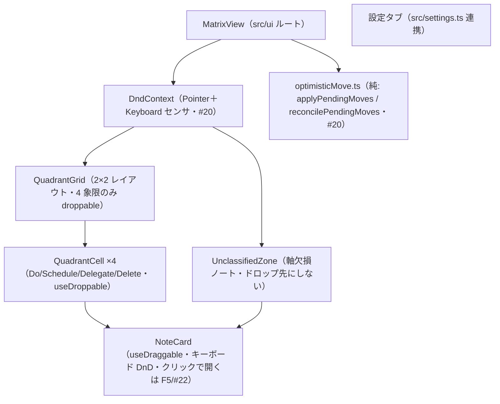
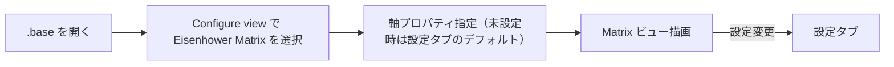
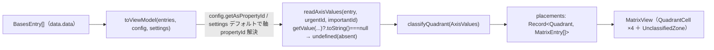
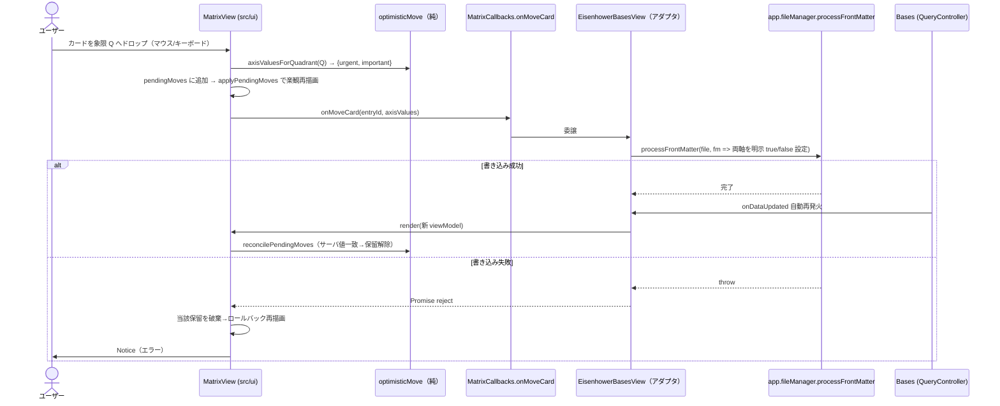

# UI 設計

> 起点は `docs/要件定義書.md`「UI/UX 方針」節。F1（#18）のシェル＋状態表示に続き、#19（F2）で 2×2 グリッド＋未分類ゾーンの配置を実装し `status: active` に確定した。**#20（F3）のドラッグ書き戻しを実装し `status: active` に確定した。**
>
> **#20（F3）の確定事項（2026-06-30・人間承認済み）**: ① レイアウトは #19 から据え置き（2×2 グリッド＋下部フル幅の未分類行）。F3 はドラッグ/ドロップのフィードバックとフォーカス可視を上乗せするだけ（新規ワイヤーフレーム比較なし）。② 楽観移動＋ロールバックは**純レデューサ抽出**＝`applyPendingMoves`（placements に保留中の移動を重ねる純関数）と `reconcilePendingMoves`（到着 props と突合して確定済みを落とす純関数）を `src/ui` の単体テスト対象として切り出す。dnd-kit 配線とドラッグ実操作は手動/`frontend-reviewer` で担保（DoD「軸値算出=単体、DnD往復=手動/結合」）。③ **4 象限のみドロップ可。未分類ゾーンはドロップ先にしない（AC4）。** ④ **未分類ゾーンのカード（両軸 absent）も象限へドラッグ可**＝ドロップで両軸を明示 `true/false` 書き込みして分類する（書き戻しは「両軸明示・`delete` しない」方針と整合）。⑤ AC2「ちらつき抑制」＝楽観移動で書込前から目的象限に見せ、`onDataUpdated` 再描画は `file.path` keyed 差分で吸収。「スクロール位置保持」＝コンテナ DOM を破棄せず Preact 差分更新する（`unmount` はビュー破棄時のみ）。⑥ 書き込み失敗は保留移動を取り消して再描画でロールバックし、`Notice` でエラー表示（AC3）。
>
> **#19（F2）の確定事項（2026-06-30・人間承認済み）**: ① レイアウトは「2×2 グリッド＋下部フル幅の未分類行」（下記ワイヤーフレーム）。② ViewModel は**事前グルーピング**＝アダプタ（`toViewModel`）が象限ごとに entries を振り分け、UI は dumb に描画する。③ `.base` 自身・軸プロパティ無しノートは**未分類ゾーンに表示**（両軸 absent → 自然に未分類へ落ちるため特別なフィルタは持たない）。④ absent 判定はスパイク #16 確定の `getValue(...)?.toString() === null`（NullValue）で行い、`false` と区別する（`isTruthy()` だけでは区別不可＝最低象限 Delete への誤分類バグになる）。⑤ 各象限の `aria-label` は「象限名（軸ラベル）」（件数は可視ヘッダで読み上げ）、空状態「なし」は AA を満たす `--text-muted`。

## 責務（このユニットは何をするか）

Bases のエントリを 2×2 Eisenhower マトリクス（＋未分類ゾーン）として描画し、カードのドラッグ（マウス／キーボード）で象限間を移動させ、frontmatter 書き戻しの結果を反映する。ライト/ダーク両テーマに追従するネイティブ馴染みの見た目を提供する。

## 構成要素（主要コンポーネント／モジュール）



## UI/画面設計

### 画面一覧と画面遷移

1. **Eisenhower Matrix ビュー** — 2×2 グリッド＋未分類ゾーン。各セルに軸ラベル（緊急/重要の有無）を明示し、カード一覧を表示。
2. **プラグイン設定タブ** — デフォルト軸プロパティ・象限ラベル/色・欠損ノート表示・i18n 言語。
3. **Bases の Configure view 内の軸プロパティ選択 UI** — ビュー単位の軸指定（書込不可プロパティは選択時に弾く＋Notice）。



### レイアウト（ワイヤーフレーム）

```
+-----------------------------+-----------------------------+
| 重要 × 緊急   [Do]          | 重要 × 非緊急 [Schedule]     |
|  - NoteCard                 |  - NoteCard                 |
|  - NoteCard                 |                             |
+-----------------------------+-----------------------------+
| 非重要 × 緊急 [Delegate]    | 非重要 × 非緊急 [Delete]     |
|  - NoteCard                 |  - NoteCard                 |
+-----------------------------+-----------------------------+
| 未分類ゾーン（軸欠損・ドロップ不可）:  - NoteCard ...        |
+-----------------------------------------------------------+
```

> 軸の向き（緊急を左右どちらに置くか）・ラベル文言・色は設定可能（向き反転は v2）。未決事項は `docs/要件定義書.md`「未決事項」。

### アダプタ → UI の境界（ViewModel 事前グルーピング・#19 確定）

`toViewModel` が各 entry の両軸値を読んで `classifyQuadrant`（`src/logic`）で象限を決め、**象限ごとに振り分けた構造**を ViewModel に組む。UI は振り分け済みデータを描画するだけ（グルーピング・件数・空状態の判定はアダプタ＝tested 層に集約）。



- **軸 propertyId 解決**: ビュー options（`config.getAsPropertyId(key)`）を主とし、未設定時は設定タブのデフォルト（`settings.defaultUrgencyProperty` / `defaultImportanceProperty`）にフォールバック（要件定義書 F4）。
- **absent 判定**: `entry.getValue(propertyId)?.toString() === null` で absent（NullValue）を検出し `undefined` に正規化。`true`/`false` は `isTruthy()` で boolean 化。片方でも absent なら `classifyQuadrant` が `unclassified` を返す。
- **`.base` 自身・軸無しノート**: 両軸 absent → `unclassified` に落ちるため特別扱い不要（カードとして未分類ゾーンに表示。AC6）。

### ドラッグ書き戻し（楽観更新＋ロールバック・#20 F3）

カードを別象限へドラッグ→ドロップすると、ドロップ先象限から `axisValuesForQuadrant`（`src/logic`）で両軸値を求め、**楽観的にカードを移動**してから `MatrixCallbacks.onMoveCard(entryId, axisValues)` でアダプタへ委譲する。アダプタは `app.fileManager.processFrontMatter` で**両軸を明示 `true/false`** 書き込み（`delete` しない）。成功時は Bases の `onDataUpdated` 自動再発火で整合し、失敗時は保留移動を取り消してロールバック＋`Notice`。

- **DnD**: `DndContext`（dnd-kit）に `PointerSensor`＋`KeyboardSensor` を載せ、マウス・キーボード双方で操作（AC5）。各 `NoteCard` は `useDraggable`（**未分類ゾーンのカードも draggable**＝ドロップで分類）、各 `QuadrantCell`（4 象限）は `useDroppable`。**未分類ゾーンは droppable にしない**ため、未分類への移動経路自体が存在しない（AC4。`axisValuesForQuadrant("unclassified")` の `null` も二重ガード）。
- **ドラッグの視覚追従（`DragOverlay`）**: 象限セルは `overflow:hidden` のため掴んだカードに `transform` を直接当てるとセル境界でクリップされる。代わりに `DndContext` 直下に `DragOverlay` を置き、`onDragStart`/`onDragEnd`/`onDragCancel` で `activeId` を持って**掴んでいるカードの複製をグリッド外レイヤに浮遊描画**して指/カーソルへ追従させる（元カードは `--dragging` で減光）。キーボードドラッグでもドロップ先が視認できる（レビュー指摘）。
- **楽観状態（純レデューサ抽出＋世代/in-flight）**: `MatrixView` は保留中の移動を `pendingMoves: Map<entryId, {urgent, important, generation}>` で保持し、描画用 placements は純関数 `applyPendingMoves(props.placements, pendingMoves)` で算出する。新しい props（`onDataUpdated` 由来）が来たら `reconcilePendingMoves(pendingMoves, props.entries, inFlightIds)` で**サーバ値が保留と一致した移動を落とす**（確定）。同一カードを in-flight 中に連続ドラッグした競合に備え、(a) 各書き込みに**世代**（連番）を付け、(b) entryId ごとの **in-flight 書き込み数**を `MatrixView` の ref で数えて reconcile へ渡す。in-flight 中の entry はサーバ値が偶然一致しても確定しない（古いスナップショットの coincidental match で最新保留を早期に落とさない）。純レデューサ（`applyPendingMoves`/`reconcilePendingMoves`）は Bases・dnd-kit 非依存で単体テストし、世代採番と in-flight 計数は `MatrixView`（dnd 配線側）が持つ。
- **ロールバック（最新世代のみ）**: `onMoveCard` の Promise が reject したら、**その書き込みが当該 entry の最新世代のときだけ**保留移動を破棄して再描画（＝サーバ値の元象限へ戻る）。古い書き込みの失敗で後続の新しい移動の楽観状態を巻き戻さない。判定は純関数 `rollbackFailedMove`／`isLatestGeneration`（`optimisticMove.ts`）に抽出し単体テストする。`Notice` はアダプタが出す（AC3）。
- **ちらつき/スクロール（AC2）**: 楽観移動で書込前から目的象限に見えるため空白期間が出ない。カードは `file.path` を `key` にした keyed 差分で、`onDataUpdated` 再描画でも DOM が作り直されず位置・スクロールが保たれる（コンテナの `unmount` はビュー破棄時のみ）。



### 状態設計（初期・ローディング・空・成功・エラー）

> **F1（#18）実装済みの範囲＝ビューのシェル＋状態表示**（`src/ui/MatrixView.tsx` の `render`/`unmount`）。2×2 グリッドの実レイアウトとカード配置は #19 で充填する。スクリーンショット: `docs/screenshots/18-matrix-shell-{desktop,mobile}-after.png`（ライト/ダーク×loading/empty/ready）。
>
> **#19（F2）で解消した F1 申し送り**:
> - **`empty` の表現**: F1 のシェル全体 1 文プレースホルダ（「表示するノートがありません」＝entries 0 件）は維持しつつ、`ready` 時は**各象限セルが 0 件なら象限内に控えめな空プレースホルダ**を出す（象限別の空状態）。
> - **`ready` の支援技術への状態伝達**: グリッドに意味を持つ要素（4 象限セル＝`region`＋見出し、未分類ゾーン）が入ったため `aria-hidden` を外す。各象限は `aria-label`（**象限名＋軸ラベル**＝例「Do（重要 × 緊急）」）を持つランドマークにし、ランドマーク移動時に軸の文脈が伝わるようにする（件数は名前に含めず、ヘッダ内の可視テキストとして読み上げる＝変化する値を landmark 名に焼かない）。
> - **シェルの高さ依存**: グリッドは CSS Grid（`grid-template-columns: 1fr 1fr` / `1fr 1fr` 行）。親ペイン高さに追従しつつ、各セルに `min-height` を与えて高さ 0 ペインでも潰れないようにする。

| 状態 | 表示 |
|------|------|
| 初期/ローディング | Bases から entries 取得中のプレースホルダ（F1: `role=status`／`aria-live=polite`） |
| 空（entries 0 件） | シェル全体に 1 文プレースホルダ（「表示するノートがありません」） |
| ready・象限 0 件 | 該当象限セル内に控えめな空プレースホルダ（#19 で象限別に追加） |
| 軸欠損ノートあり | 既定では未分類ゾーンに表示（ドロップ不可）。**`settings.showUnclassified=false` で未分類ゾーンを描画しない**（`toViewModel` が ViewModel に flag を載せ `MatrixView` が条件描画＝レビュー指摘で配線。切替 UI は設定タブ〔F6/#23〕で追加） |
| ドラッグ中 | ドラッグ元/ドロップ可象限を視覚フィードバック（#20）。ドロップで楽観的にカードを移動（書き込み確定前＝`applyPendingMoves`） |
| 書き戻し成功 | `onDataUpdated` 自動再発火で再描画し `reconcilePendingMoves` が保留を解除して整合（keyed 差分でちらつき/スクロール維持＝#20） |
| 書き戻し失敗 | 当該保留移動を破棄して再描画でロールバック＋`Notice` 表示（#20） |
| 書込不可プロパティ選択 | 選択を弾く＋Notice（F4/#21） |

### デザイントークン参照

Obsidian テーマ変数を使用（ハードコードしない）: `--background-primary` / `--background-secondary` / `--text-normal` / `--text-muted` / `--interactive-accent` 等。4 象限は控えめなアクセント色で区別し、ライト/ダーク両テーマに追従する。

### アクセシビリティ

- **キーボード DnD**（dnd-kit 標準）でマウスなしでも象限間移動が可能。ドラッグ可能要素は dnd-kit の `attributes` で `role="button"`・`tabindex`・`aria-roledescription` を持つ（キーボードで掴んで移動）。
- **`<li>` は `listitem` を保ち、ドラッグ可能要素は内側に置く**: dnd-kit のドラッグ可能要素は `role="button"` を付与する。これを外側の `<li>` に乗せると `<ul>` のリスト意味論（件数・項目位置）が失われるため、`NoteCard` は `<li class="…-item">` を listitem のまま保ち、**内側の `<div>` をドラッグ可能要素（`role=button`）にする**（レビュー指摘 #9。件数は各象限ヘッダの可視テキスト＋`aria-label="N 件"` でも補う）。
- **dnd の日本語アナウンス＋操作説明**: `DndContext` の `accessibility.announcements`（onDragStart/Over/End/Cancel）と `screenReaderInstructions` を日本語化し、象限の**ローカライズ済みラベル**と**ノート名**で読み上げる（既定の英語＋内部 ID〔file.path・象限キー〕の読み上げを置換＝レビュー指摘）。
- **移動結果のライブ通知（最新世代のみ・誤報しない・再読み上げ可）**: ビュー内に `role="status"`／`aria-live="polite"` の視覚的非表示領域を持ち、楽観移動の結果をスクリーンリーダーへ伝える（`Notice` はビュー外トーストのため a11y ツリーに乗る保証がない）。ただし **実際にロールバックした（最新世代の失敗）ときだけ「失敗・復元」を、後続ドラッグに上書きされていない最新世代のときだけ「移動成功」を通知**する（巻き戻していないのに「元に戻しました」と誤報せず、superseded な象限も読み上げない＝レビュー指摘）。同一文言の連続移動でも読み上げが消えないよう、`nextAnnouncement`（`liveStatus.ts`・純関数）が文言を不可視のゼロ幅スペース（U+200B）で差分化して再読み上げを促す。
- フォーカス可視（`:focus-visible` のアクセントリング。親の `overflow` で切れないよう**インセット** `outline-offset`）・WCAG AA コントラスト（テーマ変数に追従）・象限は region ランドマーク＋`aria-label`「象限名（軸ラベル）」。

### コンポーネントカタログ

Obsidian 実機ロードを前提とするビュー本体は Storybook での再現が難しいため、**ロジックを含む純 UI 部品（NoteCard 等）に限り**カタログ化を検討する。実機前提の統合ビューはカタログ対象外とし、その opt-out 理由を本節に記す（要件定義書「UI/UX 方針」の合意に沿う）。スクリーンショットは `frontend-reviewer` が `docs/screenshots/` に保存した分を相対参照する。

## 主要な設計判断（現行の理由）

- **ViewModel 事前グルーピング（#19 設計オプション比較で選択）**: `toViewModel` が象限ごとに entries を振り分け件数まで組む（`placements`）。配置・absent 区別・件数・空状態を Bases 非依存の純関数で単体テストでき、UI は描画に専念する。却下「フラット＋`quadrant` フィールド」: 型変更は最小だがグルーピング/件数判定が UI に漏れテストしにくい。
- **未分類ゾーンを独立領域にする**: absent（未定義）と `false`（最低象限 Delete）を視覚的に区別するため。欠損はドロップ不可（書き戻しは両軸明示が前提）。レイアウトは 2×2 グリッドの下にフル幅で常時表示（#19 で「下部フル幅 vs 折りたたみ」を比較し、常時表示の単純さ・縦積みのレスポンシブ性で前者を採択）。
- **`.base` 自身・軸無しノートは未分類に表示（除外しない）**: AC6「未分類（誤配置しない）」の literal な解釈。両軸 absent → `classifyQuadrant` が `unclassified` を返すため特別なフィルタを持たず、誤分類経路を増やさない（#19 で確認）。
- **未分類ゾーンの非表示設定（`showUnclassified`）を配線する（レビュー指摘で確定）**: 設定値（`settings.ts`・既定 true）を `toViewModel` が `MatrixViewModel.showUnclassified` に載せ、`MatrixView` が `false` のとき未分類ゾーンを描画しない。当初は「切替 UI（設定タブ F6/#23）が無いうちは死に設定でよい」としていたが、`data.json` 直編集でも設定できる永続フィールドであり、定義・文書化された契約が黙って無視される（死に設定）状態を解消する。切替 UI 自体は F6 で追加する。
- **楽観移動の競合を世代＋in-flight で堅牢化（レビュー指摘で確定）**: 当初の「失敗時に entryId で無条件ロールバック」「reconcile は値一致のみで確定」は、同一カードを in-flight 中に連続ドラッグした際に (a) 古い書き込みの失敗が新しい移動を巻き戻す、(b) 古いサーバスナップショットの coincidental match で最新保留を早期に落とす、という競合を持っていた。書き込みに世代を付け最新世代の失敗のみロールバックし、in-flight 中の entry は reconcile で確定対象外にして解消した。dnd-kit 実操作は引き続き手動/`frontend-reviewer`、状態遷移（in-flight 込み reconcile）は純レデューサの単体テストで守る。
- **ドラッグの視覚追従は `DragOverlay`（transform 直当てを採らない）**: 象限セルが `overflow:hidden` のため、掴んだカードに `transform` を当てるとセル境界でクリップされ移動が見えない。`DragOverlay` で浮遊複製をグリッド外に描いて追従させ、クロス象限ドラッグでもカードが視認できる（レビュー指摘）。
- **楽観的更新＋ロールバック（#20）**: ドラッグの即応性を確保しつつ、書き込み失敗時は再描画で整合を取る。
- **楽観移動ロジックを純レデューサに抽出（#20 設計オプション比較で選択）**: `applyPendingMoves`／`reconcilePendingMoves` を Bases・dnd-kit 非依存の純関数（`src/ui/optimisticMove.ts`）として切り出し単体テストする。dnd-kit のドラッグ実操作は jsdom で再現困難なため、移動の状態遷移（楽観適用・確定・ロールバック）だけを純関数として赤→緑で固め、配線・実操作は手動/`frontend-reviewer` で担保する（DoD「軸値算出=単体、DnD 往復=手動/結合」と整合）。却下「コンポーネントレベルで dnd-kit イベント擬似発火」: jsdom で脆く、却下「手動のみ」: 状態遷移の回帰を自動で守れない。
- **ドロップ可は 4 象限のみ・未分類はドロップ先にしない（#20・AC4）**: 未分類ゾーンを `useDroppable` にしないことで「未分類への書き戻し」経路を構造的に消す。`axisValuesForQuadrant("unclassified")` の `null` 返却も二重ガードとして残す（書き戻しは両軸明示が前提）。
- **未分類カードも象限へドラッグ可＝分類できる（#20・人間承認）**: 両軸 absent のカードを象限へドロップすると両軸を明示 `true/false` 書き込みして分類する（「両軸明示・`delete` しない」方針と整合し、未分類ノートを片付ける自然な導線になる）。AC4 の「ドロップ不可」は未分類を**ドロップ先**にしないことを指し、未分類カードを**ドラッグ元**にすることは妨げない。
- **書き戻しは `processFrontMatter`（読みと別系統）**: 読み取りは Bases `getValue`、書き込みは標準 `app.fileManager.processFrontMatter`。アダプタ（`EisenhowerBasesView`）が `MatrixCallbacks.onMoveCard` を実装し、解決済み軸 propertyId（`note.<key>`）から frontmatter キー（`<key>`）を取り出して両軸を設定する。UI は `obsidian` 型に触れず、書き込み経路もアダプタ層に隔離（AC5 維持）。
- **テーマ変数追従**: 独自配色を持たず Obsidian テーマに馴染ませることで、ライト/ダーク両対応とコントラストをテーマ側に委ねる。
