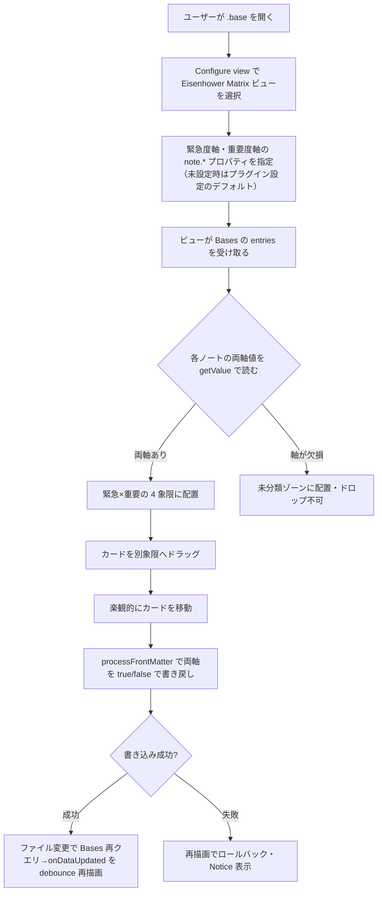

# 要件定義書 — Eisenhower Matrix（Obsidian Bases カスタムビュー）

## 1. 背景・目的

Obsidian のノートを Bases（コアのデータベース機能）で集約しているユーザーが、タスク/ノートを **緊急度×重要度の 2×2 Eisenhower マトリクス**で俯瞰し、ドラッグ操作で優先度分類を直感的に整理できるようにする。読み取り専用の可視化に留めず、**ドラッグでノートの frontmatter プロパティを書き戻して分類を永続化**する点を中核価値とする。

- **解決する課題**: 既存の Bases ビュー（テーブル/カード/カンバン）では「緊急×重要」の 2 軸俯瞰と、その場での再分類（永続化）ができない。
- **ゴール**: Bases のカスタムビューとして Eisenhower マトリクスを提供し、Obsidian コミュニティプラグインとして公開する。

### 想定ユーザー／アクター（権限ロール）

| アクター | 説明 | 権限 |
|---------|------|------|
| Vault 所有者（単一ユーザー） | 自分の Obsidian Vault でノートを管理し、Bases で集約する個人 | 全操作（ビュー利用・軸設定・ドラッグによる frontmatter 書き戻し） |

権限ロールの区分は持たない（単一ユーザー・ローカル動作）。

## 2. スコープ

### スコープ内（やること）
- `Plugin.registerBasesView` による Bases カスタムビュー登録と 2×2 マトリクス描画
- 設定可能な 2 軸プロパティ（緊急度軸・重要度軸）による象限算出。**指定はハイブリッド**（Bases ビュー options を主、プラグイン設定を未設定時のデフォルト）
- **v1 は boolean 軸限定**。ドラッグで `app.fileManager.processFrontMatter` により両軸を明示 `true/false` で書き戻し（楽観的更新＋`onDataUpdated` 整合＋失敗時ロールバック）
- 書き戻し不可プロパティ（Bases の formula 列・`file.*` メタ）は**設定時に弾く＋実行時ガード＋Notice**
- 軸欠損ノートは**未分類ゾーン**（absent と false を区別・ドロップ不可・設定で非表示可）
- マウス DnD＋**キーボード DnD**（dnd-kit）、カードはクリックで開く／Cmd・Ctrl+クリックで新タブ／ホバープレビュー
- i18n 英＋日、数百ノート/ベースを快適に表示、**desktop-only 開始**（`isDesktopOnly: true`）

### スコープ外（やらないこと）
- タッチ DnD（モバイル/タブレット）＝将来
- 数値しきい値・テキスト/タグ軸の書き戻し＝v2 以降（v1 は boolean 前提）
- 複数選択ドラッグ・一括書き戻し・インラインリネーム・カバー画像・WIP リミット＝将来
- 象限内の手動並べ替えの永続化（順序プロパティ）＝v1 は固定ソート
- 仮想化＝実測で必要になるまで導入しない
- Bases 非搭載/無効環境向けのフォールバック UI＝Bases 専用と割り切る
- Bases の filter/sort/formula の再実装＝Bases に委ねる
- ネットワーク通信・テレメトリ・自前のプラグイン更新機構＝一切持たない

## 3. 主要機能

| # | 機能 | 概要 |
|---|------|------|
| F1 | Bases カスタムビュー登録 | `onload()` で `registerBasesView` を呼び、Eisenhower Matrix ビュー型を登録。Bases 無効 Vault では `false` を graceful 処理 |
| F2 | 象限算出 | 各 entry の両軸値（`getValue`）を読み、緊急×重要の 4 象限へ自前配置（ネイティブ grouping に頼らない）。軸欠損は未分類ゾーン |
| F3 | ドラッグ書き戻し | カードを別象限へドラッグ→楽観的移動→`processFrontMatter` で両軸を `true/false` で書き戻し→`onDataUpdated` で整合（失敗時ロールバック） |
| F4 | 軸プロパティ設定 | ビュー options（主）＋プラグイン設定（デフォルト）で緊急度軸・重要度軸の `note.*` プロパティを指定。書込不可プロパティは選択時に弾く |
| F5 | カード操作 | クリックで開く／Cmd・Ctrl+クリックで新タブ／ホバープレビュー／キーボード DnD |
| F6 | 設定タブ | デフォルト軸プロパティ・象限ラベル/色・欠損ノート表示・i18n 言語 等 |
| F7 | 設定ミス診断・軸可視化 | 両軸同一 `note.*` キー（全カードが移動不可＝ロック）を、原因（同一プロパティ名）＋直し方（2 軸に別プロパティを指定）付きの警告バナーで説明。空状態・未分類非表示ヒントに解決済みの緊急度/重要度軸名を控えめに添える（typo で全未分類のときの気づき）。既存の軸解決結果を ViewModel に転送するのみ（Bases API 新規接触なし） |
| F8 | カード追加プロパティ表示 | カードにタイトル下へ**読み取り専用**バッジで追加プロパティ（期日・タグ・プロジェクト等）を最大 3 個表示。ビュー options（主）＋プラグイン設定（デフォルト）で選択。読み取り専用のため `formula.*`／`file.*` も可。期日らしい値（厳格 ISO・今日以前）は任意トグルでアクセント強調。既定は表示 0 個（現状維持） |
| F9 | 滞留インジケータ | `file.stat.mtime` を読み、最終更新から N 日（既定 14・0 でオフ・ビュー options 主＋設定既定のハイブリッド）を超えたカードに控えめな滞留バッジ（時計＋経過日数・`--text-muted`）を付ける。読み取り専用ヒューリスティック（**書き込みゼロ・ネットワークゼロ**） |
| F10 | カード上の完了トグル | 完了プロパティ（boolean の `note.*`・既定は空＝opt-in・ビュー options 主＋設定既定のハイブリッド）を設定すると、カードのチェックボタン（またはフォーカス中の `x`/`X` キー）で `done` を `processFrontMatter` で書き戻す（双方向トグル・`delete` しない）。完了ノートの表示/非表示は**自前フィルタせず Bases に委譲**（`done != true` フィルタ・README 推奨）。非表示にしない利用者向けに「完了ノートを淡色表示」オプション。非 boolean 値（日付型等）は書き込みを塞ぎ元値を守る（`isUnsupportedAxisValue` 流用）。軸と同一キーは衝突ガード（軸×軸＝`axesShareWritableKey`／軸×完了＝`resolveCompletionId` の pairwise 比較）で無効化。既定はオフ（現状維持） |

## 4. 業務フロー

## 5. 非機能要件

| 観点 | 要件 |
|------|------|
| 対象環境 | Obsidian デスクトップ（Electron）。`minAppVersion` 1.12.0 以上（スパイク #16 の実機検証〔1.12.7〕で確定＝§9）。開始時 desktop-only（`isDesktopOnly: true`） |
| セキュリティ・データ保護 | **完全ローカル動作**。ネットワーク通信・テレメトリを一切持たない。個人情報を扱わない。データはユーザーのノート（frontmatter）に存在し、プラグインは独自の秘密保管をしない |
| 定量目標 | 1 ベース数百ノートを快適に表示・ドラッグできること。明示的な数値 SLA は持たない（**定量 SLA なし**）。仮想化は実測でジャンクが出るまで導入しない |
| バックアップ/DR | **該当なし**（データはユーザーの Vault に属し、Obsidian/ユーザーのバックアップに委ねる。RPO/RTO は定義しない） |
| 監視方針 | **該当なし**（クライアントサイドプラグイン。サーバ監視は存在しない） |
| i18n・タイムゾーン | UI 文言・既定象限ラベルを英＋日で提供（i18n 構造）。タイムゾーンの独自処理は持たない（**該当なし**） |

## 6. テスト方針

**標準＝TDD（単体）＋結合は分離**（体系は `.claude/rules/testing-strategy.md`）。

- **単体（TDD）**: 象限判定・「軸値→bool 述語」「bool→軸値の書き戻し」・`propertyId` 判定など**純関数に切り出したロジック**を Red-Green-Refactor で TDD する。
- **結合/手動**: Obsidian API 統合（`registerBasesView`・`processFrontMatter`・`onDataUpdated`）と UI（Preact＋dnd-kit）・ドラッグ往復は、Obsidian 実機ロードが必要なため単体から分離し、手動/結合テストで担保する。
- **総合（システム）**: リリース前に実機スモーク（往復ループ・主要導線）を `docs/test/` に記録する。
- **受入（UAT）・テスト仕様書**: 内製の個人/コミュニティ向けプロジェクトのため、**納品物としての UAT・テスト仕様書は不要**（必要が生じた場合のみ作成）。
- **カバレッジ**: 数値目標は設けない（劣化検知のシグナルとして任意計測）。

## 7. 技術選定

| 項目 | 選定 | 理由 |
|------|------|------|
| 言語 | TypeScript | Obsidian 公式 API が TS 型を提供。型安全・エコシステム整合 |
| UI | Preact（dnd-kit + `preact/compat`） | React 互換で軽量（バンドル小）。後で React へ差し替え可 |
| ビルド | esbuild | Obsidian プラグインの標準バンドラ |
| パッケージマネージャ | npm | Obsidian 標準・既定 |
| 主要 API | Obsidian Plugin API（`registerBasesView` / `BasesView` / `BasesEntry` / `app.fileManager.processFrontMatter`） | Bases カスタムビュー登録（1.10.0+）＋原子的な frontmatter 書き戻し |
| アーキ方針 | Bases API 接触面を**薄いアダプタ層**に隔離し、UI と純ロジックを Bases API から疎結合化 | API churn（1.12 で破壊的変更実績）への耐性を確保 |

> アーキテクチャの詳細（構成・データフロー・主要設計判断）は `docs/design/` を真実源とする。

## 8. リリース・運用

| 項目 | 内容 |
|------|------|
| 配布方法 | Obsidian **コミュニティプラグイン申請**を目指す。`id = eisenhower-bases-view` / `name = Eisenhower Matrix`（id は公開後変更不可） |
| リリース成果物 | GitHub release に `main.js` / `manifest.json` / `styles.css` を添付。`versions.json` を初版から整備 |
| デプロイ | タグ push 起点のリリースワークフロー（`.github/workflows/release.yml`）でリリース資産を生成（サーバデプロイは無し）。**リリースタグは `manifest.json` の version と完全一致する生バージョン（例 `0.1.0`・`v` 接頭辞なし）**＝Obsidian コミュニティプラグインの申請要件で、workflow がタグ＝version 一致を検証し `npm run build`→`gh release create` で `main.js`/`manifest.json`/`styles.css` を添付する（タグ規約は `.claude/rules/git-workflow.md`「バージョンタグ」の Obsidian 例外。`release-deploy.yml` はサーバデプロイ用の別テンプレで本プラグインでは no-op） |
| データ移行 | **該当なし**（既存データ移行は不要。ノートの frontmatter をそのまま読み書きする） |

## 9. 未決事項

### スパイク（Issue #16）で確定した事項（2026-06-30）

Obsidian 1.12.7 実機での自動検証（Playwright `connectOverCDP` で往復ループを無人実行）により以下を確定した。詳細ログ・スクリーンショットはスパイク成果物に残す。

| 項目 | 確定内容 |
|------|---------|
| `registerBasesView` / factory 型 | `registerBasesView(viewId, registration): boolean`（`false`＝Bases 無効）。`BasesViewFactory = (controller: QueryController, containerEl: HTMLElement) => BasesView`。`BasesView` 抽象（`config: BasesViewConfig`・`allProperties: BasesPropertyId[]`・`data: BasesQueryResult`・`abstract onDataUpdated()`）。型は obsidian 1.13.x の型定義に存在 |
| 値読み取り | `entry.getValue(propertyId: BasesPropertyId): Value \| null`。`BasesEntry.file: TFile`（書き戻し対象）。軸は `note.<name>`（`BasesPropertyType = 'note' \| 'formula' \| 'file'`）。ビュー options の選択は `config.getAsPropertyId(key)` で取得 |
| **absent / false / true の区別（実装必須・#33 で是正）** | `true`→`toString()="true"`/`isTruthy()=true`、`false`→`toString()="false"`/`isTruthy()=false`、**`absent`→NullValue（singleton）・`toString()="null"`（文字列）/`isTruthy()=false`**。**absent と false は `isTruthy()` では区別不可。`value instanceof NullValue`（型同一性）で absent を判定する**こと（さもないと欠損ノートが「最低象限」に誤分類される＝実機で実証）。⚠️ スパイク #16 は当初 `toString()===null`（JS null）と誤観測したが、#33 の実機再検証で `toString()` は型契約どおり**文字列 `"null"`** を返すと判明し是正した（constructor 名は minify 済み `"t"` のため名前判定も不可。型同一性は prototype チェーンで成立し文字列・名前に依存しない） |
| 書き戻し往復・再描画 | `app.fileManager.processFrontMatter` で両軸を明示 `true/false` 書き込み（`delete` しない）→ **`onDataUpdated` が自動再発火**して再配置（手動再描画は不要）。反応ループは自動で閉じる。楽観更新は体感向上の任意最適化に格下げ |
| UI 橋渡し | 命令的 `onDataUpdated()` 内で `containerEl` に描画する（本実装では Preact の `render()` をここで呼ぶ）。dnd-kit は本実装で導入（スパイクは移動ボタンで代替） |
| `minAppVersion` | **1.12.0 で確定**（1.12.7 で全 API が動作。`manifest.json` は既に 1.12.0） |
| プロパティ列挙 | `this.allProperties`（`BasesPropertyId[]`）で取得できるため、内部 API `app.metadataTypeManager.properties` は不要 |

### 残る未決事項

| 項目 | 現在の仮置き | 確認先・時期 |
|------|------------|-------------|
| 性能/仮想化方針 | MVP は非仮想化（7 件で描画 2–3ms を確認。数百件は未測定） | 数百件で実測しジャンク時に `@tanstack/virtual` 等を検討 |
| 開いている（dirty）ノートへの `processFrontMatter` 挙動 | 標準 API に委ねる（スパイクでは未テスト） | 実装初期に実機確認 |
| 4 象限のラベル文言・色・軸の向き反転の設定可否 | ラベル/色は設定可（英日既定訳同梱）、向き反転は v2 | 設計時 |
| desktop-only の審査説明（`isDesktopOnly`） | README に「マウス DnD のため当面 desktop 限定・タッチは将来」を明記し審査コメントに返信 | 申請時 |
| コミュニティ審査の graceful degradation | Bases 無効時は `registerBasesView=false` を graceful 処理（コードパスあり・実機では未発火） | 申請前 |
| ポップアウト（別ウィンドウ）でのカード DnD（#44・SEV3） | **v1 で対応と決定**。起票時の見立て「dnd-kit センサーの別 document 解決」は原因調査で反証（dnd-kit 6.3.1 の掴み経路は `event.target` の `ownerDocument`/`defaultView` から解決し realm 安全・Preact も adoptNode で自己修復・v6 に該当既知不具合なし）。真因は静的解析で機序仮説が出そろわず未確定（活性化/イベント配線側が最有力） | 実機 Obsidian の popout で 1 プローブ（`pointerdown`/`pointermove` ログ・クリック導線の弁別）→ 真因特定 → realm 堅牢化（例: `nativeEvent.view.document` へバインド）で修正。設計は `docs/design/ui.md` |
| 完了トグルの Bases フィルタ意味論（#105 F10・④ プローブ） | README 推奨フィルタは `done != true`（完了カードを隠す）を想定。ただし「**完了プロパティ未定義のノートが `done != true` を通過するか**」（Bases のフィルタが absent をどう扱うか）は未検証。実装環境に Obsidian ランタイムが無く実機検証できないため保留 | 実機 Obsidian で 1 プローブ（`done` 未設定ノート・`done: false`・`done: true` の 3 種で `done != true` フィルタの通過を確認）→ 結果に応じて README 推奨フィルタ文言を確定（必要なら `done` の存在チェックを併記）。手動/結合フェーズで実施 |

> 適用デフォルト（ヒアリングの前進保証由来）: Preact 採用・desktop-only 開始・npm・性能は非仮想化で開始。解消したら本文の該当節を改訂し「変更履歴」に記録のうえ、この表から消す。

## 10. 変更履歴

| 日付 | 変更内容 | 合意者 |
|------|---------|--------|
| 2026-06-28 | 初版作成（`/project-setup` のヒアリング・要件ディスカッション〔Bases カスタムビュー実現可能性の調査・批判的検証を含む〕に基づく） | Takahiro.N |
| 2026-06-30 | 着手前スパイク（Issue #16）の実機自動検証で技術前提を確定し「9. 未決事項」を改訂。確定: `registerBasesView`/`BasesViewFactory` 型・`getValue` の Value 表現（**absent は `toString()===null` で判定**）・`processFrontMatter` 書き戻し→`onDataUpdated` 自動再発火・`minAppVersion` 1.12.0。残: 大規模性能・dirty ノート挙動・`.base` 自己エントリ除外 等 | Takahiro.N |
| 2026-07-02 | undo（直前 1 手の「元に戻す」）を最小実装し「9. 未決事項」から解消。トリガーはビュー内トースト＋独自コマンド（ホットキー割当可）の 2 系統、Obsidian 標準 Ctrl+Z とは非統合（README に明記）。復元は完全復元（未分類由来は軸プロパティを delete して戻す）。設計は `docs/design/ui.md`・`bases.md`（status: active）。 | Takahiro.N |
| 2026-07-01 | #33: absent 判定を是正。スパイク #16 の `toString()===null`（JS null）は誤観測で、実機の `NullValue.toString()` は型契約どおり**文字列 `"null"`** を返す。判定を `value instanceof NullValue`（型同一性・singleton）へ変更し、軸欠損ノートが Delete 象限に誤分類されるバグを修正（実機 `scripts/e2e` プローブ＋placements 検証で確定） | Takahiro.N |
| 2026-07-03 | `.base` 自己エントリ・非 md をビュー配置対象から除外（`toViewModel` の `isPlaceableNote`＝`file.extension === "md"` の md 限定フィルタ。非 md は象限にも未分類にも出さず、md 0 件は空状態）を実装し「9. 未決事項」から解消。設計は `docs/design/bases.md`・`ui.md`（status: active） | Takahiro.N |
| 2026-07-05 | #44（ポップアウトでカードを掴めない）の原因調査を実施。多観点＋敵対的検証で起票時の見立て「dnd-kit センサーの別 document 解決」を**反証**（dnd-kit 6.3.1 の掴み経路は `event.target` の `ownerDocument`/`defaultView` から popout を正しく解決し realm 安全）。真因は静的解析で機序仮説が出そろわず未確定＝実機プローブ待ちと判明。**v1 スコープで対応と決定**し「9. 未決事項」に追加。あわせて popout で誤動作する `document.activeElement`（undo トーストの自動消滅時フォーカス復帰）を `ownerDocument.activeElement` に是正。設計は `docs/design/ui.md`（status: active） | Takahiro.N |
| 2026-07-10 | #106: 主要機能に **F9 滞留インジケータ** を追加（#87 で合意済みの追記方針）。`file.stat.mtime` から「最終更新から N 日超過」を純関数で判定し、控えめな滞留バッジ（時計＋経過日数・`--text-muted`）をカードに付ける読み取り専用ヒューリスティック（書き込みゼロ・ネットワークゼロ）。しきい値はビュー options 主＋設定既定（既定 14・0 でオフ）のハイブリッド。再計算は `toViewModel` 実行時のみ（日単位粒度の割り切りを設計書に明記）。設計は `docs/design/bases.md`・`ui.md`（status: active） | Takahiro.N |
| 2026-07-10 | #105: 主要機能に **F10 カード上の完了トグル** を追加（#84 で合意済みの追記方針）。完了プロパティ（boolean `note.*`・opt-in）をカードのチェック（または `x`/`X` キー）で `done` 書き戻し（双方向・`delete` しない）。完了ノートの表示/非表示は **Bases 委譲**（`done != true` フィルタ）で自前フィルタしない・淡色表示オプションのみ持つ。**実装前設計で undo 記録を本 Issue 内でキーリスト一般化に決定**（基盤 Issue を切り出さない）＝ドラッグ書き戻しと同じ「直前 1 手」機構を共有。非 boolean 値は元値を守り書き込まない。**④ フィルタ意味論プローブ（`done` 未定義が `done != true` を通過するか）は実機検証不可のため「9. 未決事項」に追加**。設計は `docs/design/ui.md`・`bases.md`（status: active） | Takahiro.N |

## 11. UI/UX 方針

- **ターゲットユーザーと利用文脈**: Obsidian で Eisenhower マトリクスにより優先順位付けしたい個人（Vault 所有者）。ノートを Bases で集約し、緊急×重要で俯瞰・整理する文脈。
- **デザインの方向性**: **ネイティブ馴染み＋控えめの象限色分け**。Obsidian テーマ変数（`--background-*`・`--text-*`・`--interactive-*` 等）を用いてライト/ダーク両テーマに追従し、4 象限（Do/Schedule/Delegate/Delete）は控えめなアクセント色で区別する。
- **主要画面の構成**:
  1. **Eisenhower Matrix ビュー**（2×2 グリッド＋未分類ゾーン。各セルに軸ラベルを明示、カード一覧）
  2. **プラグイン設定タブ**（デフォルト軸プロパティ・象限ラベル/色・欠損ノート表示・i18n 言語 等）
  3. **Bases の Configure view 内の軸プロパティ選択 UI**（ビュー単位の軸指定）
- **デザインシステム・コンポーネントライブラリ**: Obsidian テーマ変数＋Preact コンポーネント。コンポーネントカタログ（Storybook 等）はロジックを含む UI 部品に検討し、Obsidian 実機前提のビューは設計書に opt-out 理由を記す。
- **アクセシビリティ**: キーボード DnD（dnd-kit 標準）、フォーカス可視、WCAG AA コントラスト（テーマ変数に追従）、aria/ラベル。
- **既存ブランド資産**: なし。

> 本節は Issue の視覚 AC（`.claude/rules/spec-driven.md`）と `frontend-reviewer` のデザイン意図整合チェックの照合元になる。
