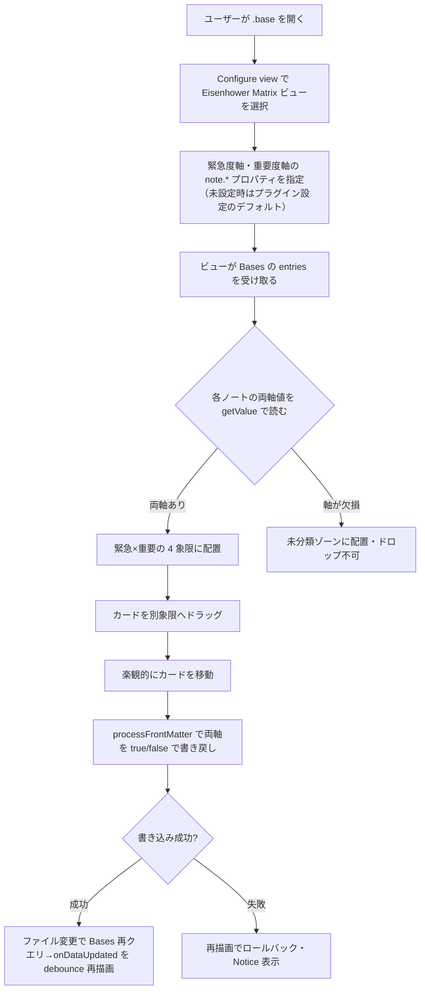

# 要件定義書 — Eisenhower Matrix（Obsidian Bases カスタムビュー）

## 1. 背景・目的

Obsidian のノートを Bases（コアのデータベース機能）で集約しているユーザーが、タスク/ノートを **緊急度×重要度の 2×2 Eisenhower マトリクス**で俯瞰し、ドラッグ操作で優先度分類を直感的に整理できるようにする。読み取り専用の可視化に留めず、**ドラッグでノートの frontmatter プロパティを書き戻して分類を永続化**する点を中核価値とする。

- **解決する課題**: 既存の Bases ビュー（テーブル/カード/カンバン）では「緊急×重要」の 2 軸俯瞰と、その場での再分類（永続化）ができない。
- **ゴール**: Bases のカスタムビューとして Eisenhower マトリクスを提供し、Obsidian コミュニティプラグインとして公開する。

### 想定ユーザー／アクター（権限ロール）

| アクター | 説明 | 権限 |
|---------|------|------|
| Vault 所有者（単一ユーザー） | 自分の Obsidian Vault でノートを管理し、Bases で集約する個人 | 全操作（ビュー利用・軸設定・ドラッグによる frontmatter 書き戻し） |

権限ロールの区分は持たない（単一ユーザー・ローカル動作）。

## 2. スコープ

### スコープ内（やること）
- `Plugin.registerBasesView` による Bases カスタムビュー登録と 2×2 マトリクス描画
- 設定可能な 2 軸プロパティ（緊急度軸・重要度軸）による象限算出。**指定はハイブリッド**（Bases ビュー options を主、プラグイン設定を未設定時のデフォルト）
- **v1 は boolean 軸限定**。ドラッグで `app.fileManager.processFrontMatter` により両軸を明示 `true/false` で書き戻し（楽観的更新＋`onDataUpdated` 整合＋失敗時ロールバック）
- 書き戻し不可プロパティ（Bases の formula 列・`file.*` メタ）は**設定時に弾く＋実行時ガード＋Notice**
- 軸欠損ノートは**未分類ゾーン**（absent と false を区別・ドロップ不可・設定で非表示可）
- マウス DnD＋**キーボード DnD**（dnd-kit）、カードはクリックで開く／Cmd・Ctrl+クリックで新タブ／ホバープレビュー
- i18n 英＋日、数百ノート/ベースを快適に表示、**desktop-only 開始**（`isDesktopOnly: true`）

### スコープ外（やらないこと）
- タッチ DnD（モバイル/タブレット）＝将来
- 数値しきい値・テキスト/タグ軸の書き戻し＝v2 以降（v1 は boolean 前提）
- 複数選択ドラッグ・一括書き戻し・インラインリネーム・カバー画像・WIP リミット＝将来
- 象限内の手動並べ替えの永続化（順序プロパティ）＝v1 は固定ソート
- 仮想化＝実測で必要になるまで導入しない
- Bases 非搭載/無効環境向けのフォールバック UI＝Bases 専用と割り切る
- Bases の filter/sort/formula の再実装＝Bases に委ねる
- ネットワーク通信・テレメトリ・自前のプラグイン更新機構＝一切持たない

## 3. 主要機能

| # | 機能 | 概要 |
|---|------|------|
| F1 | Bases カスタムビュー登録 | `onload()` で `registerBasesView` を呼び、Eisenhower Matrix ビュー型を登録。Bases 無効 Vault では `false` を graceful 処理 |
| F2 | 象限算出 | 各 entry の両軸値（`getValue`）を読み、緊急×重要の 4 象限へ自前配置（ネイティブ grouping に頼らない）。軸欠損は未分類ゾーン |
| F3 | ドラッグ書き戻し | カードを別象限へドラッグ→楽観的移動→`processFrontMatter` で両軸を `true/false` で書き戻し→`onDataUpdated` で整合（失敗時ロールバック） |
| F4 | 軸プロパティ設定 | ビュー options（主）＋プラグイン設定（デフォルト）で緊急度軸・重要度軸の `note.*` プロパティを指定。書込不可プロパティは選択時に弾く |
| F5 | カード操作 | クリックで開く／Cmd・Ctrl+クリックで新タブ／ホバープレビュー／キーボード DnD |
| F6 | 設定タブ | デフォルト軸プロパティ・象限ラベル/色・欠損ノート表示・i18n 言語 等 |

## 4. 業務フロー

## 5. 非機能要件

| 観点 | 要件 |
|------|------|
| 対象環境 | Obsidian デスクトップ（Electron）。`minAppVersion` 1.12.0 以上（暫定・スパイクの実機版で確定）。開始時 desktop-only（`isDesktopOnly: true`） |
| セキュリティ・データ保護 | **完全ローカル動作**。ネットワーク通信・テレメトリを一切持たない。個人情報を扱わない。データはユーザーのノート（frontmatter）に存在し、プラグインは独自の秘密保管をしない |
| 定量目標 | 1 ベース数百ノートを快適に表示・ドラッグできること。明示的な数値 SLA は持たない（**定量 SLA なし**）。仮想化は実測でジャンクが出るまで導入しない |
| バックアップ/DR | **該当なし**（データはユーザーの Vault に属し、Obsidian/ユーザーのバックアップに委ねる。RPO/RTO は定義しない） |
| 監視方針 | **該当なし**（クライアントサイドプラグイン。サーバ監視は存在しない） |
| i18n・タイムゾーン | UI 文言・既定象限ラベルを英＋日で提供（i18n 構造）。タイムゾーンの独自処理は持たない（**該当なし**） |

## 6. テスト方針

**標準＝TDD（単体）＋結合は分離**（体系は `.claude/rules/testing-strategy.md`）。

- **単体（TDD）**: 象限判定・「軸値→bool 述語」「bool→軸値の書き戻し」・`propertyId` 判定など**純関数に切り出したロジック**を Red-Green-Refactor で TDD する。
- **結合/手動**: Obsidian API 統合（`registerBasesView`・`processFrontMatter`・`onDataUpdated`）と UI（Preact＋dnd-kit）・ドラッグ往復は、Obsidian 実機ロードが必要なため単体から分離し、手動/結合テストで担保する。
- **総合（システム）**: リリース前に実機スモーク（往復ループ・主要導線）を `docs/test/` に記録する。
- **受入（UAT）・テスト仕様書**: 内製の個人/コミュニティ向けプロジェクトのため、**納品物としての UAT・テスト仕様書は不要**（必要が生じた場合のみ作成）。
- **カバレッジ**: 数値目標は設けない（劣化検知のシグナルとして任意計測）。

## 7. 技術選定

| 項目 | 選定 | 理由 |
|------|------|------|
| 言語 | TypeScript | Obsidian 公式 API が TS 型を提供。型安全・エコシステム整合 |
| UI | Preact（dnd-kit + `preact/compat`） | React 互換で軽量（バンドル小）。後で React へ差し替え可 |
| ビルド | esbuild | Obsidian プラグインの標準バンドラ |
| パッケージマネージャ | npm | Obsidian 標準・既定 |
| 主要 API | Obsidian Plugin API（`registerBasesView` / `BasesView` / `BasesEntry` / `app.fileManager.processFrontMatter`） | Bases カスタムビュー登録（1.10.0+）＋原子的な frontmatter 書き戻し |
| アーキ方針 | Bases API 接触面を**薄いアダプタ層**に隔離し、UI と純ロジックを Bases API から疎結合化 | API churn（1.12 で破壊的変更実績）への耐性を確保 |

> アーキテクチャの詳細（構成・データフロー・主要設計判断）は `docs/design/` を真実源とする。

## 8. リリース・運用

| 項目 | 内容 |
|------|------|
| 配布方法 | Obsidian **コミュニティプラグイン申請**を目指す。`id = eisenhower-bases-view` / `name = Eisenhower Matrix`（id は公開後変更不可） |
| リリース成果物 | GitHub release に `main.js` / `manifest.json` / `styles.css` を添付。`versions.json` を初版から整備 |
| デプロイ | タグ push（`v*`）起点のリリースワークフローでリリース資産を生成（サーバデプロイは無し） |
| データ移行 | **該当なし**（既存データ移行は不要。ノートの frontmatter をそのまま読み書きする） |

## 9. 未決事項

| 項目 | 現在の仮置き | 確認先・時期 |
|------|------------|-------------|
| Preact＋dnd-kit の Obsidian/Electron 上の動作と、命令的 `onDataUpdated`→Preact `render()` 橋渡しパターン | Preact 採用（`preact/compat`）で暫定 | **着手前スパイク**で確証 |
| 再描画/楽観更新パターン（自動発火・ちらつき・スクロール保持・楽観更新要否） | `obsidian-bases-kanban` 実証パターンを踏襲＋楽観更新・ロールバックを織り込む | スパイク／実装初期 |
| `registerBasesView` の factory 第1引数 `controller` の実型・`BasesViewFactory` の完全型 | 公式型に従う（逐語未確認） | スパイクで確認 |
| `minAppVersion` の最終値 | 1.12.0 以上（暫定） | スパイクの実機版で確定 |
| 性能/仮想化方針 | MVP は非仮想化 | 実測でジャンク時に `react-window`/`@tanstack/virtual` を検討 |
| 非該当軸を `false` で書くか `delete` するか | 常に明示 `true/false` を書く（`delete` しない＝空 frontmatter バグ回避） | boolean 仕様確定後に詰める |
| 4 象限のラベル文言・色・軸の向き反転の設定可否 | ラベル/色は設定可（英日既定訳同梱）、向き反転は v2 | 設計時 |
| undo（Ctrl+Z 非統合） | 直前 1 手の「元に戻す」を最小実装し、非統合を README/設定に明記 | 実装時 |
| プロパティ型検出に使う `app.metadataTypeManager.properties` が内部 API | boolean 限定で型 coerce 不要＝当面回避 | 必要が生じたら再検討 |
| 開いている（dirty）ノートへの `processFrontMatter` 挙動 | 標準 API に委ねる | スパイク/実機確認 |
| desktop-only の審査説明（`isDesktopOnly` の公式定義は Node/Electron API 使用有無） | README に「マウス DnD のため当面 desktop 限定・タッチは将来」を明記し審査コメントに返信 | 申請時 |
| コミュニティ審査の Bases ビュー型・graceful degradation の固有要件 | 公式ガイドライン順守、Bases 無効時は `registerBasesView=false` を graceful 処理 | 申請前 |

> 適用デフォルト（ヒアリングの前進保証由来）: Preact 採用・desktop-only 開始・npm・性能は非仮想化で開始。解消したら本文の該当節を改訂し「変更履歴」に記録のうえ、この表から消す。

## 10. 変更履歴

| 日付 | 変更内容 | 合意者 |
|------|---------|--------|
| 2026-06-28 | 初版作成（`/project-setup` のヒアリング・要件ディスカッション〔Bases カスタムビュー実現可能性の調査・批判的検証を含む〕に基づく） | Takahiro.N |

## 11. UI/UX 方針

- **ターゲットユーザーと利用文脈**: Obsidian で Eisenhower マトリクスにより優先順位付けしたい個人（Vault 所有者）。ノートを Bases で集約し、緊急×重要で俯瞰・整理する文脈。
- **デザインの方向性**: **ネイティブ馴染み＋控えめの象限色分け**。Obsidian テーマ変数（`--background-*`・`--text-*`・`--interactive-*` 等）を用いてライト/ダーク両テーマに追従し、4 象限（Do/Schedule/Delegate/Delete）は控えめなアクセント色で区別する。
- **主要画面の構成**:
  1. **Eisenhower Matrix ビュー**（2×2 グリッド＋未分類ゾーン。各セルに軸ラベルを明示、カード一覧）
  2. **プラグイン設定タブ**（デフォルト軸プロパティ・象限ラベル/色・欠損ノート表示・i18n 言語 等）
  3. **Bases の Configure view 内の軸プロパティ選択 UI**（ビュー単位の軸指定）
- **デザインシステム・コンポーネントライブラリ**: Obsidian テーマ変数＋Preact コンポーネント。コンポーネントカタログ（Storybook 等）はロジックを含む UI 部品に検討し、Obsidian 実機前提のビューは設計書に opt-out 理由を記す。
- **アクセシビリティ**: キーボード DnD（dnd-kit 標準）、フォーカス可視、WCAG AA コントラスト（テーマ変数に追従）、aria/ラベル。
- **既存ブランド資産**: なし。

> 本節は Issue の視覚 AC（`.claude/rules/spec-driven.md`）と `frontend-reviewer` のデザイン意図整合チェックの照合元になる。
